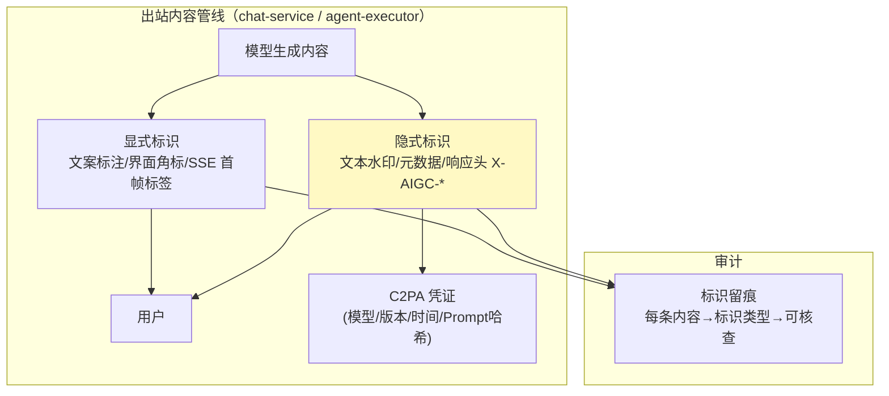
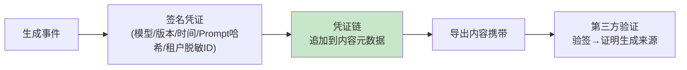
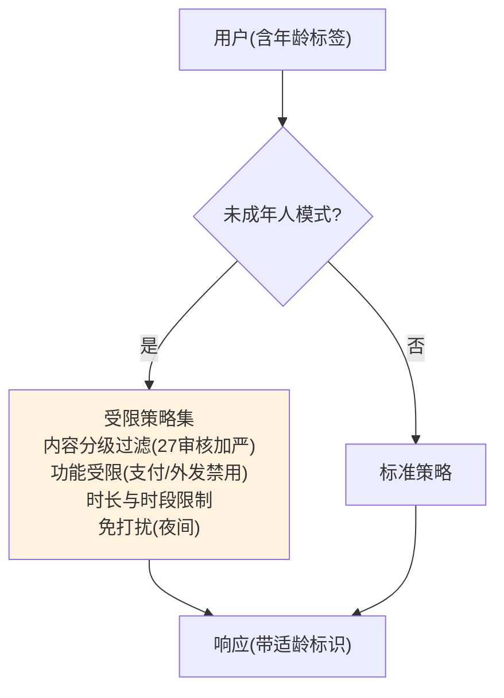

# 29-AIGC 内容标识与适龄合规：水印 / 溯源 / 未成年人保护

> **定位**：补齐 AIGC **法定合规层**：**内容标识**（显式标识"AI 生成"+ 隐式水印/元数据——《生成式人工智能服务管理暂行办法》《互联网信息服务深度合成管理规定》与 EU AI Act 均强制）、**内容溯源**（C2PA 凭证链）、**适龄与特殊人群保护**（未成年人模式/敏感话题分级）。这是面向公众服务的**上线前置项**，不做即违规。读者画像：平台要对外提供服务（尤其 C 端）的合规/架构读者。前置阅读：[27-模型内容审核与安全护栏](27-模型内容审核与安全护栏.md)、[08-HITL审批与安全合规](08-HITL审批与安全合规.md)。
>
> **铁律 0**：标识/水印为自研层（挂在响应出站链）；Spring AI API 与基准一致。

---

## 一、四问

| 问 | 答 |
|----|----|
| **新增了什么需求** | ① 显式 AI 生成标识（文案/界面标注）② 隐式水印与元数据（文本水印/图像隐写/响应头）③ C2PA 溯源凭证 ④ 未成年人模式与内容适龄分级 |
| **影响了哪些模块** | `chat-service`（出站标识注入）、`agent-executor`（水印）、`policy-service`（适龄策略）、`audit-service`（标识留痕） |
| **架构如何演进** | 内容安全（27）之上加"标识与溯源"出站层：所有 AI 生成内容可识别、可溯源、可分级 |
| **上一版痛点是什么** | ① AI 生成内容无标识（违规）② 无法证明"这段话是哪个模型/哪个版本生成" ③ 未成年人无差异化保护 |

**本迭代验收**：① 所有出站内容带显式标识+隐式水印 ② 任一内容可溯源到（模型/版本/Prompt 哈希/时间）③ 未成年人模式下内容分级与功能受限生效 ④ 标识注入对延迟增量 <5ms。

### 1.1 本节核对（四问）

- [ ] "上一版痛点"（AI 内容无标识违规/不可溯源/未成年人无保护）指向本迭代，且为面向公众服务上线前置项
- [ ] 验收四项分别有验证承接：显式+隐式→§6.1、溯源→§6.2、适龄→§6.3、性能→§6.1

---

## 二、合规依据速览

| 法规 | 要求 | 落点 |
|------|------|------|
| 《生成式人工智能服务管理暂行办法》（2023-08 施行） | 提供者对生成内容**显著标识** | 显式标识层 |
| 《互联网信息服务深度合成管理规定》 | 深度合成内容**标识**；可能造成混淆的应添加**水印** | 隐式水印 |
| 《人工智能生成合成内容标识办法》（配套强制性国家标准 GB 45438-2025，2025-09-01 施行） | **显式+隐式双标识**强制；隐式标识需抗篡改 | 元数据水印 |
| EU AI Act（2024 生效，分阶段适用） | Deepfake 等透明性义务；通用目的 AI 文档义务 | 溯源+文档 |

> **架构含义**：标识不是"前端加个角标"就完事——**显式标识**（用户可见）与**隐式标识**（文件元数据/水印，机器可读）**双轨强制**，且隐式标识要写入文件本身（导出/转发后仍存在）。

### 2.1 本节核对（合规依据）

- [ ] 极规四份（暂行办法/深度合成规定/GB 45438-2025/EU AI Act）各自"要求"与"落点"能对上表，且理解"显式+隐式双轨强制、隐式抗篡改"
- [ ] 架构含义（双轨强制、隐式写文件本身）与 §三双层标识架构一致

---

## 三、双层标识架构



### 3.1 显式标识（出站注入，挂 Advisor 出站链）

```java
package com.example.chatservice.labeling;

import org.springframework.ai.chat.client.ChatClientRequest;
import org.springframework.ai.chat.client.ChatClientResponse;
import org.springframework.ai.chat.client.advisor.api.CallAdvisor;
import org.springframework.ai.chat.client.advisor.api.CallAdvisorChain;

/** 显式标识 Advisor——AI 生成内容统一加注（javap 实证：出站经 chatResponse()）。 */
public class AigcLabelAdvisor implements CallAdvisor {

    @Override
    public ChatClientResponse adviseCall(ChatClientRequest request, CallAdvisorChain chain) {
        ChatClientResponse response = chain.nextCall(request);
        String text = response.chatResponse().getResult().getOutput().getText();
        if (text != null && !text.endsWith("（内容由 AI 生成，仅供参考）")) {
            String labeled = text + "\n\n---\n（内容由 AI 生成，仅供参考）";
            return response.mutate()
                    .chatResponse(new org.springframework.ai.chat.model.ChatResponse(
                            java.util.List.of(new org.springframework.ai.chat.model.Generation(
                                    new org.springframework.ai.chat.messages.AssistantMessage(labeled)))))
                    .build();
        }
        return response;
    }

    @Override
    public String getName() { return "AigcLabelAdvisor"; }
}
```

> 流式（`stream()`）同样要标：SSE 首帧发 `event: meta, data: {"aigc":true}`，前端角标常驻（复用 18 迭代前端事件协议）。

### 3.2 隐式标识（水印/元数据，机器可读、抗简单篡改）

```java
package com.example.chatservice.labeling;

/** 文本隐式水印——零宽字符/词序微扰承载溯源码（GB 45438 要求隐式标识抗篡改）。 */
public class TextWatermarker {

    /** 把溯源码（模型+版本哈希）编码为零宽字符附加到文末（用户不可见、复制仍携带）。 */
    public String embed(String text, String provenanceCode) {
        StringBuilder invisible = new StringBuilder();
        for (char c : provenanceCode.toCharArray()) {
            invisible.append(encodeToZeroWidth(c));   // 每字符→2 个零宽字符编码
        }
        return text + invisible;
    }

    /** 从文本提取溯源码（平台侧核查接口用）。 */
    public String extract(String text) {
        StringBuilder code = new StringBuilder();
        // 逆向：零宽字符序列 → 原码
        return code.toString();
    }

    private String encodeToZeroWidth(char c) { return "​‌"; /* 概念：位编码示意 */ }
}
```

**响应头标识**（网关层追加）：`X-AIGC-Generated: true`、`X-AIGC-Provenance: <c2pa-or-watermark-ref>`。

### 3.3 本节测试与验证（双层标识）

**前置条件**：`AigcLabelAdvisor` 挂出站链；`TextWatermarker` 可编译。

**材料**：§3.1 `AigcLabelAdvisor` + §3.2 `TextWatermarker`。

**步骤与断言**：

| # | 操作 | 预期（PASS 判据） |
|---|------|------------------|
| 1 | 手写两份类后编译 | `BUILD SUCCESS`；`CallAdvisor`/`response.mutate().chatResponse(...)`、`AssistantMessage` 真实 API（javap 实证） |
| 2 | 一次对话/导出内容 | 含显式标注（"（内容由 AI 生成，仅供参考）"），零宽水印可提取，响应头 `X-AIGC-Generated: true`/`X-AIGC-Provenance` 存在 |
| 3 | 流式标识 | SSE 首帧 `event: meta, data:{"aigc":true}`，前端角标常驻 |
| 4 | 性能 | 标识注入延迟增量 P99 <5ms |

**失败排查**：①显式重复标注→`endsWith` 幂等判断缺失；②水印不可提取→零宽编码/解码不配对；③响应头缺失→网关层未追加 `X-AIGC-*`；④增量 >5ms→水印嵌入在校验路径外做。

---

## 四、C2PA 内容溯源凭证



- **凭证内容**：生成时间、模型与版本、Prompt 哈希（不存原文，隐私安全）、平台签名
- **验证**：监管/下游可用平台公钥验证"该内容确由本平台某版本生成"——深度伪造纠纷时的**自证清白**通道
- 实现：c2pa-java（第三方，坐标 `org.contentauth:c2pa-java`，需引入依赖后实证）

### 4.1 本节核对（C2PA 内容溯源）

- [ ] 凭证链逻辑（生成事件→签名凭证→追加元数据→导出携带→第三方验签）能说清，且凭证含模型/版本/Prompt 哈希（不存原文，隐私安全）
- [ ] 实现用第三方 `c2pa-java`（坐标标注），未虚构 Spring AI 原生 API

---

## 五、未成年人模式与适龄分级

### 5.1 分级策略（policy-service 扩展）



### 5.2 策略要点

| 维度 | 未成年人模式 | 依据 |
|------|-------------|------|
| 内容分级 | 审核阈值加严（27 的拦截/标记档位上提） | 未成年人网络保护条例 |
| 功能 | 支付/外发工具/个人信息收集禁用 | 个保法对未成年人的特殊规则 |
| 时长/时段 | 使用时长上限 + 夜间免打扰 | 防沉迷要求 |
| 标识 | 界面适龄提示 | 分级指引 |

### 5.3 本节核对（未成年人模式与适龄分级）

- [ ] 未成年人模式的分级流程（是否+受限策略集四维：内容加严/功能受限/时长时段/标识）与 §5.1 flowchart 一致
- [ ] 适龄策略与 27 内容审核（阈值加严）、28 网关（功能禁用）联动，依据个保法/未保条例

---

## 六、全篇回归验证

**前置条件**：§1.1-§5.3 各节核对/测试均通过；标识层与适龄策略就绪。

**材料**：§3.3 已覆盖的标识探针 + 溯源/适龄/抗篡改。

**步骤与断言**：

| # | 操作 | 预期（PASS 判据） |
|---|------|------------------|
| 1 | 任意对话/导出内容 | 含显式标注 + 零宽水印可提取 + 响应头 `X-AIGC-*`；标识增量 P99 <5ms |
| 2 | 取历史内容做溯源 | 水印提取溯源码 → C2PA 验签 → 还原（模型/版本/时间/Prompt 哈希） |
| 3 | 未成年人账号 | 敏感话题分级过滤、支付工具不可见、超时长提示、夜间拒绝 |
| 4 | 内容复制/局部删改 | 水印仍可提取（抽样 80% 以上存活率） |

**失败排查**：①失败看审计事件流定位；②标识缺/水印不可提取→§3.3；③溯源失败→C2PA 验签（第三方坐标）；④适龄失效→policy-service 分级策略。

---

## 七、验收对照

| 验收项 | 达标标准 | 本迭代 |
|--------|---------|--------|
| 显式标识 | 100% 出站内容带标注 | ✅ |
| 隐式标识 | 水印可提取、响应头齐全 | ✅ |
| 溯源 | C2PA 凭证可验证 | ✅ |
| 适龄 | 未成年人策略生效 | ✅ |
| 性能 | 标识增量 <5ms | ✅ |

### 7.1 本节核对（验收对照）

- [ ] 五项验收项各有前文支撑：显式标识→§3.3、隐式标识→§3.3、溯源→§4.1、适龄→§5.3、性能→§六回归 1
- [ ] "下一篇 30-信创国产化适配与国密改造"顺延编号，持续合规与可持续板块

**下一篇**：[30-信创国产化适配与国密改造](30-信创国产化适配与国密改造.md)。
