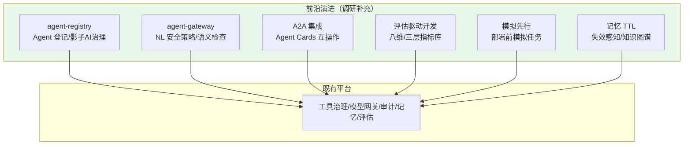

# 29-工业前沿调研与特性补充：2026 企业 Agent 平台演进方向

> **定位**：对项目 14 做**工业前沿调研**——梳理 2026 年 Google / AWS / Microsoft / Nebius / PagerDuty / Arthur.ai 等关于企业级 Agent 平台生产落地的最佳实践，对照项目 14 找缺口，给出**演进方向**。读者画像：想站在行业前沿审视平台设计的读者。前置阅读：[00-需求分析与架构设计](00-需求分析与架构设计.md)、[前沿 00-A2A协议]、[前沿 06-Spring-AI生态全景]。
>
> **来源**：本文引用均为真实外部资料，已标注链接（CLAUDE.md 规则 14）。

---

## 一、调研结论：2026 的核心转变

2026 年企业 Agent 平台的行业共识——**难的不再是模型能力，而是系统工程**：

1. **Agent 是运维软件，不是聊天机器人**（[Google 20 问框架](https://itbrief.com.au/story/google-sets-out-20-question-framework-for-ai-agents)）：要集中登记每个 Agent、所有者、目标数据、允许工具——防"影子 AI"。
2. **Agent 失败是系统失败，不是模型失败**（[Nebius Agents Blueprint](https://nebius.com/blog/posts/introducing-the-nebius-agents-blueprint)）：单步 95% 成功率，十步任务只剩 ~60%；检索质量/编排/评估的影响大于模型增量。
3. **模型只占 ~20%，Harness 占 80%**（[腾讯云 2026 工程范式](https://cloud.tencent.com.cn/developer/article/2705204)）：上下文/工具/记忆/评估/循环控制/可观测/权限治理才是大头。
4. **评估驱动开发成为新范式**（[AWS 企业生产级 Agent 指南](https://cloud.it168.com/a2026/0708/6939/000006939041.shtml)）：40% Agent 项目可能被砍；评估标准必须**企业自持**（金标集是护城河）。
5. **开放标准 MCP + A2A**（[Google Agent 生产指南](https://cloud.google.com/blog/topics/developers-practitioners/five-guides-to-building-and-scaling-production-ready-ai-agents)）：MCP 是工具桥，A2A 是 Agent 间互操作。

---

## 二、前沿特性对照（项目 14 缺口）

| # | 前沿特性 | 来源 | 项目 14 现状 | 演进方向 |
|---|---------|------|-------------|---------|
| N1 | **Agent 级治理（五层栈）**：身份徽章/注册表/网关(NL 安全策略)/行为异常/安全看板 | [Google](https://cloud.google.com/blog/topics/developers-practitioners/five-guides-to-building-and-scaling-production-ready-ai-agents) | 有工具治理，无 Agent 级治理 | 新增 `agent-registry`（登记每个 Agent）+ `agent-gateway`（NL 安全策略）+ 行为异常检测 |
| N2 | **影子 AI 治理**：集中登记 Agent 所有者/数据/工具 | [Google](https://itbrief.com.au/story/google-sets-out-20-question-framework-for-ai-agents) | 未覆盖 | agent-registry 增加"影子 AI"清单 |
| N3 | **A2A 协议 + Agent Cards**（跨组织互操作） | [Google](https://cloud.google.com/blog/topics/developers-practitioners/five-guides-to-building-and-scaling-production-ready-ai-agents) | 多 Agent 内部编排 | 接入 A2A（Agent 卡发布/发现） |
| N4 | **评估驱动开发框架**：八维评估 + 三层指标库 + 企业自持金标 | [AWS](https://cloud.it168.com/a2026/0708/6939/000006939041.shtml) | 13 迭代有 Evaluator/回归 | 深化"八维评估 + 三层指标库" |
| N5 | **模拟先行**：部署前跑数百模拟任务产出评估集/回归套件 | [Nebius](https://nebius.com/blog/posts/introducing-the-nebius-agents-blueprint) | 未覆盖 | 新增"模拟任务生成评估集" |
| N6 | **记忆 TTL/失效感知/显式记住忘记 + 知识图谱** | [PagerDuty](https://www.pagerduty.com/eng/production-ai-agents-closing-the-gaps-between-idea-and-reality/) | 记忆服务有，无 TTL/失效感知 | 记忆加 TTL/失效使失联（知识图谱可选） |
| N7 | **模型-任务复杂度匹配**：轻量模型例行工作，重模型终决策 | [Google](https://developers.googleblog.com/build-better-ai-agents-5-developer-tips-from-the-agent-bake-off/) | 16 迭代有路由 | 深化"任务分档→模型匹配" |
| N8 | **语义安全双策略**：传统 IAM + NL 语义检查（agent-gateway） | [Google](https://cloud.google.com/blog/topics/developers-practitioners/five-guides-to-building-and-scaling-production-ready-ai-agents) | 有 RBAC/注入检测 | 深化"语义检查网关" |
| N9 | **长任务委托审批零计算暂停 + 7 天状态持久化** | [Google](https://cloud.google.com/blog/topics/developers-practitioners/five-guides-to-building-and-scaling-production-ready-ai-agents) | 12 迭代审批 Sinks 挂起 | 深化"暂停零计算 + 状态持久化" |
| N10 | **决策点可观测埋点**：每个关键决策点打点 | [Arthur.ai](https://www.arthur.ai/blog/checklist-to-launch-a-production-ready-ai-agent) | 07 迭代有观测 | 强调"决策点埋点"规范 |
| N11 | **Token 长尾监控**：一次错误执行路径乘数放大账单 | [Nebius](https://nebius.com/blog/posts/introducing-the-nebius-agents-blueprint) | 09 迭代有成本 | 深化"长尾 Token 监控/上限" |

---

## 三、演进方向落地（新增能力组）

### 演进优先级建议

| 优先级 | 演进 | 理由 |
|--------|------|------|
| P0 | Agent 级治理（registry + gateway + 影子 AI） | 防"影子 AI"，治理从工具级到 Agent 级 |
| P0 | 评估驱动开发（八维/三层指标库） | AWS 2026 核心范式 |
| P1 | 记忆 TTL/失效感知 | 共享记忆失效是 RAG 的已知坑 |
| P1 | 模拟先行 | 部署前质量门 |
| P2 | A2A 互操作 | 跨组织协作 |
| P2 | Token 长尾监控 | 成本深水区 |

---

## 四、更新：00 矩阵新增组（9.12 前沿治理与评估）

> 00 篇「工业级落地特性覆盖矩阵」已同步新增 9.12 组（见 00 篇 §九）。

| 特性 | 来源 | 演进落点 |
|------|------|---------|
| Agent 级治理（身份/注册表/网关/异常/看板） | [Google](https://cloud.google.com/blog/topics/developers-practitioners/five-guides-to-building-and-scaling-production-ready-ai-agents) | agent-registry / agent-gateway |
| 影子 AI 治理 | [Google](https://itbrief.com.au/story/google-sets-out-20-question-framework-for-ai-agents) | agent-registry |
| A2A + Agent Cards | [Google](https://cloud.google.com/blog/topics/developers-practitioners/five-guides-to-building-and-scaling-production-ready-ai-agents) | A2A 适配层 |
| 评估驱动（八维/三层/自持金标） | [AWS](https://cloud.it168.com/a2026/0708/6939/000006939041.shtml) | eval-service 深化 |
| 模拟先行 | [Nebius](https://nebius.com/blog/posts/introducing-the-nebius-agents-blueprint) | 模拟任务引擎 |
| 记忆 TTL/失效 | [PagerDuty](https://www.pagerduty.com/eng/production-ai-agents-closing-the-gaps-between-idea-and-reality/) | memory-service |
| 语义安全双策略 | [Google](https://cloud.google.com/blog/topics/developers-practitioners/five-guides-to-building-and-scaling-production-ready-ai-agents) | policy-service |
| 模型-任务匹配 | [Google Bake-Off](https://developers.googleblog.com/build-better-ai-agents-5-developer-tips-from-the-agent-bake-off/) | model-gateway |
| Token 长尾监控 | [Nebius](https://nebius.com/blog/posts/introducing-the-nebius-agents-blueprint) | 成本治理 |

---

## 五、总结

调研确认项目 14 的架构方向与 2026 行业共识一致（微服务化、管控分离、可观测、评估驱动、工具/模型治理）。**主要缺口在 Agent 级治理与评估驱动开发的深化**——这是下一阶段的演进重点（N1/N2/N4/N6 优先级最高）。项目 14 至此 **27 篇**，是一套可以照着实操并持续演进的企业级 Agent 平台蓝图。

> 本项目到此收官。独立项目，无后续依赖。
