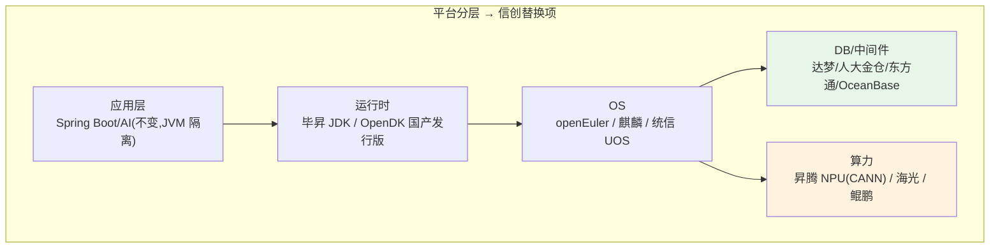
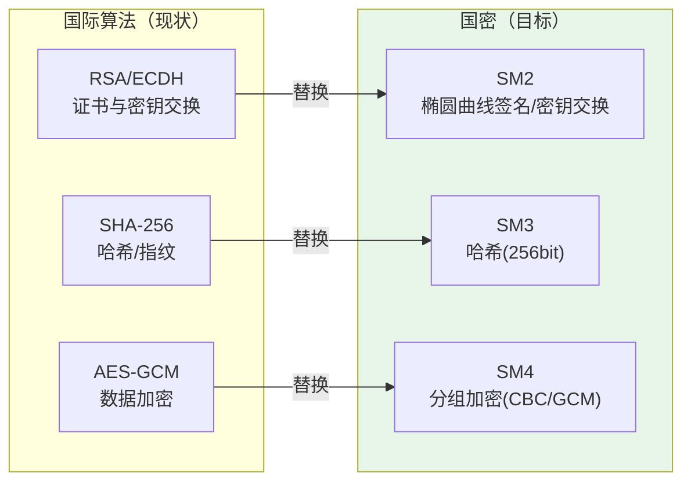
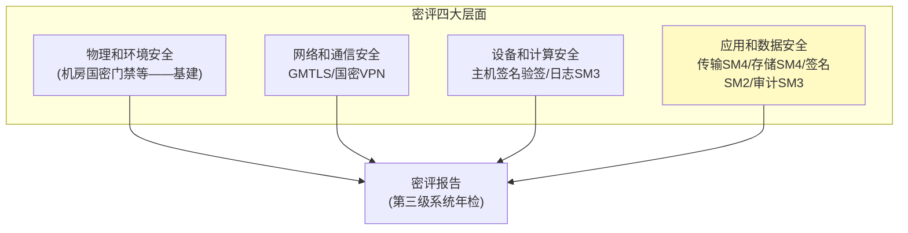
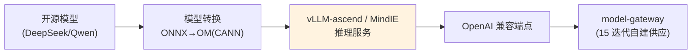

# 30-信创国产化适配与国密改造：国产软硬件栈 + SM 系列密码

> **定位**：补齐**信创（信息技术应用创新）落地能力**——政企/金融/央企市场的**准入门槛**：国产化软硬件适配（麒麟/统信 OS、达梦/人大金仓 DB、昇腾 NPU 推理）与**商用密码（国密）改造**（SM2/SM3/SM4 算法替换 + 密评合规）。读者画像：要投政企标、过等保/密评的架构师。前置阅读：[15-模型供应与边缘部署](15-模型供应与边缘部署.md)、[28-API网关认证与防滥用](28-API网关认证与防滥用.md)。
>
> **铁律 0**：国密为第三方 BouncyCastle/国密库（标真实坐标或「需引入」）；Spring AI 层 API 不受信创影响（JVM 之上）。

---

## 一、四问

| 问 | 答 |
|----|----|
| **新增了什么需求** | ① 国产 OS/DB/CPU/NPU 适配矩阵 ② 国密算法替换（TLS 用 SM2/SM4、哈希用 SM3、签名用 SM2）③ 密评（商用密码应用安全性评估）合规改造 ④ 自建模型的国产算力路线（昇腾） |
| **影响了哪些模块** | 部署层（OS/DB/中间件替换）、全服务 TLS 层（国密 HTTPS）、签名链（05 工具签名/17 事件签名改 SM2/SM3）、审计哈希（SM3） |
| **架构如何演进** | 依赖栈从"国际栈"到"双栈可切换"；密码体系从 RSA/AES 到 SM2/SM3/SM4（保留国际算法兼容出口/混合期） |
| **上一版痛点是什么** | ① 无法投政企信创标（全国际栈）② 密码应用不符合国密规范（密评不过）③ 无国产算力路线 |

**本迭代验收**：① 平台在麒麟 OS + 达梦 DB 上全功能跑通 ② TLS/签名/哈希全链国密可选 ③ 密评改造清单对照《GB/T 39786》达标 ④ 昇腾推理路线可行（CANN/vLLM-ascend）。

### 1.1 本节核对（四问）

- [ ] "上一版痛点"（无法投信创标/密评不过/无国产算力）指向本迭代，为政企/金融/央企准入项
- [ ] 验收四项分别有验证承接：麒麟+达梦→§6.1、国密→§6.2、密评→§6.3、昇腾→§6.4

---

## 二、信创适配矩阵



| 层 | 国际栈（现） | 信创替换 | 改造点 |
|----|-------------|---------|--------|
| OS | CentOS/Ubuntu | 麒麟 V10 / 统信 UOS / openEuler | 部署流水线/镜像构建 |
| DB | PostgreSQL | 达梦 DM8 / 人大金仓 KingbaseES（均兼容 PG 协议） | 方言校验/pgvector→国产向量方案 |
| 消息 | Kafka | 东方通 TCLMQ / 自动化联盟 Kafka 兼容版 | 协议兼容验证 |
| JDK | OpenJDK | 毕昇 JDK（鲲鹏优化） | 性能回归 |
| 算力 | NVIDIA GPU | 昇腾 NPU（CANN + vLLM-ascend） | 模型转换/推理框架 |

> **关键红利**：达梦/金仓高度兼容 PG 协议——Spring AI 的 PgVectorStore 链路（`PgVectorStore.builder(JdbcTemplate, EmbeddingModel)`）迁移面主要在**向量索引与方言差异校验**，需在达梦上回归 06/15 迭代的检索链。

### 2.1 本节核对（信创适配矩阵）

- [ ] 五层适配（应用/JDK/OS/DB中间件/算力）的国际栈→信创替换→改造点能对上表，且应用层（Spring Boot/AI）因 JVM 隔离基本不变
- [ ] 达梦/金仓的 PG 兼容红利理解到位（迁移面在向量索引与方言校验）

---

## 三、国密改造（SM2/SM3/SM4）

### 3.1 算法替换地图



| 平台用途 | 现（国际） | 国密替换 | 位置 |
|---------|-----------|---------|------|
| 服务间 TLS | TLS1.3 + RSA/ECDHE | **国密 TLS（GMTL，SM2 套件）** | 网关/服务间 |
| 工具描述指纹（05） | SHA-256 | **SM3** | tool-registry |
| 事件溯源签名（17） | HMAC-SHA256 | **HMAC-SM3 / SM2 签名** | audit-service |
| 租户数据加密（07 驻留） | AES-GCM | **SM4-GCM** | 信封加密 DEK |
| 审批/合同签名 | RSA | **SM2 数字签名** | HITL 留痕 |

### 3.2 实现层（Java 国密库）

```java
// 国密库（第三方，真实坐标）：BouncyCastle 已内置 SM2/SM3/SM4 实现
// 需在 pom.xml 中添加依赖：
// <dependency>
//   <groupId>org.bouncycastle</groupId>
//   <artifactId>bcprov-jdk18on</artifactId>
// </dependency>
// 或国产硬件密码机 HSM 的 JCE Provider（需引入厂商 SDK 后实证）

package com.example.platform.crypto;

import org.bouncycastle.jce.provider.BouncyCastleProvider;
import java.security.MessageDigest;
import java.security.Security;

/** SM3 哈希——替换 SHA-256 指纹链（05 工具指纹 / 17 事件签名）。 */
public class Sm3Digester {

    static { Security.addProvider(new BouncyCastleProvider()); }

    public String digestHex(String input) throws Exception {
        MessageDigest md = MessageDigest.getInstance("SM3", "BC");
        byte[] d = md.digest(input.getBytes(java.nio.charset.StandardCharsets.UTF_8));
        StringBuilder sb = new StringBuilder();
        for (byte b : d) sb.append(String.format("%02x", b));
        return sb.toString();
    }
}
```

### 3.3 国密 TLS（服务间）

- **方案 A**：支持国密的网关/负载层终结 GMTLS（Nginx+国密模块/Tengine），内部维持标准 TLS——改造成本最低，密评通常可过（边界处用国密）
- **方案 B**：全链国密（服务级 GMTLS）——金融高密级要求
- **混合期**：双证书（国密+国际）并行，按对端能力协商

### 3.4 本节测试与验证（国密改造）

**前置条件**：BouncyCastle 已引入（第三方坐标 `org.bouncycastle:bcprov-jdk18on`，需加依赖）。

**材料**：§3.2 `Sm3Digester` + 国密 TLS 套件。

**步骤与断言**：

| # | 操作 | 预期（PASS 判据） |
|---|------|------------------|
| 1 | 手写 `Sm3Digester` 后编译/单测 | `MessageDigest.getInstance("SM3","BC")` 可用，SM3 哈希输出 256bit |
| 2 | SM3 指纹替换 | 05 工具指纹 / 17 事件签名改用 SM3/HMAC-SM3，结果与既有 SHA-256 链路交替可用（双栈期） |
| 3 | 国密 TLS 握手 | 抓包确认 SM2 套件（方案 A/B/混合期之一） |
| 4 | SM4/SM2 | SM4 加解密、SM2 签名验签单测通过 |

**失败排查**：①`SM3` 算法名找不到→BouncyCastle 未注册 Provider（`Security.addProvider`）；②TLS 握手失败→对端不支持国密套件；③双栈互通异常→证书/协商配置不一致。

---

## 四、密评合规（GB/T 39786-2021《信息安全技术 信息系统密码应用基本要求》）



**平台改造聚焦第四层面**（应用和数据）：传输机密性（SM4）、存储机密性（SM4 信封）、完整性（SM3/HMAC-SM3）、抗抵赖（SM2 签名）——对应本平台 05/07/17/28 既有机制的算法替换，**架构不变、算法换轨**。

### 4.1 本节核对（密评合规）

- [ ] 密评四层面（物理/网络/设备/应用数据）与§四示意一致，且平台改造聚焦第四层面的四个密码应用点（SM4 传输/存储、SM3 完整性、SM2 抗抵赖）
- [ ] "架构不变、算法换轨"与 05/07/17/28 算法替换映射一致

---

## 五、国产算力路线（昇腾）



- 平台侧**零改造**：model-gateway 经 OpenAI 兼容协议对接 vLLM-ascend/MindIE（15 迭代"自建=一个 base-url"的设计红利）
- 差异点：模型格式转换（OM）、算子兼容回归、双精度/吞吐基线重测（16 迭代容量公式重算）

### 5.1 本节核对（国产算力路线）

- [ ] 昇腾推理链路（开源模型→ONNX→OM(CANN)→vLLM-ascend/MindIE→OpenAI 兼容端点→model-gateway）走通，理解"自建=一个 base-url"设计使平台零改造
- [ ] 差异点（OM 转换/算子兼容/容量重测）与 15/16 迭代自主供应/容量公式衔接

---

## 六、全篇回归验证

**前置条件**：§1.1-§5.1 各节核对/测试均通过；信创/国密/昇腾环境就绪。

**材料**：§3.4 已覆盖的国密探针 + 信创/密评/昇腾。

**步骤与断言**：

| # | 操作 | 预期（PASS 判据） |
|---|------|------------------|
| 1 | 麒麟 V10 + 达梦 DM8 + 毕昇 JDK 全服务回归 | 对话/工具/检索/审计核心链路通过；达梦方言逐项校验（06/15 用例） |
| 2 | SM3 指纹 / SM4 加解密 / SM2 签名验签单测 | 通过；国密 TLS 握手套件确认；双栈（RSA/SM2）互通 |
| 3 | 按 GB/T 39786 四层面自评 | 高危项清零后请测评机构预评 |
| 4 | DeepSeek 转 OM → vLLM-ascend → model-gateway | 压测吞吐/延迟基线达标 |

**失败排查**：①失败看审计事件流定位；②国密→§3.4、密评→§4.1、昇腾→§5.1 回查；③达梦方言→向量/DDL 校验（06/15 用例）。

---

## 七、验收对照

| 验收项 | 达标标准 | 本迭代 |
|--------|---------|--------|
| 信创适配 | 麒麟+达梦全功能跑通 | ✅ |
| 国密替换 | TLS/指纹/签名/加密 SM 系列可选 | ✅ |
| 密评 | GB/T 39786 应用数据层面达标 | ✅ |
| 国产算力 | 昇腾推理链路通 | ✅ |

### 7.1 本节核对（验收对照）

- [ ] 四条验收项各有前文支撑：信创适配→§2.1/§六回归 1、国密替换→§3.4、密评→§4.1、国产算力→§5.1
- [ ] "下一篇 31-业务连续性与法律保全"顺延编号，持续合规与可持续板块

**下一篇**：[31-业务连续性与法律保全](31-业务连续性与法律保全.md)。
