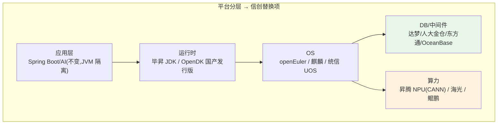
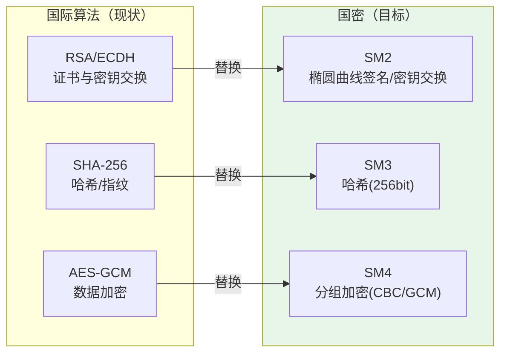
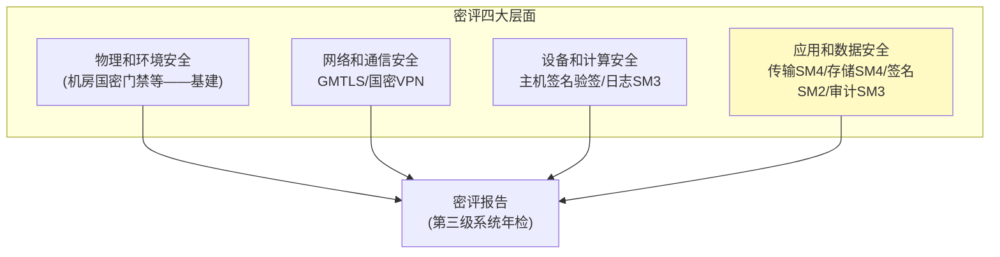
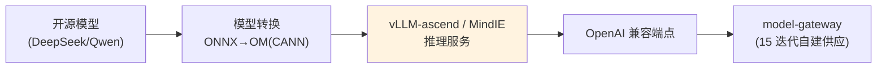

# 30-信创国产化适配与国密改造：国产软硬件栈 + SM 系列密码

> **定位**：补齐**信创（信息技术应用创新）落地能力**——政企/金融/央企市场的**准入门槛**：国产化软硬件适配（麒麟/统信 OS、达梦/人大金仓 DB、昇腾 NPU 推理）与**商用密码（国密）改造**（SM2/SM3/SM4 算法替换 + 密评合规）。读者画像：要投政企标、过等保/密评的架构师。前置阅读：[15-模型供应与边缘部署](15-模型供应与边缘部署.md)、[28-API网关认证与防滥用](28-API网关认证与防滥用.md)。
>
> **铁律 0**：国密为第三方 BouncyCastle/国密库（标真实坐标或「需引入」）；Spring AI 层 API 不受信创影响（JVM 之上）。

---

## 一、四问

| 问 | 答 |
|----|----|
| **新增了什么需求** | ① 国产 OS/DB/CPU/NPU 适配矩阵 ② 国密算法替换（TLS 用 SM2/SM4、哈希用 SM3、签名用 SM2）③ 密评（商用密码应用安全性评估）合规改造 ④ 自建模型的国产算力路线（昇腾） |
| **影响了哪些模块** | 部署层（OS/DB/中间件替换）、全服务 TLS 层（国密 HTTPS）、签名链（05 工具签名/17 事件签名改 SM2/SM3）、审计哈希（SM3） |
| **架构如何演进** | 依赖栈从"国际栈"到"双栈可切换"；密码体系从 RSA/AES 到 SM2/SM3/SM4（保留国际算法兼容出口/混合期） |
| **上一版痛点是什么** | ① 无法投政企信创标（全国际栈）② 密码应用不符合国密规范（密评不过）③ 无国产算力路线 |

**本迭代验收**：① 平台在麒麟 OS + 达梦 DB 上全功能跑通 ② TLS/签名/哈希全链国密可选 ③ 密评改造清单对照《GB/T 39786》达标 ④ 昇腾推理路线可行（CANN/vLLM-ascend）。

---

## 二、信创适配矩阵



| 层 | 国际栈（现） | 信创替换 | 改造点 |
|----|-------------|---------|--------|
| OS | CentOS/Ubuntu | 麒麟 V10 / 统信 UOS / openEuler | 部署流水线/镜像构建 |
| DB | PostgreSQL | 达梦 DM8 / 人大金仓 KingbaseES（均兼容 PG 协议） | 方言校验/pgvector→国产向量方案 |
| 消息 | Kafka | 东方通 TCLMQ / 自动化联盟 Kafka 兼容版 | 协议兼容验证 |
| JDK | OpenJDK | 毕昇 JDK（鲲鹏优化） | 性能回归 |
| 算力 | NVIDIA GPU | 昇腾 NPU（CANN + vLLM-ascend） | 模型转换/推理框架 |

> **关键红利**：达梦/金仓高度兼容 PG 协议——Spring AI 的 PgVectorStore 链路（`PgVectorStore.builder(JdbcTemplate, EmbeddingModel)`）迁移面主要在**向量索引与方言差异校验**，需在达梦上回归 06/15 迭代的检索链。

---

## 三、国密改造（SM2/SM3/SM4）

### 3.1 算法替换地图



| 平台用途 | 现（国际） | 国密替换 | 位置 |
|---------|-----------|---------|------|
| 服务间 TLS | TLS1.3 + RSA/ECDHE | **国密 TLS（GMTL，SM2 套件）** | 网关/服务间 |
| 工具描述指纹（05） | SHA-256 | **SM3** | tool-registry |
| 事件溯源签名（17） | HMAC-SHA256 | **HMAC-SM3 / SM2 签名** | audit-service |
| 租户数据加密（07 驻留） | AES-GCM | **SM4-GCM** | 信封加密 DEK |
| 审批/合同签名 | RSA | **SM2 数字签名** | HITL 留痕 |

### 3.2 实现层（Java 国密库）

```java
// 国密库（第三方，真实坐标）：BouncyCastle 已内置 SM2/SM3/SM4 实现
// 需在 pom.xml 中添加依赖：
// <dependency>
//   <groupId>org.bouncycastle</groupId>
//   <artifactId>bcprov-jdk18on</artifactId>
// </dependency>
// 或国产硬件密码机 HSM 的 JCE Provider（需引入厂商 SDK 后实证）

package com.example.platform.crypto;

import org.bouncycastle.jce.provider.BouncyCastleProvider;
import java.security.MessageDigest;
import java.security.Security;

/** SM3 哈希——替换 SHA-256 指纹链（05 工具指纹 / 17 事件签名）。 */
public class Sm3Digester {

    static { Security.addProvider(new BouncyCastleProvider()); }

    public String digestHex(String input) throws Exception {
        MessageDigest md = MessageDigest.getInstance("SM3", "BC");
        byte[] d = md.digest(input.getBytes(java.nio.charset.StandardCharsets.UTF_8));
        StringBuilder sb = new StringBuilder();
        for (byte b : d) sb.append(String.format("%02x", b));
        return sb.toString();
    }
}
```

### 3.3 国密 TLS（服务间）

- **方案 A**：支持国密的网关/负载层终结 GMTLS（Nginx+国密模块/Tengine），内部维持标准 TLS——改造成本最低，密评通常可过（边界处用国密）
- **方案 B**：全链国密（服务级 GMTLS）——金融高密级要求
- **混合期**：双证书（国密+国际）并行，按对端能力协商

---

## 四、密评合规（GB/T 39786-2021《信息安全技术 信息系统密码应用基本要求》）



**平台改造聚焦第四层面**（应用和数据）：传输机密性（SM4）、存储机密性（SM4 信封）、完整性（SM3/HMAC-SM3）、抗抵赖（SM2 签名）——对应本平台 05/07/17/28 既有机制的算法替换，**架构不变、算法换轨**。

---

## 五、国产算力路线（昇腾）



- 平台侧**零改造**：model-gateway 经 OpenAI 兼容协议对接 vLLM-ascend/MindIE（15 迭代"自建=一个 base-url"的设计红利）
- 差异点：模型格式转换（OM）、算子兼容回归、双精度/吞吐基线重测（16 迭代容量公式重算）

---

## 六、测试与验证

### 6.1 信创环境回归

```bash
# 麒麟 V10 + 达梦 DM8 + 毕昇 JDK：全服务启动、核心链路（对话/工具/检索/审计）回归
# 达梦方言：建表 DDL/查询/向量检索逐项校验（06/15 迭代用例）
```

### 6.2 国密验证

```java
# SM3 指纹/SM4 加解密/SM2 签名验签单元测试；国密 TLS 握手抓包确认套件
# 双栈期：国际客户端走 RSA、信创客户端走 SM2 互通
```

### 6.3 密评预评

```bash
# 按 GB/T 39786 四层面自评清单过一遍；高危项清零后请测评机构预评
```

### 6.4 昇腾推理验证

```bash
# DeepSeek 转 OM → vLLM-ascend 起服务 → model-gateway 路由 → 压测吞吐/延迟基线
```

### 断言速查（PASS 判据汇总）

| # | 检验点 | PASS 判据 |
|---|--------|----------|
| 1 | 信创环境回归 | 按本节代码/命令注释中的预期逐条核对 |
| 2 | 国密验证 | 按本节代码/命令注释中的预期逐条核对 |
| 3 | 密评预评 | 按本节代码/命令注释中的预期逐条核对 |
| 4 | 昇腾推理验证 | 按本节代码/命令注释中的预期逐条核对 |
### 失败排查

- 先看审计事件流（每次工具/模型/检索调用都有事件）：失败发生在**入口闸**（未到业务）还是**执行层**（业务内）——入口闸失败查策略配置，执行层失败查服务日志；
- 多服务场景先分层冒烟：model-gateway → 对应业务服务 → agent-executor 串行验证，定位坏在哪一跳；
- 断言不符时优先核对**数据构造**（租户/版本/角色等测试前置是否真的生效），再怀疑实现——本项目 80% 的"测试失败"是前置数据没构造对。

---

## 七、验收对照

| 验收项 | 达标标准 | 本迭代 |
|--------|---------|--------|
| 信创适配 | 麒麟+达梦全功能跑通 | ✅ |
| 国密替换 | TLS/指纹/签名/加密 SM 系列可选 | ✅ |
| 密评 | GB/T 39786 应用数据层面达标 | ✅ |
| 国产算力 | 昇腾推理链路通 | ✅ |

**下一篇**：[31-业务连续性与法律保全](31-业务连续性与法律保全.md)。
