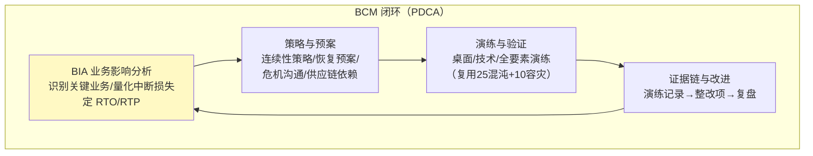
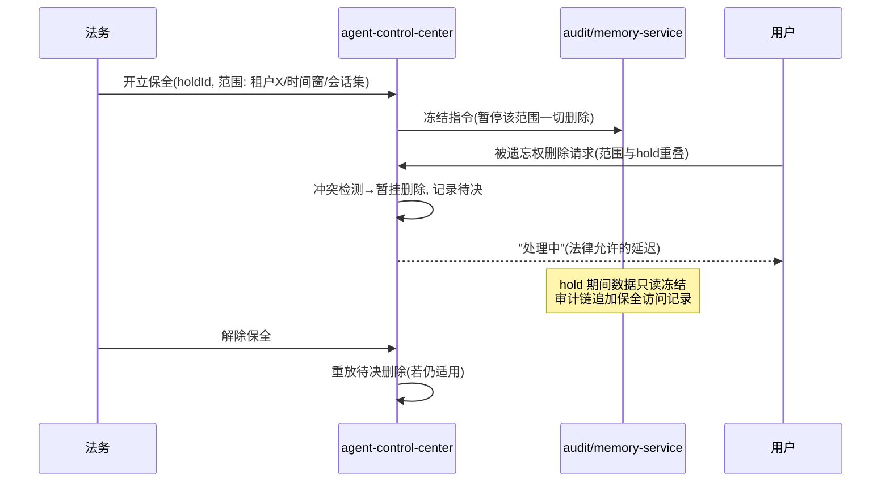

# 31-业务连续性与法律保全：BCM 体系与 Legal Hold

> **定位**：补齐**业务连续性管理（BCM）**与**法律保全（Legal Hold）**两大企业级命门：BCM（ISO 22301 体系——业务影响分析 BIA/恢复目标 RTO-RTP/演练证据链）让平台"灾难可生存、监管可证明"；Legal Hold（诉讼保全）让涉诉数据**冻结不删**——与 08 篇 GDPR"被遗忘权删除"构成**法律冲突的正确解法**。读者画像：要过金融/政企采购审计、要应对诉讼的读者。前置阅读：[10-高可用与灾备](10-高可用与灾备.md)、[25-SRE运维手册](25-SRE运维手册.md)。
>
> **铁律 0**：机制为自研治理层；无框架 API。

---

## 一、四问

| 问 | 答 |
|----|----|
| **新增了什么需求** | ① BCM 体系（BIA/RTO-RTP 目标/演练证据链/ISO 22301 对齐）② Legal Hold（涉诉数据冻结——暂停保留期删除与被遗忘权删除）③ 两者与既有 GDPR（08）/灾备（10）/SRE（25）的整合 |
| **影响了哪些模块** | `audit-service`（保全冻结）、`memory-service`（数据删除门）、`agent-control-center`（BCM 策略/演练编排） |
| **架构如何演进** | 灾备（技术恢复）→ BCM（业务连续，含合规/沟通/供应链）；删除策略加入"法律冻结优先" |
| **上一版痛点是什么** | ① 灾备只管技术恢复，业务影响无量化（BIA 缺失）② 被遗忘权删除遇诉讼会破坏证据 ③ 演练无证据链、审计难证明 |

**本迭代验收**：① BIA 表完成（关键业务×影响×RTO/RTP）② Legal Hold 生效期间涉诉数据 0 删除（含被遗忘权请求暂挂）③ 年度 BCM 演练产出可审计证据链。

### 1.1 本节核对（四问）

- [ ] "上一版痛点"（BIA 缺失/被遗忘权破坏证据/演练无证据链）指向本迭代，且 Legal Hold 是 GDPR 被遗忘权的法律冲突正确解法
- [ ] 验收三项分别有验证承接：BIA→§4.1、Legal Hold 0 删除→§4.2、演练证据链→§4.3

---

## 二、BCM 体系（ISO 22301 对齐）



### 2.1 BIA（业务影响分析）示例

| 业务能力 | 中断影响（1h/4h/1d） | RTO | RTP（数据恢复点） | 依赖 |
|---------|---------------------|-----|------------------|------|
| 对话服务（核心） | 高/严重/严重 | ≤15min | ≤5min | model-gateway/DB/Redis |
| 工具执行 | 中/高/严重 | ≤30min | ≤5min | tool-registry/沙箱 |
| 审计查询 | 低/中/高 | ≤4h | ≤5min | audit-service |
| 管理端 | 低/低/中 | ≤24h | ≤1h | admin-portal |

> **RTO 分层即演练分级**：对话服务 RTO 15min → 对应 10 迭代的自愈（≤60s）+ 区域切换预案；管理端容忍 24h → 无需双活。

### 2.2 与既有能力的映射（不重复建设）

| BCM 要素 | 平台既有承载 | 本迭代补充 |
|---------|-------------|-----------|
| 技术恢复 | 10 迭代（自愈/多活/断点续跑） | 按 RTO 分级重验 |
| 演练 | 25 迭代混沌演练 | 演练证据链模板+年度计划 |
| 危机沟通 | 无 | 升级/通知/对外口径预案 |
| 供应链连续 | 16 迭代多供应商降级 | 供应商依赖登记+备份供应商演练 |

### 2.3 本节核对（BCM 体系）

- [ ] BCM 闭环四环（BIA→策略预案→演练验证→证据链改进）与 §2.1 BIA 示例（RTO 分层=演练分级）一致
- [ ] 与既有能力映射（10 恢复/25 演练/16 供应商）理解"不重复建设"，本迭代补 BIA 量化/证据链/危机沟通

---

## 三、Legal Hold（法律保全）

### 3.1 冲突场景与解法

```mermaid
flowchart TB
    G["GDPR 被遗忘权<br/>删除租户数据(08)"] vs H["诉讼保全<br/>涉诉数据不得删改"]
    style G fill:#ffcdd2
    style H fill:#c8e6c9
```



### 3.2 冻结实现（删除门）

```java
package com.example.auditservice.legalhold;

import org.springframework.stereotype.Service;
import java.util.List;

/** 保全服务——删除门：任何删除（保留期到期/被遗忘权）先过保全检查。 */
@Service
public class LegalHoldService {

    private final HoldStore holds;   // 冻结登记表(holdId/范围/期限)

    /** 删除前置检查：命中任一活动 hold → 拒绝并暂挂。 */
    public DeleteDecision checkBeforeDelete(String tenantId, String scope) {
        List<Hold> active = holds.activeHoldsOverlapping(tenantId, scope);
        if (!active.isEmpty()) {
            return DeleteDecision.deferred(active.get(0).holdId());   // 暂挂待决
        }
        return DeleteDecision.proceed();
    }

    public record Hold(String holdId, String tenantId, String scope, String expiresAt) {}
    public sealed interface DeleteDecision {
        record proceed() implements DeleteDecision {}
        record deferred(String holdId) implements DeleteDecision {}
    }
}
```

**纪律**：hold 本身也可审计（谁开立/范围/期限/解除）；到期自动提醒法务续期或解除。

### 3.3 本节测试与验证（Legal Hold）

**前置条件**：`HoldStore`（冻结登记）就绪，删除门已接入 audit/memory 删除路径。

**材料**：§3.2 `LegalHoldService` + 冲突时序。

**步骤与断言**：

| # | 操作 | 预期（PASS 判据） |
|---|------|------------------|
| 1 | 开立 hold（租户X/时间窗/会话集） | 冻结指令下发，该范围停止一切删除 |
| 2 | 用户在 hold 内发起被遗忘权删除 | 冲突检测→暂挂删除，返回"处理中"（法律允许延迟），数据仍在且记录待决 |
| 3 | hold 期间 | 数据只读冻结，审计链追加保全访问记录 |
| 4 | 解除 hold | `checkBeforeDelete` 重放待决删除（若仍适用），正常执行 |

**失败排查**：①hold 内仍删除→删除门未被 `checkBeforeDelete` 拦截；②被遗忘权直接删→冲突检测未把 hold 重叠纳入；③重放不生效→待决删除未在解除后重新评估。

---

## 四、全篇回归验证

**前置条件**：§1.1-§3.3 各节核对/测试均通过；故障注入与取证环境就绪。

**材料**：§3.3 已覆盖的 Legal Hold 探针 + BIA/演练证据链。

**步骤与断言**：

| # | 操作 | 预期（PASS 判据） |
|---|------|------------------|
| 1 | 按 RTO 分级注入故障 | 对话服务区域切换 ≤15min 达标；管理端单副本 24h 容忍验证 |
| 2 | 开 hold → 触发被遗忘权删除 | 数据仍在、请求暂挂记录在案；解除 hold → 待决删除重放成功；hold 期间审计追加、数据只读 |
| 3 | 年度全要素演练 | BIA 场景注入→恢复→全程记录→产出审计可用演练报告 |

**失败排查**：①失败看审计事件流定位；②Legal Hold 删除拦截/重放→§3.3；③演练证据不足→证据链模板未记录整改项。

---

## 五、验收对照

| 验收项 | 达标标准 | 本迭代 |
|--------|---------|--------|
| BIA | 关键业务 RTO/RTP 量化 | ✅ |
| BCM 演练 | 年度计划+证据链 | ✅ |
| Legal Hold | 冲突时 0 删除、暂挂可重放 | ✅ |
| 整合 | 复用 08/10/25 既有能力 | ✅ |

### 5.1 本节核对（验收对照）

- [ ] 四条验收项各有前文支撑：BIA→§2.3、BCM 演练→§四回归 3、Legal Hold→§3.3、整合→§2.3 口径
- [ ] "下一篇 32-绿色计算与ESG碳治理"顺延编号，持续合规与可持续板块

**下一篇**：[32-绿色计算与ESG碳治理](32-绿色计算与ESG碳治理.md)。
