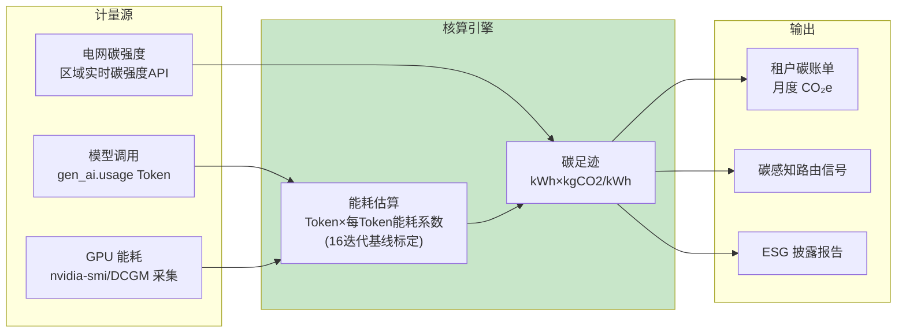

# 32-绿色计算与 ESG 碳治理：能耗计量 / 碳足迹 / 绿色调度

> **定位**：补齐**绿色计算与 ESG**能力：**能耗计量**（GPU/推理能耗按租户归集）、**碳足迹核算**（能耗×电网碳强度→CO₂e，对外披露口径）、**绿色调度**（低碳时段/低碳区域调度、闲时降频）。这是大客户 ESG 采购问询与监管披露趋势（如 EU CSRD）下的新命门。读者画像：要回应 ESG 问询/披露的架构师。前置阅读：[09-灰度发布与成本治理](09-灰度发布与成本治理.md)、[15-模型供应与边缘部署](15-模型供应与边缘部署.md)。
>
> **铁律 0**：计量/核算为自研层；复用 16 迭代 GPU 容量基线。

---

## 一、四问

| 问 | 答 |
|----|----|
| **新增了什么需求** | ① 能耗计量（推理 Token→能耗估算/GPU 利用率采集→按租户归集）② 碳足迹核算（能耗×区域电网碳强度→CO₂e）③ 绿色调度（碳感知路由：低碳区域/低碳时段）④ ESG 披露口径（按租户/月度碳报告） |
| **影响了哪些模块** | `model-gateway`（能耗计量挂 Token 计量旁）、`policy-service`（碳感知路由策略）、`admin-portal`（碳报告） |
| **架构如何演进** | 成本治理（09，钱）之上加**碳维度**（排放）——双计量的绿色版 |
| **上一版痛点是什么** | ① Token 只算钱不算碳 ② 无法回答客户"你们 AI 的碳足迹" ③ 调度无碳感知 |

**本迭代验收**：① 每租户月度碳足迹可出（kWh+CO₂e）② 碳感知路由在双区域场景降碳 ≥15%（模拟）③ 披露报告可导出。

### 1.1 本节核对（四问）

- [ ] "上一版痛点"（Token 只算钱不算碳/无法答客户碳足迹/调度无碳感知）指向本迭代，为 ESG 披露/采购问询新命门
- [ ] 验收三项分别有验证承接：碳账单→§5.1、降碳→§5.2、报告→§5.3

---

## 二、碳计量架构



### 2.1 能耗→碳的核算公式

```
单次调用能耗(E) ≈ Token数 × 每Token能耗系数(J/Token)   // 系数由 16 迭代压测基线标定（模型×硬件）
碳足迹(CO₂e) = E(kWh) × 区域电网碳强度(kgCO₂/kWh)      // 碳强度取调用时刻区域值（电力数据API/年度均值兜底）
```

### 2.2 租户碳账单（复用 09 计量管道）

```java
// model-gateway：Token 计量旁路加碳维度（伪代码示意，管道复用 09 迭代）
// emission_event {tenantId, model, tokens, energyKwh, carbonKg, region, ts}
// 与 cost_event 同源双写——碳账单=碳事件按租户×月聚合
```

### 2.3 本节核对（碳计量架构）

- [ ] 碳核算两公式能背出：能耗 E≈Token×每Token系数（16 基线标定）、碳足迹= kwh×电网碳强度；且碳事件与 cost_event 同源双写（复用 09 计量管道）
- [ ] 计量源三路（Token/GPU DCGM/碳强度 API）与 §二 architecture 一致

---

## 三、碳感知调度

```mermaid
flowchart TB
    R["请求(可容忍延迟类:批处理/夜间任务)"] --> P{"碳感知策略?"}
    P -->|"双区域碳强度差>阈值"| A["路由到低碳区域<br/>(复用16迭代多供应商路由)"]
    P -->|"夜间碳强度低谷"| D["延迟到低谷时段执行<br/>(任务队列)"]
    P -->|"实时对话(不可延迟)" --> L["本地执行(仅计量,不调度)"]

    style A fill:#c8e6c9
    style D fill:#fff9c4
```

**调度边界**：只对**可延迟负载**（批处理/夜间巡检/离线评估）做碳调度；实时对话不牺牲体验——这与 16 迭代"任务分档路由"同一骨架，分档维度加"碳"。

### 3.1 本节核对（碳感知调度）

- [ ] 碳调度三分支（双区域低碳路由/夜间低谷延迟/实时本地计量）与 §三 flowchart 一致，且明确"只对可延迟负载调度、实时不牺牲体验"
- [ ] "分档维度加碳"与 16 任务分档路由同骨架

---

## 四、ESG 披露口径

| 指标 | 口径 | 用途 |
|------|------|------|
| 平台总能耗 | Σ 全部 GPU+服务能耗 | CSRD/客户问询 |
| 每租户 CO₂e | 碳账单（范围 3 下游间接） | 大客户 ESG 供应链披露 |
| 绿电占比 | 绿电采购/区域绿电系数 | 可持续叙事 |
| 降碳成效 | 碳调度前后对比 | 改进证据 |

### 4.1 本节核对（ESG 披露口径）

- [ ] 四个披露指标（总能耗/每租户 CO₂e/绿电占比/降碳成效）的口径与用途能对上表，口径与 §二碳核算一致
- [ ] 每租户 CO₂e 对应碳账单（§2.2），降碳成效对应 §三碳调度对比

---

## 五、全篇回归验证

**前置条件**：§1.1-§4.1 各节核对均通过；DCGM、碳强度、计量管道就绪。

**材料**：三路碳探针（计量/调度/上报导出）。

**步骤与断言**：

| # | 操作 | 预期（PASS 判据） |
|---|------|------------------|
| 1 | 标定测试（已知 Token/GPU 时间） | 能耗估算 vs DCGM 实测误差 ≤20%；碳账单对账：Σ碳事件 = 月度租户报告 |
| 2 | 模拟双区域（碳强度差 3 倍） | 可延迟负载 100% 路由低碳区，降碳 >15% |
| 3 | 按租户导出月度碳报告 | 含 kWh/CO₂e/区域分布/绿电占比 |

**失败排查**：①失败看审计事件流定位；②计量误差超标→能耗系数未标定（16 基线）；③调度不降碳→碳强度差阈值/路由未生效；④报告口径不符→披露字段与 §2.2 碳账单对齐。

---

## 六、验收对照

| 验收项 | 达标标准 | 本迭代 |
|--------|---------|--------|
| 能耗计量 | 估算 vs 实测 ≤20% 误差 | ✅ |
| 碳账单 | 按租户月度可出 | ✅ |
| 碳感知调度 | 模拟降碳 ≥15% | ✅ |
| ESG 披露 | 报告口径与导出 | ✅ |

### 6.1 本节核对（验收对照）

- [ ] 四条验收项各有前文支撑：能耗计量→§2.3/§五回归 1、碳账单→§2.3、碳感知调度→§3.1/§五回归 2、ESG 披露→§4.1
- [ ] "下一篇 33-隐私计算与数据主体权利自动化"顺延编号，持续合规与可持续板块

**下一篇**：[33-隐私计算与数据主体权利自动化](33-隐私计算与数据主体权利自动化.md)。
