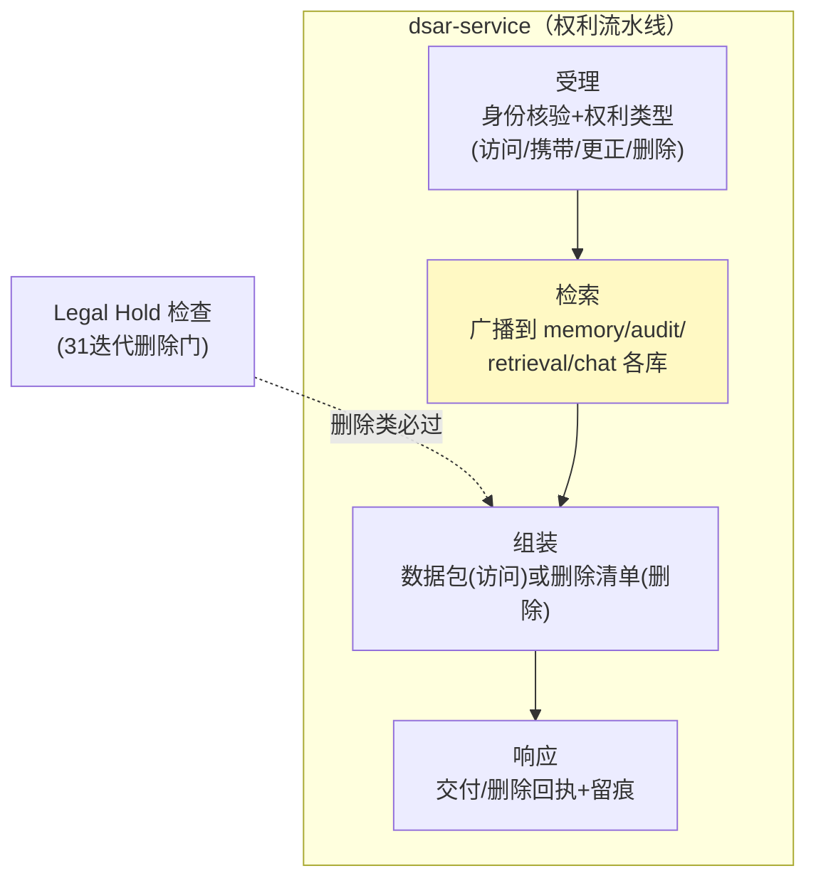
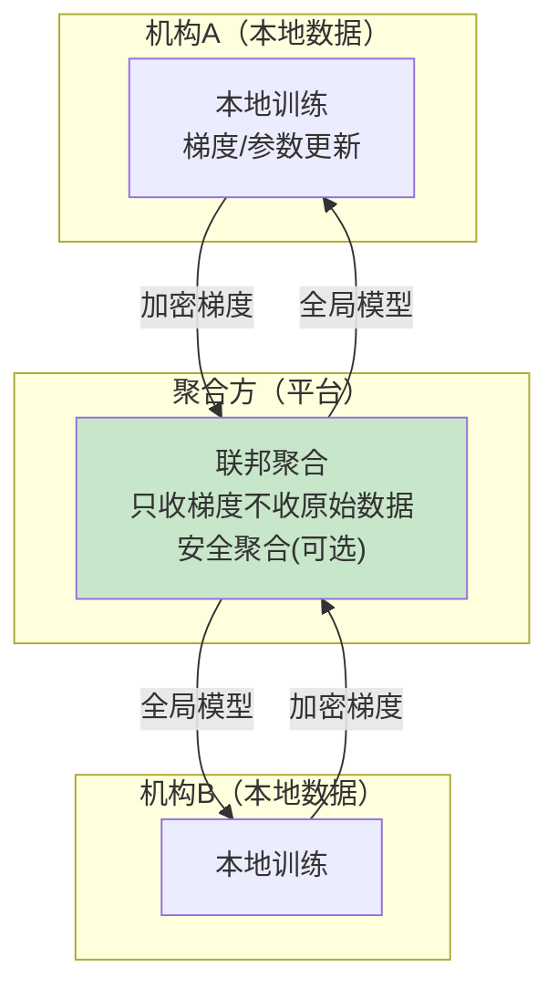
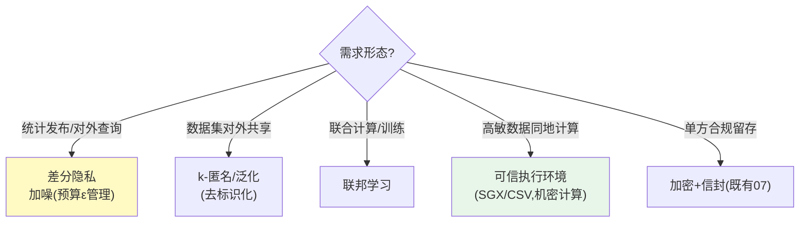

# 33-隐私计算与数据主体权利自动化：DSAR / 联邦学习 / 数据不出域

> **定位**：补齐**隐私计算与数据权利**能力：**DSAR 自动化**（数据主体访问权/可携带权/更正权/删除权的请求受理-检索-响应流水线，GDPR 30 天时限）、**联邦学习**（跨机构联合建模数据不出域）、**隐私增强技术选型**（差分隐私/匿名化 k-匿名/TEE 可信执行环境）。读者画像：跨境/多机构/强监管场景的合规架构师。前置阅读：[08-HITL审批与安全合规](08-HITL审批与安全合规.md)、[31-业务连续性与法律保全](31-业务连续性与法律保全.md)。
>
> **铁律 0**：DSAR 为自研治理层；联邦学习/TEE 为第三方（标真实坐标或「需引入」）。

---

## 一、四问

| 问 | 答 |
|----|----|
| **新增了什么需求** | ① DSAR 自动化（受理→跨库检索→打包→响应，30 天时限 SLA）② 联邦学习（跨机构模型协同、原始数据不出域）③ 隐私增强选型（差分隐私/匿名化/TEE 决策框架） |
| **影响了哪些模块** | 新增 `dsar-service`；`memory/audit/retrieval` 提供按数据主体检索接口；`model-gateway` 预留联邦接入 |
| **架构如何演进** | GDPR 合规（08）从"删除权"扩展为**全权利流水线**；模型层从"集中训练"扩展"联邦可选" |
| **上一版痛点是什么** | ① 数据散落多服务，人工响应 DSAR 超时限 ② 跨机构合作只能拷数据（违规）③ 隐私技术无选型依据 |

**本迭代验收**：① DSAR 全流程 ≤5 个工作日（远低于 30 天法定）② 联邦 PoC：双方各持数据联合训练、原始数据不出域 ③ 选型决策表可复用。

### 1.1 本节核对（四问）

- [ ] "上一版痛点"（DSAR 超时限/跨机构靠拷数据/无选型依据）指向本迭代，且 GDPR 合规（08）从删除权扩展为全权利流水线
- [ ] 验收三项分别有验证承接：DSAR→§5.1、联邦 PoC→§5.2、选型表→§5.3

---

## 二、DSAR 自动化



```java
package com.example.dsarservice;

import org.springframework.stereotype.Service;
import java.util.List;

/** DSAR 流水线——四类权利统一处理；删除类过 LegalHold 删除门（31 迭代）。 */
@Service
public class DsarOrchestrator {

    private final List<SubjectDataPort> ports;      // memory/audit/retrieval/chats 各自实现
    private final LegalHoldClient holdClient;

    public DsarOrchestrator(List<SubjectDataPort> ports, LegalHoldClient holdClient) {
        this.ports = ports;
        this.holdClient = holdClient;
    }

    /** 访问权：聚合全部数据主体的数据 → 打包。 */
    public SubjectDataPackage collect(String subjectId) {
        SubjectDataPackage pkg = new SubjectDataPackage(subjectId);
        for (SubjectDataPort p : ports) {
            pkg.merge(p.exportFor(subjectId));       // 各库导出（含向量库的租户过滤检索）
        }
        return pkg;
    }

    /** 删除权：先过保全门，再广播删除。 */
    public DeletionReceipt delete(String subjectId) {
        for (SubjectDataPort p : ports) {
            String scope = p.scopeOf(subjectId);
            var decision = holdClient.checkBeforeDelete(subjectId, scope);
            if (decision instanceof Deferred d) {    // 命中保全→暂挂
                return DeletionReceipt.deferred(subjectId, d.holdId());
            }
        }
        ports.forEach(p -> p.deleteFor(subjectId));
        return DeletionReceipt.done(subjectId);
    }
    // 端口接口由各数据持有服务实现；record 定义略
}
```

### 2.1 本节测试与验证（DSAR 自动化）

**前置条件**：`dsar-service` 与各 `SubjectDataPort`（memory/audit/retrieval/chats）已实现。

**材料**：§二 `DsarOrchestrator` + §二流水线。

**步骤与断言**：

| # | 操作 | 预期（PASS 判据） |
|---|------|------------------|
| 1 | 造数据主体（会话/记忆/审计/向量库各有数据），提交**访问权** | `collect` 聚合成完整数据包（各端口 exportFor 齐全） |
| 2 | 提交**删除权**（无保全） | 各端口 `deleteFor` 清零，返回 done 回执 |
| 3 | 删除权命中 Legal Hold（31 删除门） | `checkBeforeDelete` 返回 deferred，删除暂挂 |
| 4 | 时限（SLA） | 全流程 <5 工作日 |

**失败排查**：①数据包缺库→某 `SubjectDataPort` 未实现/未注入；②删除越权→删除门未在删除前统一调用；③暂挂不生效→LegalHoldClient 判据与 31 一致；④超时限→广播检索串行慢，改并行聚合。

---

## 三、联邦学习（跨机构数据不出域）



| 要素 | 方案 | 说明 |
|------|------|------|
| 框架 | FATE / Flower（开源，需引入） | 横向/纵向联邦 |
| 安全增强 | 安全聚合/同态加密 | 聚合方也看不到单方梯度 |
| 平台落点 | 模型再训练闭环（13 飞轮）的联邦版 | 评分卡/风控模型跨行联合 |
| 合规依据 | 数据二十条/个保法——"原始数据不出域、数据可用不可见" | 政务/金融联合建模标准话术 |

### 3.1 本节核对（联邦学习）

- [ ] 联邦学习机制（各机构本地训练→只传加密梯度→聚合方安全聚合→回全局模型）能说清，原始数据不出域
- [ ] 要素（FATE/Flower 框架、安全聚合、13 飞轮联邦版、数据二十条）标注第三方需引入坐标

---

## 四、隐私增强技术选型（决策表）



| 技术 | 抗什么 | 代价 | 平台落点 |
|------|--------|------|---------|
| 差分隐私 | 个体重识别（查询/统计） | 精度损失（ε 越小越安全越不准） | 对外统计接口 |
| k-匿名 | 数据集发布链接攻击 | 信息损失 | 脱敏数据集导出 |
| 联邦学习 | 原始数据出域 | 通信/工程复杂 | 跨机构建模 |
| TEE | 运行时窥探（含运维方） | 硬件绑定/证明链 | 高敏工具执行（沙箱升级） |

### 4.1 本节核对（隐私增强选型）

- [ ] 五类需求→技术映射（统计发布→差分隐私、数据集共享→k-匿名、联合训练→联邦、同地高敏→TEE、单方留存→加密信封）与决策表一致
- [ ] 每种技术的"抗什么/代价/平台落点"能对应表，TEE 升级沙箱与 05 工具治理衔接

---

## 五、全篇回归验证

**前置条件**：§1.1-§4.1 各节核对/测试均通过；各数据端口与联邦环境就绪。

**材料**：§2.1 已覆盖的 DSAR 探针 + 联邦/选型。

**步骤与断言**：

| # | 操作 | 预期（PASS 判据） |
|---|------|------------------|
| 1 | 造数据主体，提交访问权/删除权（含开 LegalHold） | 访问包完整；删除正常清零/命中保全暂挂；全流程 <5 工作日 |
| 2 | 两方各持半份风控数据 → FATE/Flower 联合训练 | 全局模型 AUC ≥ 单方基线；抓包仅梯度出域，原始数据 0 泄露 |
| 3 | 用决策表对 3 个真实场景选型 | 给出理由（评审通过），复用选型框架 |

**失败排查**：①失败看审计事件流定位；②DSAR→§2.1；③联邦原始数据泄露→框架/安全聚合配置；④选型争议→决策表分支梳理。

---

## 六、验收对照

| 验收项 | 达标标准 | 本迭代 |
|--------|---------|--------|
| DSAR | 四权利流水线+5 日 SLA | ✅ |
| 联邦 PoC | 数据不出域+模型达标 | ✅ |
| 隐私选型 | 决策表可复用 | ✅ |
| LegalHold 联动 | 删除权过保全门 | ✅ |

### 6.1 本节核对（验收对照）

- [ ] 四条验收项各有前文支撑：DSAR→§2.1、联邦 PoC→§3.1/§五回归 2、隐私选型→§4.1、LegalHold 联动→§2.1
- [ ] "下一篇 34-API生命周期功能开关与资源公平性"顺延编号，持续合规与可持续板块

**下一篇**：[34-API生命周期功能开关与资源公平性](34-API生命周期功能开关与资源公平性.md)。
