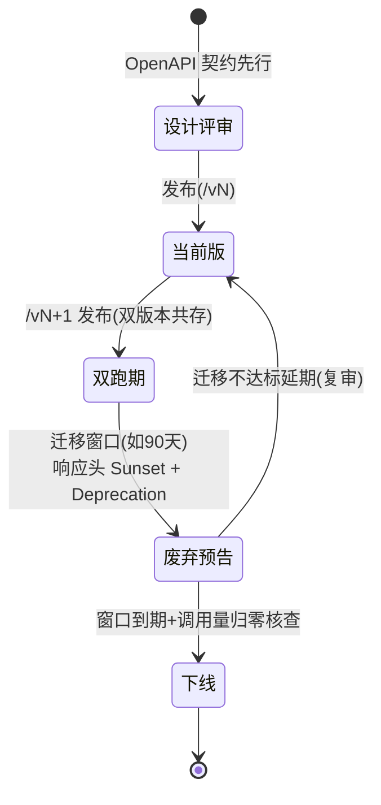
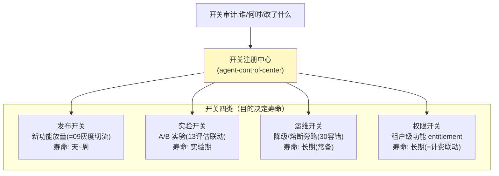
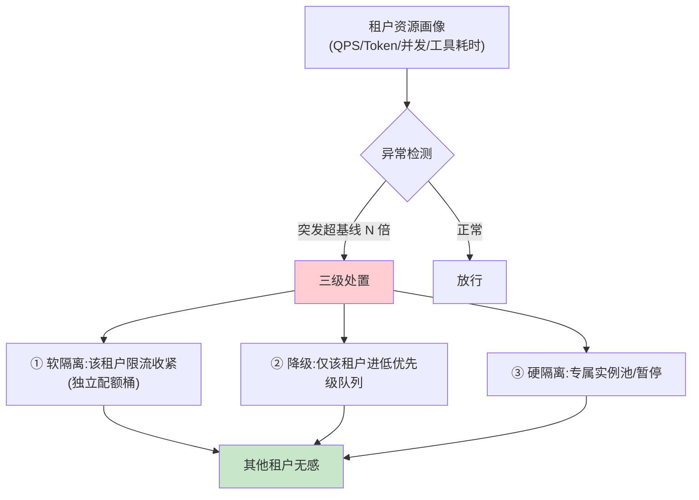

# 34-API 生命周期、功能开关与资源公平性：平台长期演进的三块地基

> **定位**：补齐平台**长期演进的三块治理地基**：**API 生命周期管理**（版本化/废弃 deprecation 政策/破坏性变更流程——业务线依赖的 API 不能说停就停）、**Feature Flags 功能开关体系**（运行时开关与 09 灰度的关系、开关治理防"开关债"）、**资源公平性（Noisy Neighbor 治理）**（单租户异常负载不得拖垮他人——检测/隔离/惩罚）。读者画像：平台跑了一年后"债"开始出现的团队。前置阅读：[09-灰度发布与成本治理](09-灰度发布与成本治理.md)、[26-运营纵深压测微调计费迁移](26-运营纵深压测微调计费迁移.md)。
>
> **铁律 0**：机制为自研治理层。

---

## 一、四问

| 问 | 答 |
|----|----|
| **新增了什么需求** | ① API 版本化与废弃政策（/v1→/v2 迁移窗口/ Sunset 头）② Feature Flags 体系（运行时开关分类/生命周期/开关债治理）③ Noisy Neighbor 检测与公平调度（异常租户隔离不伤无辜） |
| **影响了哪些模块** | `api-gateway`（版本路由/Sunset 头/公平限流）、`agent-control-center`（开关注册中心）、`policy-service`（公平策略） |
| **架构如何演进** | 灰度（09，放量控制）之下补齐**版本共存**与**运行时开关**两层；租户隔离（04）之上补**行为级公平** |
| **上一版痛点是什么** | ① API 升级即破坏业务线 ② 功能发布无运行时关闭手段（出事只能回滚部署）③ 个别租户突发流量拖垮共享服务 |

**本迭代验收**：① /v1→/v2 无停机迁移窗口跑通（Sunset 头+双跑 90 天政策）② 开关全生命周期登记（出生-退役 ≤90 天清理）③ 注入异常租户负载，其他租户 P99 波动 ≤10%。

---

## 二、API 生命周期管理



```yaml
# 废弃政策示例（网关层统一注入）
# 响应头：
#   Deprecation: version="v1"
#   Sunset: Wed Sep 30 2026 23:59:59 GMT+0000 (RFC 8594)
# 迁移文档：/docs/api/migration/v1-to-v2
```

**纪律**：破坏性变更必须升主版本号；双跑期按调用量动态评估（Sunset 前 30 天仍 >阈值则延期并复审）；下线前对未迁移调用方逐户通知（复用审计的调用方画像）。

---

## 三、Feature Flags 功能开关体系

### 3.1 开关分类（与 09 灰度的关系）



### 3.2 开关债治理

| 规则 | 说明 |
|------|------|
| 登记出生 | 开关创建即登记（owner/目的/预期寿命/清理日期） |
| 到期清理 | 发布/实验类到期自动进清理清单（≤90 天硬上限） |
| 默认值纪律 | 清理=删代码（默认值固化），不是"永远开着" |
| 爆炸半径 | 每请求组合开关数上限（防组合爆炸不可测） |

---

## 四、Noisy Neighbor 资源公平性

### 4.1 检测与处置



### 4.2 公平实现要点

| 层 | 手段 | 复用 |
|----|------|------|
| 网关 | 每租户独立限流桶（04 已有）→ 异常时**动态收紧** | 04 迭代限流 |
| 执行 | 每租户并发/Token 配额（04）→ 超限进**该租户自己的**排队，不占公共池 | 12 迭代 flatMap 限流 |
| 工具 | 长耗时工具按租户隔离信号量 | 05 迭代沙箱限额 |
| 判定 | 基线画像（7 天滑动）+ 突变检测，防误伤大促报备场景 | 25 迭代容量基线 |

```java
// policy-service：租户级公平处置（伪代码示意）
// detect(tenant).spike() → tightenQuota(tenant, factor) / degrade(tenant, LOW_PRIORITY)
// 关键：处置只作用于异常租户，公共池水位不受单租户影响
```

---

## 五、测试与验证

### 5.1 API 迁移测试

```bash
# /v1 流量双跑期→v2 切流→Sunset 头生效→到期下线（模拟 90 天压缩为演练时间窗）
# 未迁移调用方收到 Deprecation 头+通知
```

### 5.2 开关治理测试

```java
# 创建发布开关→放量→默认值固化→90 天清理清单自动出现→删代码
# 组合开关数超限被拒
```

### 5.3 公平性测试

```bash
# 租户A 突发 10 倍流量 → 断言：A 被收紧/降级；租户B/C P99 波动 ≤10%
# 大促报备场景：白名单租户不受误伤
```

### 断言速查（PASS 判据汇总）

| # | 检验点 | PASS 判据 |
|---|--------|----------|
| 1 | API 迁移测试 | 按本节代码/命令注释中的预期逐条核对 |
| 2 | 开关治理测试 | 按本节代码/命令注释中的预期逐条核对 |
| 3 | 公平性测试 | 租户A 突发 10 倍流量 → 断言：A 被收紧/降级；租户B/C P99 波动 ≤10% |
### 失败排查

- 先看审计事件流（每次工具/模型/检索调用都有事件）：失败发生在**入口闸**（未到业务）还是**执行层**（业务内）——入口闸失败查策略配置，执行层失败查服务日志；
- 多服务场景先分层冒烟：model-gateway → 对应业务服务 → agent-executor 串行验证，定位坏在哪一跳；
- 断言不符时优先核对**数据构造**（租户/版本/角色等测试前置是否真的生效），再怀疑实现——本项目 80% 的"测试失败"是前置数据没构造对。

---

## 六、验收对照

| 验收项 | 达标标准 | 本迭代 |
|--------|---------|--------|
| API 生命周期 | 版本共存+Sunset+无停机迁移 | ✅ |
| Feature Flags | 四类分治+90 天清理纪律 | ✅ |
| Noisy Neighbor | 异常租户隔离、他人 P99 波动 ≤10% | ✅ |
| 复用 | 与 04/09/12/25/30 既有机制整合 | ✅ |

**下一篇**：[35-工业前沿调研与特性补充](35-工业前沿调研与特性补充.md)——全项目收官。
