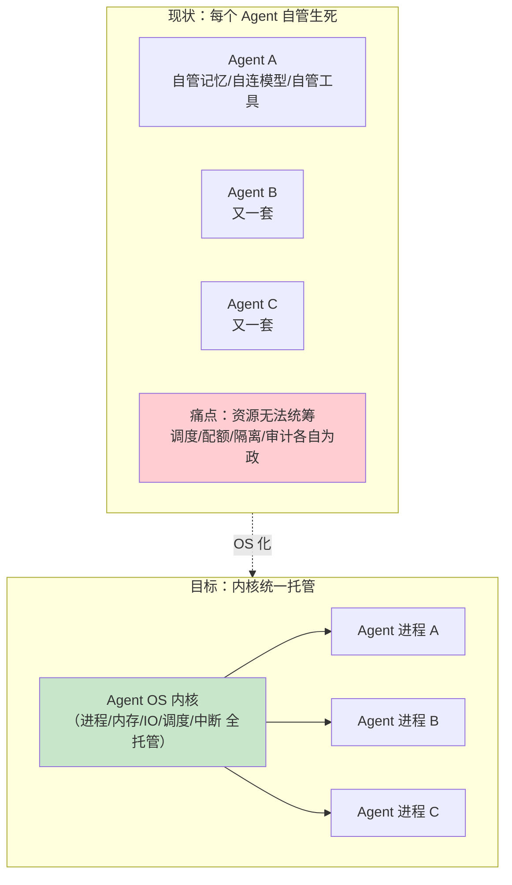
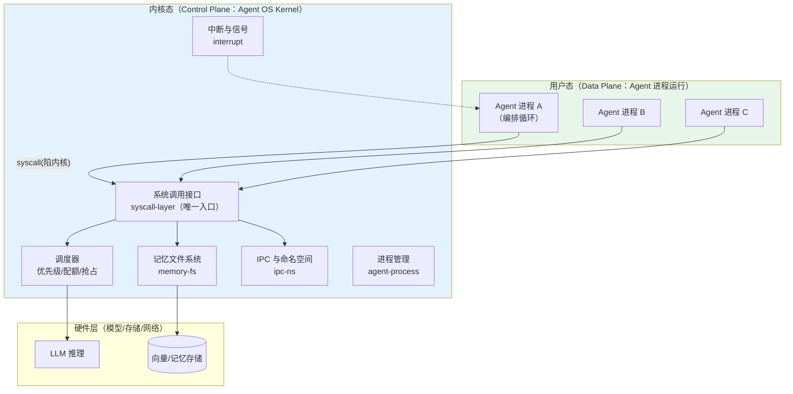
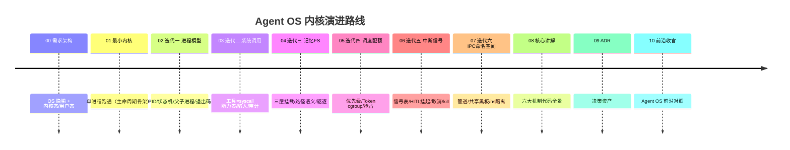

# 00-需求分析与架构设计：企业级 Agent 操作系统内核

> **定位**：本文是《企业级 Agent 操作系统内核》的奠基篇——用**操作系统隐喻**重新组织一个管控分离的多微服务 Agent 平台：**Agent=进程、工具=系统调用、记忆=文件系统、调度=内核态管控面**。它回答"当成百上千个长生命周期 Agent 在企业里并发运行时，需要什么样的'操作系统'来托管它们"。读者画像：已理解管控分离（可先读 [教程 04-企业级架构主干/00-管控分离架构]）、想从**运行时/内核视角**设计 Agent 基础设施的 Java 架构师。前置阅读：[教程 04-企业级架构主干/00-管控分离架构]、[教程 02-SpringAI核心机制/02-Agent状态管理]、[教程 08-架构师进阶/06-长任务持久化与中断恢复]。
>
> **铁律 0**：本文 Spring AI 2.0.0 代码/配置均经本地 jar `javap` 实证（`scripts/api-baseline-spring-ai-2.0.0.md` 为 ground truth）；未实证写法标「概念代码」。本项目与项目 14 互补：14=企业平台视角（业务治理全景），15=内核视角（运行时机制深钻）——两者独立，互不引用。

---

## ★ 阅读顺序总览（序号 = 你的实际阅读顺序）

> 本子文件夹 14 个文件，**文件名编号 00-15 即阅读顺序**（08-10 为进阶迭代，13-15 为讲解/ADR/前沿）：

| 阶段 | 文件 | 读者定位 |
|------|------|---------|
| ① 全貌 | 00-需求分析与架构设计 | **先读**：OS 隐喻、内核态/用户态分离、迭代路线 |
| ② 起步 | 01-最小内核 Demo | **动手**：单 Agent 进程跑通 |
| ③ 主体迭代 | 02~07（进程/系统调用/记忆FS/调度配额/中断信号/IPC命名空间） | **严格顺序**：六大内核机制逐层搭建 |
| ③+ 进阶迭代 | 08~10（进程编排守护/内核安全沙箱/分布式内核HA） | **进阶**：fork-join、沙箱四件套、内核多实例/迁移/热升级 |
| ④ 代码讲解 | 11-核心代码讲解 | **回顾**：内核六大机制代码全景 |
| ⑤ 决策资产 | 12-ADR架构决策记录 | **按需查阅**：改内核前先查 |
| ⑥ 前沿收官 | 13-工业前沿与演进方向 | **扩展**：Agent OS 前沿对照 |

---

## 一、为什么需要"Agent 操作系统"

### 1.1 问题：Agent 数量爆炸后的托管真空

当成百上千个**长生命周期** Agent 并发运行（个人助理、值班风控、巡检机器人……），每个 Agent 需要：生命周期管理、记忆存储、工具访问、算力配额、人机中断、相互通信——**这恰好是操作系统四十年解决的问题域**。借 OS 隐喻不是为了花哨，而是因为它是"多进程共享资源"最成熟的答案。

### 1.2 OS 概念 → Agent 平台映射

| OS 概念 | Agent 平台对应 | 本项目模块 |
|---------|---------------|-----------|
| 进程/线程 | Agent 实例（生命周期：创建/就绪/运行/挂起/终止） | `agent-process` |
| 系统调用 | 工具/能力（统一入口、权限检查、陷入内核态） | `syscall-layer` |
| 文件系统 | 记忆（会话/长期/语义的分层"挂载"） | `memory-fs` |
| 调度器 + cgroup | 算力/Token 配额、优先级、抢占 | `scheduler` |
| 中断/信号 | HITL 审批、外部事件、取消、超时 kill | `interrupt` |
| IPC + 命名空间 | Agent 间通信、租户/命名空间隔离 | `ipc-ns` |
| 内核态/用户态 | **管控面（内核）/数据面（用户态）**——本项目管控分离的对应 | control/data plane |

### 一.1 本节核对（OS 隐喻与映射）

- [ ] 能不看正文复述七行映射中至少五条（进程/系统调用/文件系统/调度+配额/中断+信号/IPC+命名空间/内核态用户态）
- [ ] 问题场景（Agent 数量爆炸后托管真空）与结论（借 OS 成熟答案）能对应——"为什么借 OS 隐喻"

---

## 二、四问（需求分析阶段）

| 问 | 答 |
|----|----|
| **新增了什么需求** | 明确内核边界：进程模型、系统调用、记忆 FS、调度配额、中断信号、IPC 命名空间——六大机制 + 内核态/用户态分离 |
| **影响了哪些模块** | 新平台 |
| **架构如何演进** | 本文定目标架构 → 01 最小内核 → 02-07 六大机制逐层搭 |
| **上一版痛点** | Agent 各自为政、资源无法统筹（§1.1） |

### 二.1 本节核对（四问）

| # | 核对项 | 判据 |
|---|--------|------|
| 1 | 四问齐备 | 需求/影响模块/架构演进/痛点均有答，且痛点与 §1.1 一致 |
| 2 | 范围克制 | 本文只定"目标架构 + 迭代路线"，不做码；演进到 01 最小内核起步（不越序） |

---

## 三、内核架构：内核态 = 管控面

**内核态/用户态纪律**（对应管控分离铁律）：
- Agent 进程**不能**绕过 syscall 层直接摸模型/存储——一切资源访问陷入内核（管控面做权限/配额/审计）
- 内核保持**小而稳**：机制在内核、策略可插拔（调度策略/记忆驱逐策略经配置下发）

### 三.1 本节核对（内核态/用户态分离）

| # | 核对项 | 判据 |
|---|--------|------|
| 1 | 管控/数据面边界 | 图中用户态进程全部经 syscall 陷入内核态，无进程直连模型/存储的边 |
| 2 | 两条纪律 | "不能绕过 syscall（管控面鉴权/配额/审计）"与"机制在内核、策略可插拔"均能被正文复述 |

---

## 四、微服务清单

| 服务 | 平面 | 职责 | 对应 OS | 迭代 |
|------|------|------|---------|------|
| `agent-process` | Control | Agent 实例生命周期（PID/状态机/父子进程） | 进程管理 | 02 |
| `syscall-gateway` | Control | 统一能力入口（工具调用=陷入内核） | 系统调用 | 03 |
| `memory-fs` | Data | 分层记忆存储（挂载/路径/缓存/驱逐） | 文件系统 | 04 |
| `scheduler` | Control | 优先级调度/配额/抢占 | 调度器+cgroup | 05 |
| `interrupt-hub` | Control | 信号投递/HITL 挂起/取消/超时 | 中断 | 06 |
| `ipc-ns` | Data+Control | Agent 间通信 + 租户命名空间隔离 | IPC+ns | 07 |
| `kernel-obs` | Data | 内核观测（进程表/syscall trace） | /proc | 06 |

### 四.1 本节核对（微服务清单）

| # | 核对项 | 判据 |
|---|--------|------|
| 1 | 服务来自映射 | 七项服务与 §一.1 的 OS 概念映射一一对应，控制/数据平面标注与"内核态=管控面"一致 |
| 2 | 迭代落点 | 每项服务的"迭代"列（02-07）与后续迭代篇主题对应，无错位 |

---

## 五、迭代路线

### 五.1 本节核对（迭代路线）

- [ ] timeline 每个节点与 01-10 各篇标题一一对应、无缺漏错位（00→需求架构、01→最小内核、02-07→六机制、08-10→讲解/ADR/前沿）
- [ ] 六机制顺序（进程→syscall→记忆FS→调度→中断→IPC）与后续各篇阅读顺序一致

---

## 六、量化验收（项目级）

| 类别 | 指标 | 目标 |
|------|------|------|
| 进程 | 并发 Agent 进程 | ≥1000/集群 |
| 进程 | 进程创建延迟 | ≤50ms |
| syscall | 工具调用经内核开销 | ≤10ms 增量 |
| 调度 | 高优先级进程唤醒 | ≤100ms |
| 记忆 | 命中热记忆读写 | ≤20ms |
| 可靠性 | 单进程崩溃不影响内核与他人 | 100% |
| 审计 | syscall 100% 可追溯 | 100% |

### 六.1 本节核对（量化验收）

| # | 核对项 | 判据 |
|---|--------|------|
| 1 | 指标可度量 | 七项验收均为可量化目标（并发数/延迟/开销/峰值/命中/可靠率/追溯率），非定性描述 |
| 2 | 验收有承接 | 每项指标能在后续某个迭代篇的回归表中找到对应（如 ≤10ms→03、≤100ms/≤20ms→05/04、100%→03/06） |

---

## 七、与教程体系的锚点

| 教程 | 落点 |
|------|------|
| [教程 04-企业级架构主干/00-管控分离架构] | 内核态/用户态=管控/数据面 |
| [教程 00-基础与核心/03-工具调用] | syscall 层的工具循环 |
| [教程 00-基础与核心/04-记忆与会话管理]、[教程 08-架构师进阶/05-高级记忆架构] | memory-fs 分层 |
| [教程 04-企业级架构主干/08-Human-in-the-Loop与审批流] | 中断信号（SIG_APPROVE） |
| [教程 00-基础与核心/09-多Agent协作] | IPC/共享黑板 |
| [教程 04-企业级架构主干/06-多租户隔离与资源治理] | 命名空间/cgroup 配额 |
| [教程 08-架构师进阶/06-长任务持久化与中断恢复] | 进程挂起/恢复 |

### 七.1 本节核对（教程锚点）

- [ ] 七个教程锚点覆盖六机制 + 管控分离，每条能指出对应机制（20→管控面/03→syscall/04·39→记忆/28→SIG_APPROVE/09→IPC/26→ns·配额/40→挂起恢复）
- [ ] 锚点均为真实体系篇目，无虚构引用

---

## 八、总结

Agent OS 内核把"多 Agent 共享资源"这个老化问题映射到操作系统四十年成熟答案上：**六大机制（进程/syscall/记忆FS/调度/中断/IPC-ns）+ 内核态用户态分离**。下一篇从最小内核跑起。

### 八.1 本节核对（总结）

> 一句话核对：总结点出的"六大机制 + 内核态/用户态分离"与 §1.2 映射、§三 架构、§五 迭代路线口径一致即 PASS。

**下一篇**：[01-最小内核Demo搭建](01-最小内核Demo搭建.md)。
