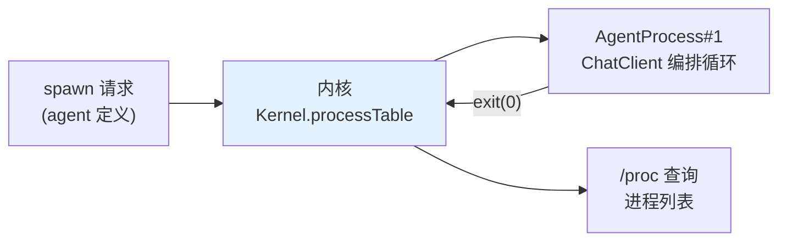

# 01-最小内核 Demo：第一个 Agent 进程

> **定位**：跑通**最小内核**——一个 Agent 进程从创建（spawn）到运行（ChatClient 编排循环）到退出（exit code）的完整骨架，内核持有进程表。其余五大机制（syscall/记忆FS/调度/中断/IPC）后续迭代叠加。读者画像：想动手看到"进程被内核托管"的开发者。前置阅读：[00-需求分析与架构设计](00-需求分析与架构设计.md)。
>
> **铁律 0**：代码经 javap 实证（ChatClient/ChatModel 等）。

---

## 一、四问

| 问 | 答 |
|----|----|
| **新增了什么需求** | 最小闭环：内核 spawn 一个 Agent 进程→进程用 ChatClient 跑一轮编排→exit；进程表可查 |
| **影响了哪些模块** | 新单体 `agent-kernel`（内核雏形） |
| **架构如何演进** | 无 → 进程骨架 + 进程表 |
| **上一版痛点** | 无（首个版本） |

**本迭代验收**：① spawn→run→exit 全程进程表状态可见 ② 进程崩溃内核不崩 ③ 进程退出码可查。

### 一.1 本节核对（需求与验收范围）

- [ ] 能一句话说清"最小内核"是什么：内核持进程表 + spawn/run/exit 骨架，其余五机制留待后续迭代
- [ ] 本迭代三次验收（状态可见/崩溃不崩/退出码可查）与后续 §四 断言一一对应

---

## 二、最小内核形态



### 二.1 本节核对（最小内核形态）

| # | 核对项 | 判据 |
|---|--------|------|
| 1 | 数据流闭环 | spawn 请求 → 内核 processTable → 进程运行 → exit 回内核 → /proc 可查，图中路径完整无断裂 |
| 2 | 内核职责 | 图中心 `Kernel.processTable` 是唯一持有进程状态的组件（进程不绕开内核） |

## 三、最小工程骨架（编译运行验证载体）

> **概念内核声明**：本系列各篇代码是**概念内核**——机制语义优先（进程表/syscall/中断等隐喻落地），不追求 OS 级完备；本节工程骨架的唯一职责，是给各篇"本节测试与验证"的**最小可执行载体**（JUnit 测试）提供可编译、可运行的 Spring Boot 容器。02-10 各篇的验证载体均跑在这同一骨架上。

**pom 依赖清单**（Boot 4.1.0 / Java 21 / Spring AI 2.0.0；测试依赖 `spring-boot-starter-test` 在各篇验证节标注）：

```xml
<parent>
    <groupId>org.springframework.boot</groupId>
    <artifactId>spring-boot-starter-parent</artifactId>
    <version>4.1.0</version>
</parent>
<properties>
    <java.version>21</java.version>
    <spring-ai.version>2.0.0</spring-ai.version>
</properties>
<dependencyManagement>
    <dependencies>
        <dependency>
            <groupId>org.springframework.ai</groupId>
            <artifactId>spring-ai-bom</artifactId>
            <version>${spring-ai.version}</version>
            <type>pom</type>
            <scope>import</scope>
        </dependency>
    </dependencies>
</dependencyManagement>
<dependencies>
    <dependency>
        <groupId>org.springframework.boot</groupId>
        <artifactId>spring-boot-starter-webflux</artifactId>
    </dependency>
    <dependency>
        <groupId>org.springframework.ai</groupId>
        <artifactId>spring-ai-starter-model-openai</artifactId>
    </dependency>
    <dependency>
        <groupId>org.projectlombok</groupId>
        <artifactId>lombok</artifactId>
        <scope>provided</scope>
    </dependency>
</dependencies>
```

**两段式配置**（主配置只管导入与 profile，环境差异进 profile 专属文件）：

```yaml
# src/main/resources/application.yaml —— 仅两件事：导入 .env + 激活 profile
spring:
  config:
    import: optional:file:.env[.properties]
  profiles:
    active: kernel
```

```yaml
# src/main/resources/application-kernel.yaml —— kernel profile 专属：端口 + 模型
server:
  port: 8081
spring:
  ai:
    openai:
      base-url: ${OPENAI_BASE_URL:https://api.deepseek.com}
      api-key: ${OPENAI_API_KEY}
      chat:
        model: deepseek-chat
```

**主类**（内核以 Spring Boot 容器承载，启动即内核就绪）：

```java
package com.example.kernel;

import org.springframework.boot.SpringApplication;
import org.springframework.boot.autoconfigure.SpringBootApplication;

@SpringBootApplication
public class KernelApplication {

    public static void main(String[] args) {
        SpringApplication.run(KernelApplication.class, args);
    }
}
```

**ChatClient 构建配置类**（javap 实证：`ChatClient.Builder` 由 Boot 自动装配注入）：

```java
package com.example.kernel.config;

import org.springframework.ai.chat.client.ChatClient;
import org.springframework.context.annotation.Bean;
import org.springframework.context.annotation.Configuration;

@Configuration
public class KernelConfig {

    @Bean
    ChatClient chatClient(ChatClient.Builder builder) {
        return builder
                .defaultSystem("你是被内核托管的 Agent 进程，按指令完成任务后正常退出。")
                .build();
    }
}
```

**编译与启动命令**：

```bash
export OPENAI_API_KEY=sk-xxx                                # 或写入项目根 .env（经 spring.config.import 导入）
mvn clean compile                                           # 编译通过 = 骨架就绪
mvn spring-boot:run -Dspring-boot.run.profiles=kernel       # 以 kernel profile 启动内核（端口 8081）
```

### 三.1 本节核对（最小工程骨架）

- [ ] 骨架四件（pom 两依赖一 BOM / 两段式配置 / KernelApplication / KernelConfig）齐备，`mvn clean compile` 通过
- [ ] "概念内核"定位说得出：骨架只为验证载体提供容器，机制学习以各篇核心代码为准

---

## 四、核心代码

### 4.1 进程定义（PID + 状态机）

```java
package com.example.kernel.process;

import lombok.extern.slf4j.Slf4j;

import java.time.Instant;
import java.util.concurrent.atomic.AtomicLong;

/** Agent 进程——最小骨架：PID、状态机、退出码。 */
@Slf4j
public class AgentProcess implements Runnable {

    public enum State { CREATED, RUNNING, SUSPENDED, EXITED }

    private static final AtomicLong PID_GEN = new AtomicLong(1);

    private final long pid = PID_GEN.getAndIncrement();
    private final String agentName;
    private volatile State state = State.CREATED;
    private volatile int exitCode = -1;

    private final org.springframework.ai.chat.client.ChatClient chatClient;

    public AgentProcess(String agentName, org.springframework.ai.chat.client.ChatClient chatClient) {
        this.agentName = agentName;
        this.chatClient = chatClient;   // javap 实证：ChatClient 由 Builder 构建
    }

    @Override
    public void run() {
        state = State.RUNNING;
        try {
            // 编排循环（最小版：单轮；02 迭代扩成多轮/挂起/恢复）
            String reply = chatClient.prompt()
                    .system("你是内核托管的 Agent 进程 " + agentName)
                    .user("执行你的任务")
                    .call().content();          // javap 实证：CallResponseSpec.content()
            log.info("[pid={}] {}", pid, reply);   // 本迭代 log 占位；正式输出通道（观测事件流）见 [06-中断与信号系统 §五]
            exit(0);
        } catch (Exception e) {
            exit(1);   // 进程崩溃：内核不崩（关键纪律）
        }
    }

    public synchronized void exit(int code) {
        this.exitCode = code;
        this.state = State.EXITED;
    }

    // getter（完整）
    public long pid() { return pid; }
    public String agentName() { return agentName; }
    public State state() { return state; }
    public int exitCode() { return exitCode; }
    public Instant createdAt() { return createdAt; }
    private final Instant createdAt = Instant.now();
}
```

### 4.2 内核与进程表

```java
package com.example.kernel;

import com.example.kernel.process.AgentProcess;
import java.util.List;
import java.util.Map;
import java.util.concurrent.*;

/** 最小内核——进程表 + spawn + /proc 查询。 */
public class AgentKernel {

    private final Map<Long, AgentProcess> processTable = new ConcurrentHashMap<>();
    private final ExecutorService runners = Executors.newVirtualThreadPerTaskExecutor();  // Java 21 虚拟线程：进程天然映射

    public long spawn(String agentName, org.springframework.ai.chat.client.ChatClient chatClient) {
        AgentProcess p = new AgentProcess(agentName, chatClient);
        processTable.put(p.pid(), p);
        runners.submit(p);   // 虚拟线程承载——单进程崩溃不影响内核
        return p.pid();
    }

    /** /proc：进程列表快照。 */
    public List<String> proc() {
        return processTable.values().stream()
                .map(p -> "pid=%d name=%s state=%s exit=%d"
                        .formatted(p.pid(), p.agentName(), p.state(), p.exitCode()))
                .toList();
    }
}
```

> **设计要点**：Agent 进程映射到**虚拟线程**（[附录 00-Java21新特性/00-虚拟线程]）——轻量（千级并发无压力）、阻塞式写法亲和编排循环；02 迭代引入挂起/恢复后再谈响应式内核。

### 4.3 本节测试与验证（核心代码可运行）

**前置条件**：最小内核（spawn/状态迁移//proc 视图/退出码记录）已按 §四 实现，虚拟线程承载进程。

**材料 A——异常进程脚本**：进程任务第 2 步抛 `RuntimeException`（触发 §4.1 `run()` 的 catch 分支；测试中用 `null` ChatClient 等价触发 NPE→catch 路径）。

**步骤与断言**：

| # | 操作 | 预期（PASS 判据） |
|---|------|------------------|
| 1 | spawn 两个进程（含一个会失败） | /proc 状态依次 CREATED→RUNNING→EXITED（正常）/EXITED(exit=1)（异常） |
| 2 | 材料A 进程异常 | exit=1；内核存活；另一进程不受影响正常完成 |
| 3 | 查询退出进程 | 退出码+耗时+步骤数可查 |

**最小可执行载体**（不依赖真实 LLM：正常路径用 Proxy 环回桩，异常路径用 `null` 触发 catch；pom 需引入 `spring-boot-starter-test`，scope=test——**需在 pom.xml 中添加依赖**）：

```java
package com.example.kernel;

import org.junit.jupiter.api.Test;
import org.springframework.ai.chat.client.ChatClient;

import java.lang.reflect.Proxy;

import static org.assertj.core.api.Assertions.assertThat;

class AgentKernelTest {

    /** 环回桩：prompt() 链一路返回自身，content() 回 "echo-ok"——进程可真实跑完 run() 全程。 */
    private static ChatClient echoStub() {
        Object chain = Proxy.newProxyInstance(ChatClient.class.getClassLoader(),
                new Class<?>[]{ChatClient.ChatClientRequestSpec.class, ChatClient.CallResponseSpec.class},
                (proxy, method, args) -> "content".equals(method.getName()) ? "echo-ok" : proxy);
        return (ChatClient) Proxy.newProxyInstance(ChatClient.class.getClassLoader(),
                new Class<?>[]{ChatClient.class},
                (proxy, method, args) -> "prompt".equals(method.getName()) ? chain : proxy);
    }

    /** 轮询至目标进程 EXITED（虚拟线程异步跑，中间态瞬时），返回其 /proc 行。 */
    private static String awaitExitLine(AgentKernel kernel, String pidKey) throws InterruptedException {
        for (int i = 0; i < 50; i++) {                       // 上限 ~5s
            for (String line : kernel.proc()) {
                if (line.startsWith(pidKey) && line.contains("state=EXITED")) return line;
            }
            Thread.sleep(100);
        }
        throw new IllegalStateException("5s 内未见 EXITED: " + pidKey);
    }

    @Test
    void spawnRunExit_生命周期与proc可见() throws Exception {
        AgentKernel kernel = new AgentKernel();
        long pid = kernel.spawn("echo-agent", echoStub());
        // 断言 ①③：终态可见、退出码 0 可查（对应 §4.2 proc() 的 "pid=.. name=.. state=.. exit=.." 格式）
        assertThat(awaitExitLine(kernel, "pid=" + pid)).contains("state=EXITED").contains("exit=0");
    }

    @Test
    void 进程崩溃_内核不崩且exit1() throws Exception {
        AgentKernel kernel = new AgentKernel();
        long good = kernel.spawn("echo-agent", echoStub());
        long bad = kernel.spawn("bad-agent", null);          // 材料A：null ChatClient → NPE → catch → exit(1)
        // 断言 ②：异常进程 exit=1，好进程不受影响照常 exit=0，内核仍能应答 /proc 查询（存活）
        assertThat(awaitExitLine(kernel, "pid=" + bad)).contains("exit=1");
        assertThat(awaitExitLine(kernel, "pid=" + good)).contains("exit=0");
        assertThat(kernel.proc()).isNotEmpty();
    }
}
```

**载体执行命令与预期**：

```bash
mvn test -Dtest=AgentKernelTest
# 预期：Tests run: 2, Failures: 0, Errors: 0, Skipped: 0
```

**失败排查**：①异常带崩内核→进程体没隔离在独立 try 边界（虚拟线程异常未捕获，应为每个进程包独立 try/catch）；③不可查→EXITED 记录被立即清除（应保留 TTL，进程从进程表移除改为延迟回收）；④测试挂起 5s 超时→`echoStub()` 桩未生效（真实调了 LLM：检查 `prompt()` 分发名拼写）。

## 五、全篇回归验证

> 各节验证材料与断言已上移至 §4.3（本节测试与验证）；本表为整篇最小内核的回归验收，不重复材料。

| # | 验收项 | 标准 |
|---|--------|------|
| 1 | 生命周期 | spawn→run→exit 全程进程表状态可见 |
| 2 | 隔离 | 进程崩溃内核不崩（虚拟线程独立承载） |
| 3 | /proc | 进程表快照可查（pid/状态/退出码） |

## 六、本迭代痛点

① 进程是"裸跑"的——工具直连、无配额（→03 syscall）② 记忆在进程内自管（→04 记忆FS）③ 无法挂起恢复（→02/06）

### 六.1 本节核对（痛点与三问对齐）

- [ ] 三条痛点分别对应后续迭代 03/04/02 之一，且与 00 §五迭代路线无矛盾

## 七、验收对照

### 七.1 本节核对（三问 vs 落地）

> §一验收目标的答案已在 §4.3 断言通过；本表为收尾自检。三行验收（生命周期/隔离//proc）与 §五 回归表三项——一一对应即 PASS。

| 验收项 | 标准 | 状态 |
|--------|------|------|
| 生命周期 | spawn→run→exit 状态可见 | ✅ |
| 隔离 | 进程崩内核不崩 | ✅ |
| /proc | 进程表可查 | ✅ |

**下一篇**：[02-进程模型与生命周期](02-进程模型与生命周期.md)。
