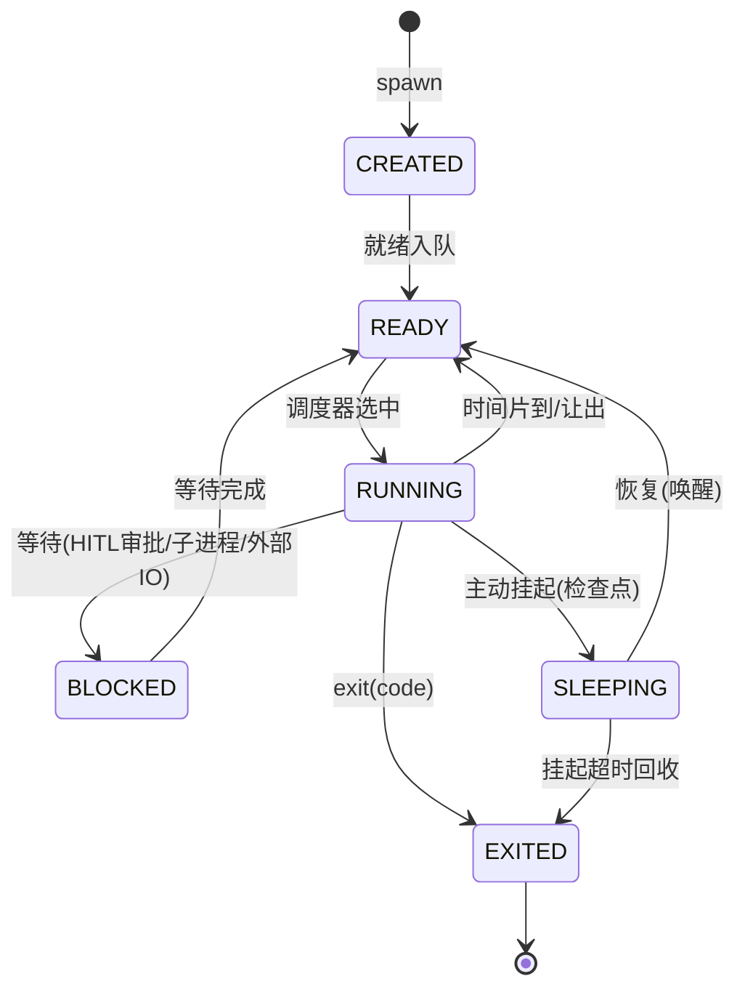
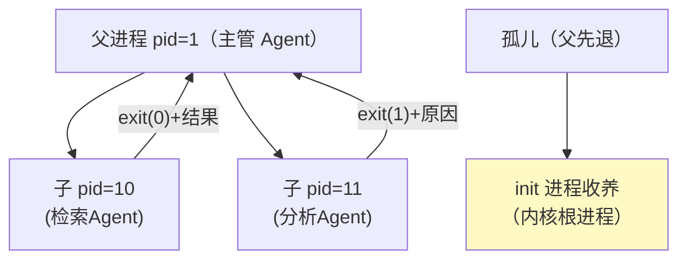

# 02-进程模型与生命周期——PID/状态机/挂起恢复/父子进程

> **定位**：把最小骨架升级为**完整进程模型**：五态状态机（创建/就绪/运行/挂起/终止）、**挂起-恢复**（长任务进程持久化后可唤醒）、**父子进程**（主管 Agent spawn 子 Agent、子退出码回收、孤儿收养）。读者画像：要让 Agent 进程"可长存、可暂停、可繁衍"的读者。前置阅读：[01-最小内核Demo搭建](01-最小内核Demo搭建.md)、[教程 40-长任务持久化与中断恢复]。
>
> **铁律 0**：`ChatMemory.get(String)` 单参等 API 与基准一致。

---

## 一、四问

| 问 | 答 |
|----|----|
| **新增了什么需求** | ① 五态状态机（含挂起 SLEEPING/BLOCKED）② 挂起-恢复（进程快照持久化）③ 父子进程（spawn 关系/退出码等待 wait/孤儿收养）④ 进程退出码语义（0 成功/1 失败/2 被取消/3 预算耗尽） |
| **影响了哪些模块** | `agent-process`（状态机/父子/快照） |
| **架构如何演进** | 单层进程 → 进程树 + 可挂起的长生命周期进程 |
| **上一版痛点** | 进程裸跑不可暂停、无亲缘关系、退出码无语义（01 §五） |

**本迭代验收**：① 进程挂起后内核重启可恢复续跑 ② 父进程 wait 子进程退出码 ③ 孤儿进程被 init 进程收养不泄漏。

---

## 二、进程状态机



## 三、挂起-恢复（进程快照）

```java
package com.example.kernel.process;

import org.springframework.ai.chat.memory.ChatMemory;
import java.util.Map;

/** 进程快照——挂起时持久化；恢复后从检查点续跑。 */
public record ProcessSnapshot(
        long pid,
        long parentPid,
        String agentName,
        String state,           // SLEEPING
        String conversationId,  // 记忆锚点（ChatMemory 键）
        int nextStep,           // 编排检查点：恢复从下一步开始
        long budgetUsed,
        Map<String, Object> processContext   // 进程私有上下文（非对话记忆）
) {}
```

```java
// 挂起：编排循环每步后落快照（事件溯源式，17 迭代审计同源）
// 恢复：内核启动时扫描快照表 → SLEEPING 进程重新入 READY → 从 nextStep 续跑（不重做已完成步骤）
// 记忆恢复：ChatMemory.get(conversationId) 单参取回对话历史（javap 实证）
```

## 四、父子进程



```java
package com.example.kernel.process;

/** 父进程语义：spawn 返回子 PID；wait 阻塞收退出码（虚拟线程下阻塞廉价）。 */
public class ParentProcessOps {

    private final AgentKernel kernel;

    public ParentProcessOps(AgentKernel kernel) { this.kernel = kernel; }

    /** 等待子进程退出，回收退出码（对应 OS wait()）。 */
    public int wait(long childPid) throws InterruptedException {
        AgentProcess child = kernel.processTable().get(childPid);
        while (child.state() != AgentProcess.State.EXITED) {
            Thread.sleep(50);            // 虚拟线程阻塞不占 OS 线程（Java 21）
        }
        return child.exitCode();
    }

    /** 孤儿收养：父进程 EXITED 后，其子进程 parentPid 改挂 init(pid=0)。 */
    public void adoptOrphans(long deadPid) {
        kernel.processTable().values().stream()
                .filter(p -> p.parentPid() == deadPid && p.state() != AgentProcess.State.EXITED)
                .forEach(p -> p.reparent(0L));   // init 收养，防泄漏
    }
}
```

**退出码语义**（平台约定）：

| 码 | 含义 | 父进程动作 |
|----|------|-----------|
| 0 | 成功 | 收结果 |
| 1 | 失败（任务错误） | 重试或降级 |
| 2 | 被取消（SIG_CANCEL，06 迭代） | 停止等待 |
| 3 | 预算耗尽（05 迭代 cgroup） | 换低成本路径或上报 |

## 五、验证包（手工测试与验证）
**前置条件**：进程快照（步骤级）/wait/孤儿收养实现。

**材料 A——三步长任务**：每步 5s，第 3 步前挂起；**材料 B——父子剧本**：父 spawn 两子（一个 exit 0 一个 exit 1）→ wait；**材料 C——父先退**剧本。

**步骤与断言**：

| # | 操作 | 预期（PASS 判据） |
|---|------|------------------|
| 1 | 材料A 跑到第 3 步前挂起 → 快照落盘 → 重启内核 | 恢复后从第 3 步续跑（1/2 步不重做——步骤日志证明） |
| 2 | 材料B | wait 分别收到 0 和 1 |
| 3 | 材料C 父先退 | 子被 init 收养并跑完；/proc 无泄漏（结束后空） |

**失败排查**：①重跑前两步→快照只存了最终态（应每步边界存 nextStep）；③泄漏→EXITED 进程不回收（收养+回收作业缺失）。


## 六、本迭代痛点

进程仍直连工具/模型（无能力边界与配额）→ 03 syscall 层。

## 七、验收对照

| 验收项 | 标准 | 状态 |
|--------|------|------|
| 挂起恢复 | 重启后续跑不重做 | ✅ |
| 父子 | wait 回收退出码 | ✅ |
| 孤儿收养 | 无泄漏 | ✅ |
| 退出码语义 | 四码约定 | ✅ |

**下一篇**：[03-系统调用与能力模型](03-系统调用与能力模型.md)。
