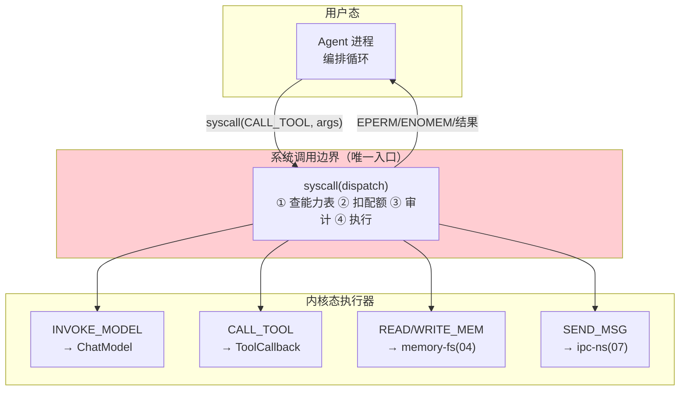
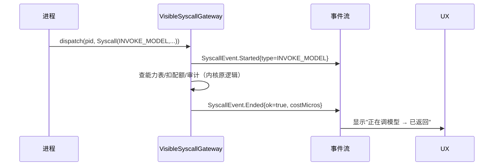

# 03-系统调用与能力模型——工具即 syscall

> **定位**：建立**系统调用层**：Agent 进程的一切能力（调模型/用工具/读写记忆/发消息）都经统一 `syscall` 接口**陷入内核**——内核做能力表检查、配额扣减、审计，然后代为执行。这是内核态/用户态分离的**强制点**。读者画像：要让"进程不能乱来"的读者。前置阅读：[02-进程模型与生命周期](02-进程模型与生命周期.md)、[教程 03-工具调用]。
>
> **铁律 0**：`ToolCallback.call(String)`、`ToolCallingManager.executeToolCalls(Prompt, ChatResponse)` 等与基准一致。

---

## 一、四问

| 问 | 答 |
|----|----|
| **新增了什么需求** | ① 统一 syscall 接口（INVOKE_MODEL/CALL_TOOL/READ_MEM/WRITE_MEM/SEND_MSG 五类）② 每进程**能力表**（capability table，可做/不可做）③ 陷入-执行-返回的内核路径 + 100% 审计 |
| **影响了哪些模块** | 新增 `syscall-gateway`；Agent 进程编排循环改为只发 syscall |
| **架构如何演进** | 进程直连资源 → 一切资源访问陷入内核 |
| **上一版痛点** | 进程裸跑直连工具/模型——无权限边界、无配额、无统一审计（02 §六） |

**本迭代验收**：① 无能力进程调用被 EPERM 拒绝 ② syscall 开销增量 ≤10ms ③ 全部 syscall 落审计可追溯（pid/类型/参数哈希/结果状态/耗时）。

---

## 二、syscall 分层



## 三、syscall 接口与能力表

```java
package com.example.kernel.syscall;

import java.util.Set;

/** 系统调用接口——Agent 进程唯一的内核入口。 */
public interface SyscallGateway {

    SyscallResult dispatch(long pid, Syscall call);

    record Syscall(SyscallType type, String target, String argsJson) {}
    enum SyscallType { INVOKE_MODEL, CALL_TOOL, READ_MEM, WRITE_MEM, SEND_MSG }

    sealed interface SyscallResult {
        record Ok(String payload, long costMicros) implements SyscallResult {}
        record Err(int code, String message) implements SyscallResult {}   // EPERM=1 ENOMEM=2
    }
}

/** 能力表——进程可做什么（spawn 时由进程定义+租户策略合成）。 */
public record CapabilityTable(
        Set<String> allowedTools,       // 允许的工具名（CALL_TOOL 白名单）
        Set<String> allowedModels,      // 允许的模型
        boolean mayMessagePeers,        // 是否可 IPC
        Set<String> memoryScopes        // 可读写的记忆作用域
) {}
```

```java
package com.example.kernel.syscall;

import org.springframework.ai.tool.ToolCallback;
import java.util.Map;

/** CALL_TOOL 执行器——内核代为执行（javap 实证：ToolCallback.call(String)）。 */
public class ToolExecutor implements SyscallExecutor {

    private final Map<String, ToolCallback> toolTable;   // 内核注册的工具表（准入后）

    @Override
    public SyscallGateway.SyscallResult execute(long pid, CapabilityTable caps,
                                                SyscallGateway.Syscall call) {
        if (!caps.allowedTools().contains(call.target())) {
            return new SyscallGateway.SyscallResult.Err(1, "EPERM: tool not granted: " + call.target());
        }
        ToolCallback cb = toolTable.get(call.target());
        long start = System.nanoTime();
        try {
            String result = cb.call(call.argsJson());          // javap 实证签名
            return new SyscallGateway.SyscallResult.Ok(result,
                    (System.nanoTime() - start) / 1000);
        } catch (Exception e) {
            return new SyscallGateway.SyscallResult.Err(3, "tool failed: " + e.getMessage());
        }
    }
}
```

> **与 Spring AI 工具循环的关系**：进程内的 `ToolCallingAdvisor`+`ToolCallingManager` 循环依然成立；本层把"工具执行"从进程内**上收到内核**——实现方式：进程的 ChatClient 配置内核代理工具（每个 @Tool 能力对应一个内核代理 `ToolCallback`，内部发 syscall），框架循环不变、执行收口到内核（机制替换、语义不变）。

## 四、syscall 审计（/proc/syscalls）

```java
// 每条 syscall 记录：{pid, type, target, argsHash(SM3/SHA-256), result, costMicros, ts}
// 审计流→Kafka（事件信封复用平台事件规范）；/proc/syscalls 提供实时 trace（strace 式排障）
```

## 五、进程过程可见性（syscall 从审计升级为过程信号）

> 过程可见性是工业级标配。在 OS 内核视角，**Agent 进程的执行过程就是它的 syscall 序列**——把 [SyscallGateway.dispatch（三节）](03-系统调用与能力模型.md) 的审计记录升级为**用户可见的过程事件流**，用户能实时看到"进程正卡在 INVOKE_MODEL→ 已返回 Ok → 下一步 CALL_TOOL"。

四、条的审计记录（pid/type/argsHash/result/costMicros/ts）**已经是过程信号的全部原料**，缺的只是——把 `SyscallResult`（三节真实类型）包装成**面向用户的可读事件**。在 `dispatch` 里直接发（不新开埋点）：

```java
// 概念代码：在真实 SyscallGateway 上叠加可见性（事件下行走 Sinks，会话式）
public class VisibleSyscallGateway implements SyscallGateway {
    private final SyscallGateway delegate;
    private final Sinks.Many<SyscallEvent> events;        // 下行事件（无界，不丢）

    public interface SyscallEvent {
        record Started(long pid, SyscallType type) implements SyscallEvent {}
        record Progress(long pid, String stage, Object detail) implements SyscallEvent {}
        record Ended(long pid, SyscallType type, boolean ok, long costMicros) implements SyscallEvent {}
    }

    @Override
    public SyscallResult dispatch(long pid, Syscall call) {
        events.tryEmitNext(new SyscallEvent.Started(pid, call.type()));   // 用项目真实 SyscallType
        long t0 = System.nanoTime();
        SyscallResult r = delegate.dispatch(pid, call);
        // Ok(payload,costMicros)/Err(code,message) 与事件一一对应（SyscallEnded 不因拒绝漏发）
        events.tryEmitNext(new SyscallEvent.Ended(pid, call.type(), r instanceof SyscallResult.Ok,
                            r instanceof SyscallResult.Ok ok ? ok.costMicros() : 0));
        return r;
    }
}
```



**四条执行纪律**：
1. **类型对齐**：`SyscallEvent.Started.type` 直接用三节的 `SyscallType` 枚举（INVOKE_MODEL/CALL_TOOL/READ_MEM/WRITE_MEM/SEND_MSG）——不另造一字符串枚举，前后端共用同一类型。
2. **拒绝也可见**：能力表拒绝返回 `Err(EPERM)` 时也发 `Ended{ok=false}`——用户看到"这步被内核拒了"而非"进程卡死"（对齐 Err.code 可读）。
3. **参数脱敏**：事件只带 `type` + `costMicros`，**不含 argsJson**（能力表检查要展示做什么，但不泄露参数明文）——与四、条的 argsHash 呼应，全量参数留在审计库。
4. **与审计同源**：`VisibleSyscallGateway` 只是包一层装饰器，底层 dispatch 仍走四、条审计——过程事件与 Kafka 审计源出一处，不重复埋点。

**验证**（叠加六、验证包）：跑一个 5 步进程（含一步 CALL_TOOL 被 EPERM）→ 事件流 Started↔Ended 成对（各 5）；EPERM 的那步 Ended{ok=false, code=1}；事件流不含 argsJson 明文（grep 断言）。

## 六、验证包（手工测试与验证）
**前置条件**：syscall 表（工具白名单+能力位）+审计管道实现。

**材料 A——越权调用**：能力表外的付费工具；**材料 B——strace 式查询接口**。

**步骤与断言**：

| # | 操作 | 预期（PASS 判据） |
|---|------|------------------|
| 1 | 材料A 调用 | EPERM；表内工具执行成功 |
| 2 | 1000 次 syscall 压测 | 内核开销增量 P99 ≤10ms |
| 3 | 材料B 查单进程调用序列 | 序列完整（与审计库逐条对账 100% 一致） |

**失败排查**：①越权通过→能力校验在工具层（应 syscall 入口统一拦）；②超 10ms→每次调用重查能力表（应缓存+版本失效）。


## 七、本迭代痛点

记忆仍由进程自管（读写不经分层存储）→ 04 记忆文件系统。

## 八、验收对照

| 验收项 | 标准 | 状态 |
|--------|------|------|
| 统一入口 | 五类 syscall 收口 | ✅ |
| 能力表 | EPERM 拦截 | ✅ |
| 审计 | 100% 追溯 | ✅ |
| 性能 | ≤10ms 增量 | ✅ |

**下一篇**：[04-记忆文件系统](04-记忆文件系统.md)。
