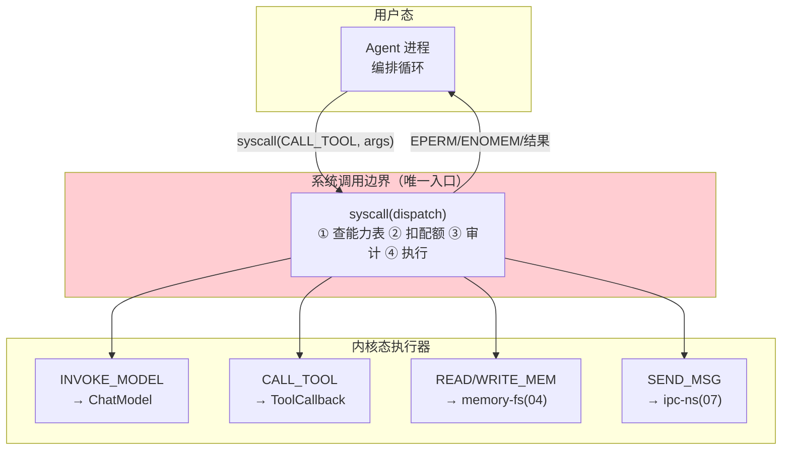

# 03-迭代二：系统调用与能力模型——工具即 syscall

> **定位**：建立**系统调用层**：Agent 进程的一切能力（调模型/用工具/读写记忆/发消息）都经统一 `syscall` 接口**陷入内核**——内核做能力表检查、配额扣减、审计，然后代为执行。这是内核态/用户态分离的**强制点**。读者画像：要让"进程不能乱来"的读者。前置阅读：[02-迭代一-进程模型与生命周期](02-迭代一-进程模型与生命周期.md)、[教程 03-工具调用]。
>
> **铁律 0**：`ToolCallback.call(String)`、`ToolCallingManager.executeToolCalls(Prompt, ChatResponse)` 等与基准一致。

---

## 一、四问

| 问 | 答 |
|----|----|
| **新增了什么需求** | ① 统一 syscall 接口（INVOKE_MODEL/CALL_TOOL/READ_MEM/WRITE_MEM/SEND_MSG 五类）② 每进程**能力表**（capability table，可做/不可做）③ 陷入-执行-返回的内核路径 + 100% 审计 |
| **影响了哪些模块** | 新增 `syscall-gateway`；Agent 进程编排循环改为只发 syscall |
| **架构如何演进** | 进程直连资源 → 一切资源访问陷入内核 |
| **上一版痛点** | 进程裸跑直连工具/模型——无权限边界、无配额、无统一审计（02 §六） |

**本迭代验收**：① 无能力进程调用被 EPERM 拒绝 ② syscall 开销增量 ≤10ms ③ 全部 syscall 落审计可追溯（pid/类型/参数哈希/结果状态/耗时）。

---

## 二、syscall 分层



## 三、syscall 接口与能力表

```java
package com.example.kernel.syscall;

import java.util.Set;

/** 系统调用接口——Agent 进程唯一的内核入口。 */
public interface SyscallGateway {

    SyscallResult dispatch(long pid, Syscall call);

    record Syscall(SyscallType type, String target, String argsJson) {}
    enum SyscallType { INVOKE_MODEL, CALL_TOOL, READ_MEM, WRITE_MEM, SEND_MSG }

    sealed interface SyscallResult {
        record Ok(String payload, long costMicros) implements SyscallResult {}
        record Err(int code, String message) implements SyscallResult {}   // EPERM=1 ENOMEM=2
    }
}

/** 能力表——进程可做什么（spawn 时由进程定义+租户策略合成）。 */
public record CapabilityTable(
        Set<String> allowedTools,       // 允许的工具名（CALL_TOOL 白名单）
        Set<String> allowedModels,      // 允许的模型
        boolean mayMessagePeers,        // 是否可 IPC
        Set<String> memoryScopes        // 可读写的记忆作用域
) {}
```

```java
package com.example.kernel.syscall;

import org.springframework.ai.tool.ToolCallback;
import java.util.Map;

/** CALL_TOOL 执行器——内核代为执行（javap 实证：ToolCallback.call(String)）。 */
public class ToolExecutor implements SyscallExecutor {

    private final Map<String, ToolCallback> toolTable;   // 内核注册的工具表（准入后）

    @Override
    public SyscallGateway.SyscallResult execute(long pid, CapabilityTable caps,
                                                SyscallGateway.Syscall call) {
        if (!caps.allowedTools().contains(call.target())) {
            return new SyscallGateway.SyscallResult.Err(1, "EPERM: tool not granted: " + call.target());
        }
        ToolCallback cb = toolTable.get(call.target());
        long start = System.nanoTime();
        try {
            String result = cb.call(call.argsJson());          // javap 实证签名
            return new SyscallGateway.SyscallResult.Ok(result,
                    (System.nanoTime() - start) / 1000);
        } catch (Exception e) {
            return new SyscallGateway.SyscallResult.Err(3, "tool failed: " + e.getMessage());
        }
    }
}
```

> **与 Spring AI 工具循环的关系**：进程内的 `ToolCallingAdvisor`+`ToolCallingManager` 循环依然成立；本层把"工具执行"从进程内**上收到内核**——实现方式：进程的 ChatClient 配置内核代理工具（每个 @Tool 能力对应一个内核代理 `ToolCallback`，内部发 syscall），框架循环不变、执行收口到内核（机制替换、语义不变）。

## 四、syscall 审计（/proc/syscalls）

```java
// 每条 syscall 记录：{pid, type, target, argsHash(SM3/SHA-256), result, costMicros, ts}
// 审计流→Kafka（事件信封复用平台事件规范）；/proc/syscalls 提供实时 trace（strace 式排障）
```

## 五、测试与验证

```bash
# 1. 能力表外工具 → EPERM；表内 → 执行成功
# 2. 1000 次 syscall 压测 → 内核开销增量 P99 ≤10ms
# 3. strace 式查看单进程调用序列；审计对账 100%
```

## 六、本迭代痛点

记忆仍由进程自管（读写不经分层存储）→ 04 记忆文件系统。

## 七、验收对照

| 验收项 | 标准 | 状态 |
|--------|------|------|
| 统一入口 | 五类 syscall 收口 | ✅ |
| 能力表 | EPERM 拦截 | ✅ |
| 审计 | 100% 追溯 | ✅ |
| 性能 | ≤10ms 增量 | ✅ |

**下一篇**：[04-迭代三-记忆文件系统](04-迭代三-记忆文件系统.md)。
