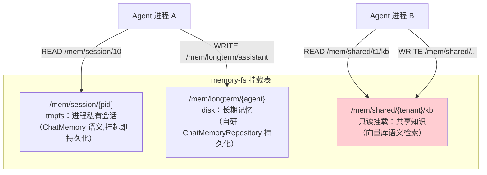
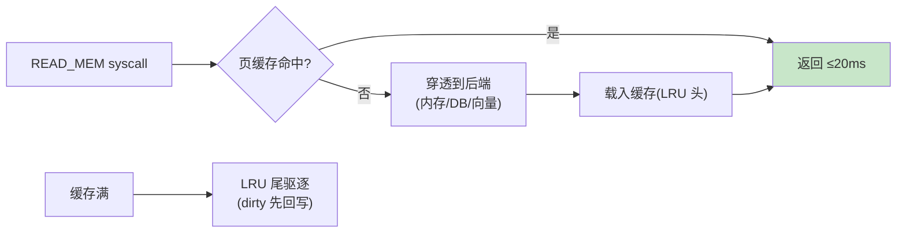

# 04-记忆文件系统——分层挂载 / 路径语义 / 缓存驱逐

> **定位**：建立**记忆文件系统（memory-fs）**：把 Agent 记忆组织为**分层挂载的文件系统**——会话记忆=进程私有 tmpfs、长期记忆=持久磁盘、共享知识=只读挂载；**路径语义**（`/mem/{scope}/{key}`）统一 READ/WRITE_MEM syscall；**页缓存与驱逐**（热记忆缓存 LRU）。读者画像：要让记忆"有结构、可共享、可治理"的读者。前置阅读：[03-系统调用与能力模型](03-系统调用与能力模型.md)、[教程 39-高级记忆架构]。
>
> **铁律 0**：`ChatMemory`/`ChatMemoryRepository`/`MessageWindowChatMemory.builder()` 与基准一致（本地 2.0.0 官方仅 `InMemoryChatMemoryRepository`，持久化自研）。

---

## 一、四问

| 问 | 答 |
|----|----|
| **新增了什么需求** | ① 三层挂载（tmpfs 会话层/disk 长期层/只读共享层）② 路径语义与统一读写接口（经 03 的 READ/WRITE_MEM）③ 页缓存（热记忆 LRU + 驱逐）④ 配额（每进程记忆配额 ENOSPC） |
| **影响了哪些模块** | 新增 `memory-fs`（挂载表/路径解析/缓存/配额）；READ/WRITE_MEM syscall 对接 |
| **架构如何演进** | 记忆进程自管 → 内核统一文件系统（分层/共享/可驱逐） |
| **上一版痛点** | 记忆散在进程里：无法共享、无法治理、无配额（03 §六） |

**本迭代验收**：① 路径读写经 syscall 生效、越权 EPERM ② 热记忆命中 ≤20ms ③ 超配额 ENOSPC ④ 只读层写入被拒。

### 一.1 本节核对（需求与验收范围）

- [ ] 能说出来四项新增需求落点（三层挂载→二/路径读写→三/页缓存→四/配额只读→五）
- [ ] 四次验收（路径路由/热读/ENOSPC/EROFS）与 §三~§五 断言一一对应

---

## 二、分层挂载



### 二.1 本节核对（三层挂载）

| # | 核对项 | 判据 |
|---|--------|------|
| 1 | 三层职责不混 | session=进程私有（tmpfs）/longterm=持久磁盘/shared=只读共享知识，图的挂载语义与正文一致 |
| 2 | 只读层标记 | shared 层（M3）标红区分，进程 B 的 `WRITE /mem/shared/...` 会被只读约束拒绝（对应 §五 EROFS） |

## 三、路径解析与统一接口

```java
package com.example.kernel.memfs;

/** memory-fs 路径——三层作用域。 */
public record MemPath(String layer, String owner, String key) {

    public static MemPath parse(String path) {
        // /mem/session/10/history → layer=session owner=10 key=history
        String[] parts = path.split("/", 5);
        if (parts.length < 5 || !"mem".equals(parts[1])) {
            throw new IllegalArgumentException("bad mem path: " + path);
        }
        return new MemPath(parts[2], parts[3], parts[4]);
    }
}
```

```java
// 会话层的底层：Spring AI 真实记忆 API（javap 实证）
// ChatMemory memory = MessageWindowChatMemory.builder()
//         .chatMemoryRepository(repository)   // tmpfs 期=InMemory；挂起时快照持久化
//         .maxMessages(40)
//         .build();
// memory.add(conversationId, message);  memory.get(conversationId) 单参
```

### 三.1 本节测试与验证（路径解析与读写路由）

**前置条件**：`MemPath.parse`（§三）与 READ/WRITE_MEM syscall 对接实现；进程 scope 按 `CapabilityTable.memoryScopes` 约束。

**材料 A——越权剧本**：进程 scope 只含 session 层，尝试写 shared 层。

**步骤与断言**：

| # | 操作 | 预期（PASS 判据） |
|---|------|------------------|
| 1 | 三层路径各读写一次 | 正确路由到对应层（`/mem/session/{pid}`、`/mem/longterm/{agent}`、`/mem/shared/{tenant}`） |
| 2 | 材料A 越权写 shared | EPERM（作用域外拒绝） |
| 3 | 读 malformed 路径（如 `/tmp/x`） | `MemPath.parse` 抛 `IllegalArgumentException`（路径格式校验） |

**失败排查**：①路径误路由→`parse` 的 split 基数与三层路径常量不一致；②越权通过→只读/作用域校验在客户端而非 syscall 入口。

## 四、页缓存与驱逐



| 层 | 后端 | 缓存策略 | 驱逐 |
|----|------|---------|------|
| session | InMemory（ChatMemory 语义） | 天然内存 | 进程退出释放；挂起落快照 |
| longterm | 自研 ChatMemoryRepository（DB） | LRU 页缓存 | dirty 回写后逐出 |
| shared | 向量库（similaritySearch） | 查询结果短 TTL 缓存 | TTL 到期 |

### 四.1 本节测试与验证（页缓存与驱逐）

**前置条件**：三层 + LRU 页缓存实现；session 层挂起即持久化快照（§四 表 + §三 ChatMemory）。

**材料 B——容量压测**：写入超缓存容量的 key 触发 LRU 驱逐。

**步骤与断言**：

| # | 操作 | 预期（PASS 判据） |
|---|------|------------------|
| 1 | 重复读同 key（热读） | P99 ≤20ms（缓存命中） |
| 2 | 材料B：写入超缓存容量 | LRU 驱逐后回源正确（被驱逐 key 重读数据一致，无丢数据） |
| 3 | 进程挂起→恢复 | session 层随快照持久化；恢复后 `get(conversationId)` 内容完整 |

**失败排查**：②驱逐丢数据→脏页未回写就驱逐（dirty 项应先行 `ChatMemoryRepository` 回写再逐出）；③恢复缺数据→session 层不在快照范围（只存了进程态，应把会话层纳入快照）。

## 五、配额与只读

```java
// WRITE_MEM：① 只读层（shared）→ EROFS ② 超 process memory quota → ENOSPC
// 配额：每进程记忆字节数/条数上限（05 迭代 cgroup 统一登记）
```

### 五.1 本节测试与验证（配额与只读）

**前置条件**：每进程记忆配额（字节数/条数）+只读层强制实现。

**材料 C——配额剧本**：进程循环写入超配额数据。

**步骤与断言**：

| # | 操作 | 预期（PASS 判据） |
|---|------|------------------|
| 1 | 材料C 超配额 | WRITE_MEM 返回 ENOSPC（进程收到配额耗尽信号） |
| 2 | 写 shared 只读层 | EROFS 拒绝（服务端强制，非客户端约束） |

**失败排查**：①超配额仍能写→配额检查缺失或计数未在 syscall 层统一登记；②EROFS 未拦→只读在客户端约束（应服务端在 WRITE_MEM 强制判 shared 层）。

## 六、全篇回归验证

> 各节验证材料与断言已上移至 §三.1（路径路由/越权）、§四.1（缓存/挂起）、§五.1（配额/只读）；本表为整篇迭代的回归验收，不重复材料。

| # | 验收项 | 标准 |
|---|--------|------|
| 1 | 分层挂载 | 三层路径路由正确（session/longterm/shared） |
| 2 | 缓存 | 热读 ≤20ms + LRU 驱逐不丢数据 |
| 3 | 只读/配额 | EROFS / ENOSPC 服务端强制 |
| 4 | 挂起联动 | session 随快照持久化，恢复不丢 |

## 七、本迭代痛点

多进程抢模型算力无序——高优先级进程饿死 → 05 调度器与配额。

### 七.1 本节核对（痛点承接）

- [ ] 痛点"多进程抢算力、高优先级饿死"与 05 的主题（优先级调度/cgroup/抢占）对应，痛点驱动下一迭代成立

## 八、验收对照

### 八.1 本节核对（验收 vs 落地）

> §2 验收目标已在 §三.1/§四.1/§五.1 断言通过；四行验收与 §六 回归表一一对应即 PASS。

| 验收项 | 标准 | 状态 |
|--------|------|------|
| 分层挂载 | 三层路径路由正确 | ✅ |
| 缓存 | 热读 ≤20ms + LRU | ✅ |
| 只读/配额 | EROFS/ENOSPC | ✅ |
| 挂起联动 | session 随快照 | ✅ |

**下一篇**：[05-调度器与资源配额](05-调度器与资源配额.md)。
