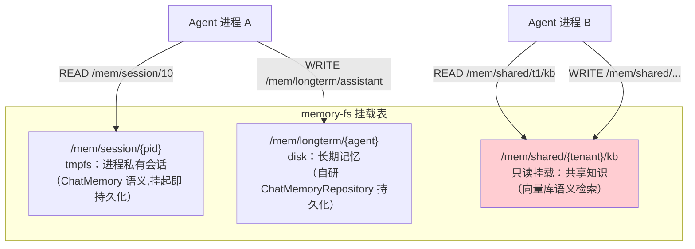
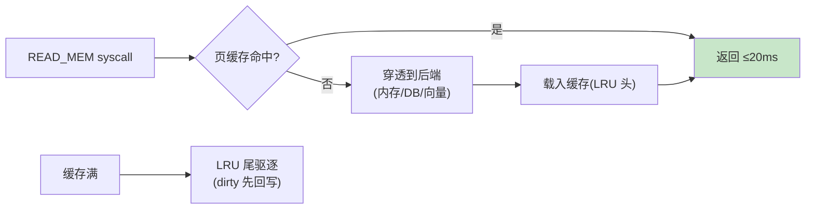

# 04-迭代三：记忆文件系统——分层挂载 / 路径语义 / 缓存驱逐

> **定位**：建立**记忆文件系统（memory-fs）**：把 Agent 记忆组织为**分层挂载的文件系统**——会话记忆=进程私有 tmpfs、长期记忆=持久磁盘、共享知识=只读挂载；**路径语义**（`/mem/{scope}/{key}`）统一 READ/WRITE_MEM syscall；**页缓存与驱逐**（热记忆缓存 LRU）。读者画像：要让记忆"有结构、可共享、可治理"的读者。前置阅读：[03-迭代二-系统调用与能力模型](03-迭代二-系统调用与能力模型.md)、[教程 39-高级记忆架构]。
>
> **铁律 0**：`ChatMemory`/`ChatMemoryRepository`/`MessageWindowChatMemory.builder()` 与基准一致（本地 2.0.0 官方仅 `InMemoryChatMemoryRepository`，持久化自研）。

---

## 一、四问

| 问 | 答 |
|----|----|
| **新增了什么需求** | ① 三层挂载（tmpfs 会话层/disk 长期层/只读共享层）② 路径语义与统一读写接口（经 03 的 READ/WRITE_MEM）③ 页缓存（热记忆 LRU + 驱逐）④ 配额（每进程记忆配额 ENOSPC） |
| **影响了哪些模块** | 新增 `memory-fs`（挂载表/路径解析/缓存/配额）；READ/WRITE_MEM syscall 对接 |
| **架构如何演进** | 记忆进程自管 → 内核统一文件系统（分层/共享/可驱逐） |
| **上一版痛点** | 记忆散在进程里：无法共享、无法治理、无配额（03 §六） |

**本迭代验收**：① 路径读写经 syscall 生效、越权 EPERM ② 热记忆命中 ≤20ms ③ 超配额 ENOSPC ④ 只读层写入被拒。

---

## 二、分层挂载



## 三、路径解析与统一接口

```java
package com.example.kernel.memfs;

/** memory-fs 路径——三层作用域。 */
public record MemPath(String layer, String owner, String key) {

    public static MemPath parse(String path) {
        // /mem/session/10/history → layer=session owner=10 key=history
        String[] parts = path.split("/", 5);
        if (parts.length < 5 || !"mem".equals(parts[1])) {
            throw new IllegalArgumentException("bad mem path: " + path);
        }
        return new MemPath(parts[2], parts[3], parts[4]);
    }
}
```

```java
// 会话层的底层：Spring AI 真实记忆 API（javap 实证）
// ChatMemory memory = MessageWindowChatMemory.builder()
//         .chatMemoryRepository(repository)   // tmpfs 期=InMemory；挂起时快照持久化
//         .maxMessages(40)
//         .build();
// memory.add(conversationId, message);  memory.get(conversationId) 单参
```

## 四、页缓存与驱逐



| 层 | 后端 | 缓存策略 | 驱逐 |
|----|------|---------|------|
| session | InMemory（ChatMemory 语义） | 天然内存 | 进程退出释放；挂起落快照 |
| longterm | 自研 ChatMemoryRepository（DB） | LRU 页缓存 | dirty 回写后逐出 |
| shared | 向量库（similaritySearch） | 查询结果短 TTL 缓存 | TTL 到期 |

## 五、配额与只读

```java
// WRITE_MEM：① 只读层（shared）→ EROFS ② 超 process memory quota → ENOSPC
// 配额：每进程记忆字节数/条数上限（05 迭代 cgroup 统一登记）
```

## 六、测试与验证

```bash
# 1. 路径解析：三层路径各读写一次正确路由；越权 scope EPERM
# 2. 缓存：重复读同 key P99 ≤20ms；缓存容量压测 LRU 驱逐正确回写
# 3. 挂起：session 层随进程快照持久化；恢复后 get(conversationId) 完整
# 4. 只读/配额：shared 写 EROFS；超配额 ENOSPC
```

## 七、本迭代痛点

多进程抢模型算力无序——高优先级进程饿死 → 05 调度器与配额。

## 八、验收对照

| 验收项 | 标准 | 状态 |
|--------|------|------|
| 分层挂载 | 三层路径路由正确 | ✅ |
| 缓存 | 热读 ≤20ms + LRU | ✅ |
| 只读/配额 | EROFS/ENOSPC | ✅ |
| 挂起联动 | session 随快照 | ✅ |

**下一篇**：[05-迭代四-调度器与资源配额](05-迭代四-调度器与资源配额.md)。
