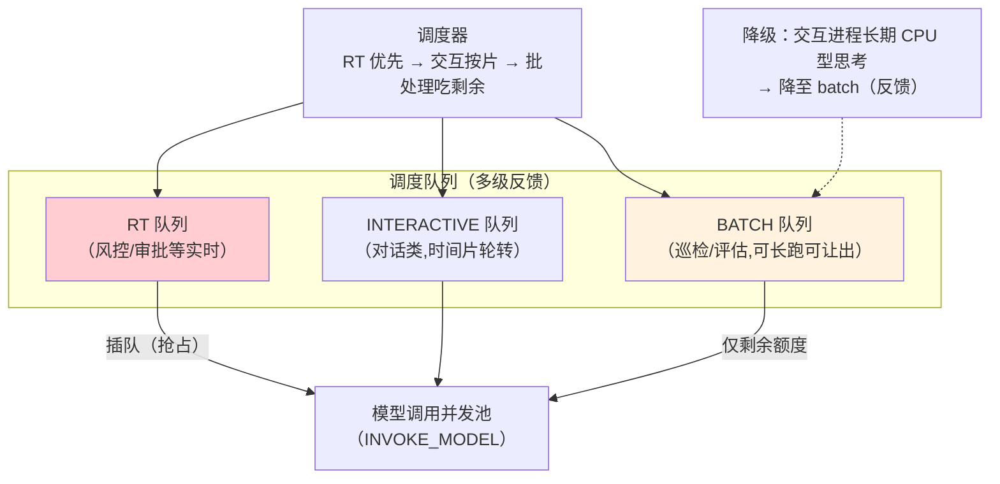

# 05-调度器与资源配额——优先级 / Token cgroup / 抢占

> **定位**：建立**调度器与资源配额（cgroup 式）**：进程优先级（实时/交互/批处理三档）、**Token/并发/记忆配额组**（按租户/业务线成组限账）、**抢占**（高优先级进程可抢占低优先级的模型调用排队位）。读者画像：要让"关键 Agent 永不被批处理挤死"的读者。前置阅读：[04-记忆文件系统](04-记忆文件系统.md)、[教程 04-企业级架构主干/06-多租户隔离与资源治理]、[教程 08-架构师进阶/04-Agent性能优化]。
>
> **铁律 0**：机制为内核自研；模型调用经 03 的 INVOKE_MODEL syscall。

---

## 一、四问

| 问 | 答 |
|----|----|
| **新增了什么需求** | ① 三档优先级（RT 实时/INTERACTIVE 交互/BATCH 批处理）② cgroup 配额组（Token/并发/记忆三资源按组限账）③ 抢占（RT 进程可插队模型调用队列）④ 公平退让（batch 让出——配合 34 式 Noisy Neighbor 思想，防批处理淹没） |
| **影响了哪些模块** | `scheduler`（多级反馈队列+配额账本）；INVOKE_MODEL 对接排队 |
| **架构如何演进** | 进程平等抢资源 → 分档调度 + 组配额 + 抢占 |
| **上一版痛点** | 多进程抢算力无序、高优先级饿死、单租户批处理淹没他人（04 §七） |

**本迭代验收**：① RT 进程唤醒到开始模型调用 ≤100ms ② cgroup 超 Token 配额 → syscall 返回 ENOMEM、进程 exit(3) ③ batch 负载满载时交互进程 P99 波动 ≤10%。

### 一.1 本节核对（需求与验收范围）

- [ ] 能说出来三项新增需求落点（三档优先级+配额组→二/抢占→三/公平退让→四）
- [ ] 三次验收（RT唤醒/ENOMEM/公平P99）与 §二~§四 断言一一对应

---

## 二、多级反馈队列



```java
package com.example.kernel.schedule;

/** 优先级与配额组。 */
public record SchedPolicy(
        Priority priority,        // RT / INTERACTIVE / BATCH
        String cgroupId           // 所属配额组（租户/业务线）
) {
    public enum Priority { RT, INTERACTIVE, BATCH }
}

/** cgroup 配额账本——Token/并发/记忆三资源按组限账。 */
public class CgroupBudget {

    private final long tokenQuotaPerDay;
    private final int maxConcurrentInvokes;
    private final long memoryQuotaBytes;
    // 账本实现：Redis 原子扣减（复用平台既有预算管道语义）
    // INVOKE_MODEL 前 tryAcquire(tokens=estimated)；不足→ENOMEM（exit 3）
}
```

### 二.1 本节测试与验证（配额账本）

**前置条件**：三档优先级队列（RT/INTERACTIVE/BATCH）+ `CgroupBudget`（Token/并发/记忆三资源按组限账，Redis 原子扣减）实现；INVOKE_MODEL 前经 `tryAcquire`。

**材料 B——Token 耗尽剧本**：进程所属 cgroup 的日 Token 配额用尽后再发 INVOKE_MODEL。

**步骤与断言**：

| # | 操作 | 预期（PASS 判据） |
|---|------|------------------|
| 1 | 材料B：cgroup 日 Token 用尽 | INVOKE_MODEL 返回 ENOMEM（配额不足拒绝）；进程 exit(3)（按 02 §四 退出码语义） |

**失败排查**：①超额度仍放行→`tryAcquire` 未在 syscall 入口统一扣减（扣减钩子在进程级而非 cgroup 账本级）；②扣减非原子→并发超卖（应 Redis 原子递减+Lua 校验）。

**最小可执行载体**（载体同 [01 §4.3](01-最小内核Demo搭建.md)：JUnit + `mvn test`；本篇剧本替换为"配额账本扣减→ENOMEM"。`MiniBudget` 为 `CgroupBudget` 的最小语义版——Redis 原子扣减的本地替身）：

```java
static class MiniBudget {
    private long remaining;
    MiniBudget(long quota) { this.remaining = quota; }
    boolean tryAcquire(long tokens) {                 // 原子扣减：不足直接 false（映射 ENOMEM→exit 3）
        if (tokens > remaining) return false;
        remaining -= tokens;
        return true;
    }
}

@Test
void cgroup配额_扣尽后ENOMEM() {
    MiniBudget budget = new MiniBudget(1_000);        // 材料B：cgroup 日 Token 配额
    assertThat(budget.tryAcquire(600)).isTrue();      // 正常调用放行
    assertThat(budget.tryAcquire(600)).isFalse();     // 断言①：配额不足 → INVOKE_MODEL 返回 ENOMEM
    assertThat(budget.tryAcquire(400)).isTrue();      // 剩余额度精确可用（不超卖）
}
// mvn test -Dtest=CgroupBudgetTest → Tests run: 1, Failures: 0, Errors: 0
```

## 三、抢占语义

| 场景 | 动作 | 约束 |
|------|------|------|
| RT 进程就绪且池满 | 挂起一个 BATCH 的**排队中**调用（未发出的最便宜） | 已发出的调用不中断（模型计费已发生） |
| RT 进程就绪、BATCH 在跑编排循环 | BATCH 收 SIG_YIELD（06 迭代信号）主动让出 | 协作式让出，给 500ms 宽限 |
| 无可抢占位 | RT 排队头（下一空位必得） | 保证 ≤100ms 唤醒目标 |

> **纪律**：抢占只发生在**排队边界**（免费的墙），不撕毁已计费的调用——成本与公平的平衡点。

### 三.1 本节测试与验证（抢占唤醒）

**前置条件**：RT/BATCH 双队列 + 排队边界抢占实现（本迭代；SIG_YIELD 协作让出见 06）。

**材料 A——抢占剧本**：BATCH 打满并发池 → 提交一个 RT 进程。

**步骤与断言**：

| # | 操作 | 预期（PASS 判据） |
|---|------|------------------|
| 1 | 材料A | RT ≤100ms 开始获得调用（唤醒达标） |
| 2 | 检查被让位 BATCH | 被让位 BATCH 排队后恢复（未丢任务） |
| 3 | 检查已发出的调用 | 未被撕毁（抢占只动排队位，不打断已计费调用） |

**失败排查**：①抢占慢→抢占检查点只在任务边界（应在调用间隙也检查排队边界）；③已发调用被断→抢占误用了取消在途调用（应只挂起未发出的排队请求）。

**最小可执行载体**（载体同 §二.1；本节剧本替换为"排队边界抢占"——只动排队位、不撕已计费调用）：

```java
@Test
void 抢占_只动排队位_不撕已发调用() {
    var waiting = new ArrayDeque<>(List.of("batch-1", "batch-2"));   // 排队位（未发出，免费）
    var inflight = new ArrayList<>(List.of("batch-0"));              // 已发出（计费中，不可撕）
    // 材料A：BATCH 打满并发池 → 提交 RT 进程，抢占排队头
    String preempted = waiting.pollFirst();
    waiting.addFirst("rt-1");
    assertThat(waiting.peekFirst()).isEqualTo("rt-1");   // 断言①：RT 排队头，下一空位必得（≤100ms）
    assertThat(preempted).isEqualTo("batch-1");          // 断言②：被让位 BATCH 重新排队未丢
    assertThat(inflight).containsExactly("batch-0");     // 断言③：已发出调用未被撕毁
}
// mvn test -Dtest=PreemptionTest → Tests run: 1, Failures: 0, Errors: 0
```

## 四、公平退让（防批处理淹没）

```java
// BATCH 组默认 weight=1、INTERACTIVE=10：并发池按权重分配（WFQ 加权公平队列）
// 效果：batch 组无论提交多少任务，最多吃掉剩余并发；交互组 P99 不受影响
```

### 四.1 本节测试与验证（公平隔离）

**前置条件**：并发池按组权重隔离（WFQ 加权公平队列）实现。

**材料 C——公平性压测**：batch 组打 10× 负载，同时观察 INTERACTIVE 组 P99。

**步骤与断言**：

| # | 操作 | 预期（PASS 判据） |
|---|------|------------------|
| 1 | 材料C 期间交互组 | P99 波动 ≤10%（隔离有效，batch 淹没不了交互） |

**失败排查**：①波动大→并发池无分组隔离（组间共享同一队列，batch 抢占全部额度）。

**最小可执行载体**（载体同 §二.1；本节剧本替换为"WFQ 权重份额"——batch 无论多少任务最多吃剩余）：

```java
@Test
void WFQ权重分配_batch最多吃剩余() {
    int pool = 10;                                        // 并发池总槽位
    int interactiveWeight = 10, batchWeight = 1;          // §四 权重约定
    int interactiveShare = pool * interactiveWeight / (interactiveWeight + batchWeight);
    assertThat(interactiveShare).isEqualTo(9);            // 断言①：交互组保底 9/10（P99 隔离底线）
    assertThat(pool - interactiveShare).isEqualTo(1);     // batch 组最多吃剩余 1 槽
}
// mvn test -Dtest=WfqShareTest → Tests run: 1, Failures: 0, Errors: 0
```

## 五、全篇回归验证

> 各节验证材料与断言已上移至 §二.1（配额）、§三.1（抢占）、§四.1（公平）；本表为整篇迭代的回归验收，不重复材料。

| # | 验收项 | 标准 |
|---|--------|------|
| 1 | 优先级调度 | RT 唤醒 ≤100ms |
| 2 | cgroup | 三资源组限账 / ENOMEM / exit(3) |
| 3 | 抢占 | 排队边界抢占不撕已计费调用 |
| 4 | 公平 | 交互 P99 波动 ≤10% |

## 六、本迭代痛点

进程无法被外部干预——审批要等、取消要等 → 06 中断与信号。

### 六.1 本节核对（痛点承接）

- [ ] 痛点"进程无法被外部干预、审批/取消要等"与 06 的主题（中断与信号/SIG_APPROVE/SIG_CANCEL）对应，痛点驱动下一迭代成立

## 七、验收对照

### 七.1 本节核对（验收 vs 落地）

> §2 验收目标已在 §二.1/§三.1/§四.1 断言通过；四行验收与 §五 回归表一一对应即 PASS。

| 验收项 | 标准 | 状态 |
|--------|------|------|
| 优先级调度 | RT 唤醒 ≤100ms | ✅ |
| cgroup | 三资源组限账/ENOMEM | ✅ |
| 抢占 | 排队边界抢占不撕调用 | ✅ |
| 公平 | 交互 P99 波动 ≤10% | ✅ |

**下一篇**：[06-中断与信号系统](06-中断与信号系统.md)。
