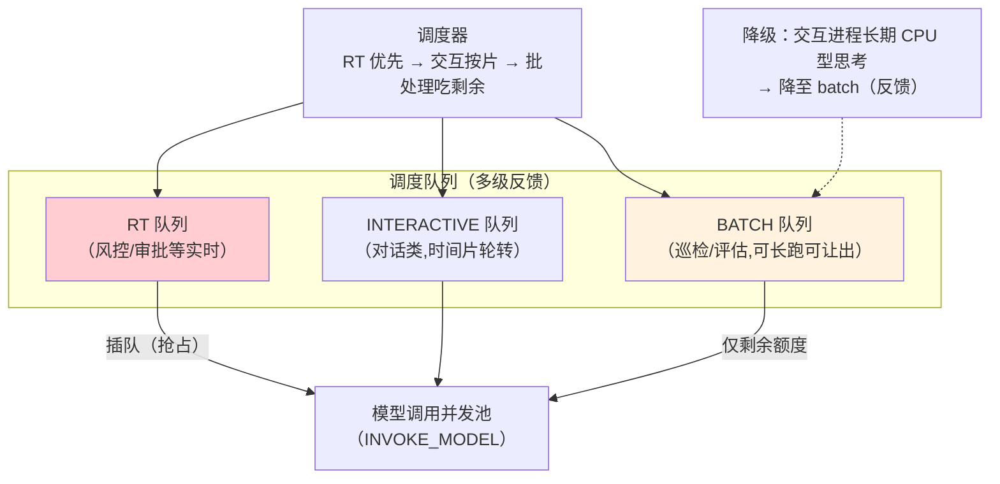

# 05-调度器与资源配额——优先级 / Token cgroup / 抢占

> **定位**：建立**调度器与资源配额（cgroup 式）**：进程优先级（实时/交互/批处理三档）、**Token/并发/记忆配额组**（按租户/业务线成组限账）、**抢占**（高优先级进程可抢占低优先级的模型调用排队位）。读者画像：要让"关键 Agent 永不被批处理挤死"的读者。前置阅读：[04-记忆文件系统](04-记忆文件系统.md)、[教程 26-多租户隔离与资源治理]、[教程 38-Agent性能优化]。
>
> **铁律 0**：机制为内核自研；模型调用经 03 的 INVOKE_MODEL syscall。

---

## 一、四问

| 问 | 答 |
|----|----|
| **新增了什么需求** | ① 三档优先级（RT 实时/INTERACTIVE 交互/BATCH 批处理）② cgroup 配额组（Token/并发/记忆三资源按组限账）③ 抢占（RT 进程可插队模型调用队列）④ 公平退让（batch 让出——配合 34 式 Noisy Neighbor 思想，防批处理淹没） |
| **影响了哪些模块** | `scheduler`（多级反馈队列+配额账本）；INVOKE_MODEL 对接排队 |
| **架构如何演进** | 进程平等抢资源 → 分档调度 + 组配额 + 抢占 |
| **上一版痛点** | 多进程抢算力无序、高优先级饿死、单租户批处理淹没他人（04 §七） |

**本迭代验收**：① RT 进程唤醒到开始模型调用 ≤100ms ② cgroup 超 Token 配额 → syscall 返回 ENOMEM、进程 exit(3) ③ batch 负载满载时交互进程 P99 波动 ≤10%。

---

## 二、多级反馈队列



```java
package com.example.kernel.schedule;

/** 优先级与配额组。 */
public record SchedPolicy(
        Priority priority,        // RT / INTERACTIVE / BATCH
        String cgroupId           // 所属配额组（租户/业务线）
) {
    public enum Priority { RT, INTERACTIVE, BATCH }
}

/** cgroup 配额账本——Token/并发/记忆三资源按组限账。 */
public class CgroupBudget {

    private final long tokenQuotaPerDay;
    private final int maxConcurrentInvokes;
    private final long memoryQuotaBytes;
    // 账本实现：Redis 原子扣减（复用平台既有预算管道语义）
    // INVOKE_MODEL 前 tryAcquire(tokens=estimated)；不足→ENOMEM（exit 3）
}
```

## 三、抢占语义

| 场景 | 动作 | 约束 |
|------|------|------|
| RT 进程就绪且池满 | 挂起一个 BATCH 的**排队中**调用（未发出的最便宜） | 已发出的调用不中断（模型计费已发生） |
| RT 进程就绪、BATCH 在跑编排循环 | BATCH 收 SIG_YIELD（06 迭代信号）主动让出 | 协作式让出，给 500ms 宽限 |
| 无可抢占位 | RT 排队头（下一空位必得） | 保证 ≤100ms 唤醒目标 |

> **纪律**：抢占只发生在**排队边界**（免费的墙），不撕毁已计费的调用——成本与公平的平衡点。

## 四、公平退让（防批处理淹没）

```java
// BATCH 组默认 weight=1、INTERACTIVE=10：并发池按权重分配（WFQ 加权公平队列）
// 效果：batch 组无论提交多少任务，最多吃掉剩余并发；交互组 P99 不受影响
```

## 五、验证包（手工测试与验证）
**前置条件**：调度器（RT/BATCH 双队列+抢占）+cgroup（Token/并发配额）实现。

**材料 A——抢占剧本**：BATCH 打满池 → 提交 RT；**材料 B——Token 耗尽剧本**；**材料 C——公平性压测**：batch 组 10× 负载。

**步骤与断言**：

| # | 操作 | 预期（PASS 判据） |
|---|------|------------------|
| 1 | 材料A | RT ≤100ms 开始获得调用；被让位 BATCH 排队后恢复 |
| 2 | 材料B：cgroup 日 Token 用尽 | INVOKE_MODEL 返回 ENOMEM；进程 exit(3) |
| 3 | 材料C 期间交互组 | P99 波动 ≤10%（隔离有效） |

**失败排查**：①抢占慢→抢占检查点只在任务边界（应调用间隙也检查）；③波动大→并发池无分组隔离（组间共享队列）。


## 六、本迭代痛点

进程无法被外部干预——审批要等、取消要等 → 06 中断与信号。

## 七、验收对照

| 验收项 | 标准 | 状态 |
|--------|------|------|
| 优先级调度 | RT 唤醒 ≤100ms | ✅ |
| cgroup | 三资源组限账/ENOMEM | ✅ |
| 抢占 | 排队边界抢占不撕调用 | ✅ |
| 公平 | 交互 P99 波动 ≤10% | ✅ |

**下一篇**：[06-中断与信号系统](06-中断与信号系统.md)。
