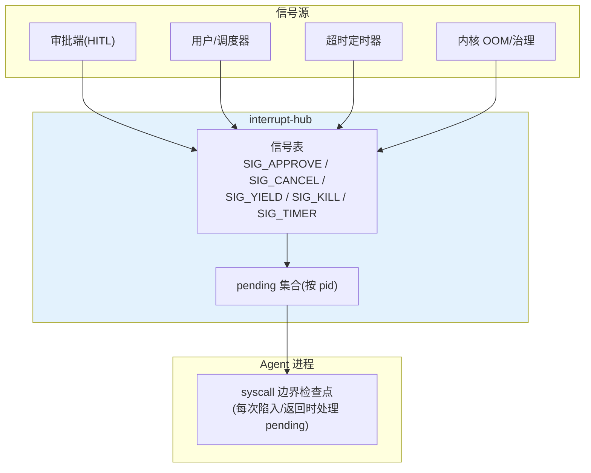
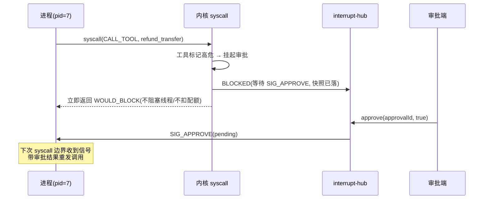

# 06-中断与信号系统——信号表 / HITL 挂起 / 取消 / kill

> **定位**：建立**中断与信号系统**：**信号表**（SIG_APPROVE 审批结果/SIG_CANCEL 取消/SIG_YIELD 让出/SIG_KILL 强杀/SIG_TIMER 超时）、**异步投递与同步点**（编排循环的 syscall 边界检查信号——对应 OS 的中断返回检查）、**kill 语义**（强杀不等于撕毁模型调用——已计费调用自然结束、进程状态终结）。读者画像：要让外部世界能"打断"Agent 的读者。前置阅读：[05-调度器与资源配额](05-调度器与资源配额.md)、[教程 28-Human-in-the-Loop与审批流]。
>
> **铁律 0**：HITL 落点纪律——审批在 syscall 执行边界（内核）与 ToolCallback 包装层，不是 Advisor。

---

## 一、四问

| 问 | 答 |
|----|----|
| **新增了什么需求** | ① 信号表与默认处置（忽略/终止/捕获）② syscall 边界检查点（异步信号同步处理）③ SIG_APPROVE：HITL 审批挂起-唤醒闭环 ④ SIG_CANCEL/SIG_KILL 语义分级 ⑤ /proc/interrupts 观测 |
| **影响了哪些模块** | `interrupt-hub`（信号投递/挂起登记）；syscall 边界加检查点；`kernel-obs` 信号观测 |
| **架构如何演进** | 进程只能跑到自己结束 → 外界可协作式中断（信号）与强制终结（kill） |
| **上一版痛点** | 审批要等整轮阻塞、取消无手段、坏进程只能看着（05 §六） |

**本迭代验收**：① 审批挂起不占线程/配额（SLEEPING），批准后唤醒续跑 ② SIG_CANCEL 优雅退出（exit 2，落快照可恢复）③ SIG_KILL 即时终结（不撕已计费调用）④ 信号全量观测。

---

## 二、信号表



| 信号 | 默认处置 | 可捕获 | 语义 |
|------|---------|--------|------|
| SIG_APPROVE | 唤醒 BLOCKED 进程 | - | 审批结果（approved/rejected）注入进程上下文 |
| SIG_CANCEL | 优雅退出 exit(2) | 是 | 落检查点快照，可恢复 |
| SIG_YIELD | 让出调度位 | 是 | 协作式（05 抢占配合） |
| SIG_KILL | 立即 EXITED | 否 | 状态终结；已发出调用自然完成 |
| SIG_TIMER | 挂起 SLEEPING | 是 | 长任务休眠/预算等待 |

## 三、HITL 挂起闭环



```java
// 内核侧（syscall 执行器扩展）：高危工具判定→挂起登记→返回 WOULD_BLOCK
// 进程侧：编排循环捕获 WOULD_BLOCK → 状态转 BLOCKED → 等信号唤醒（快照已含 nextStep）
```

## 四、CANCEL vs KILL

```java
package com.example.kernel.interrupt;

/** 信号处置——CANCEL 优雅、KILL 强制（都不撕毁已计费的模型调用）。 */
public class SignalHandler {

    public void deliver(long pid, Signal signal, String payload) {
        AgentProcess p = kernel.processTable().get(pid);
        switch (signal) {
            case SIG_CANCEL -> p.requestGracefulExit(2);   // 检查点+退出
            case SIG_KILL -> p.terminateNow();             // 状态终结（在途调用自然完成，结果丢弃）
            case SIG_APPROVE -> p.pending(new Signal(Signal.SIG_APPROVE, payload));
            default -> p.pending(signal);
        }
    }
    public enum Signal { SIG_APPROVE, SIG_CANCEL, SIG_YIELD, SIG_KILL, SIG_TIMER }
}
```

## 五、/proc/interrupts（观测）

```java
// 信号计数按类型×租户聚合：审批等待时长分布/取消原因分布/KILL 次数告警
// strace 式单进程视图：pending 信号 + 最近处置记录
```

## 六、验证包（手工测试与验证）
**前置条件**：WOULD_BLOCK 挂起（审批等待）+SIG_CANCEL/SIG_KILL+信号观测实现。

**材料 A——高危工具剧本**（触发审批）；**材料 B——取消剧本**：第 N 步收 SIG_CANCEL；**材料 C——SIG_KILL 剧本**。

**步骤与断言**：

| # | 操作 | 预期（PASS 判据） |
|---|------|------------------|
| 1 | 材料A | WOULD_BLOCK 挂起（线程/配额零占用——池占用数不变）；批准→唤醒续跑；驳回→走拒绝分支（exit 正常带原因） |
| 2 | 材料B | exit(2)+快照落盘；可从第 N 步恢复 |
| 3 | 材料C | 立即 EXITED；在途调用完成后 /proc 无僵尸 |
| 4 | 观测面板 | 审批等待 P50/P99、取消原因分布可查 |

**失败排查**：①挂起仍占线程→挂起用阻塞实现（应持久化挂起态释放执行资源）；③僵尸→子任务句柄未回收（收尾钩子缺失）。


## 七、本迭代痛点

进程之间无法协作（多 Agent 任务分工/消息传递）→ 07 IPC 与命名空间。

## 八、验收对照

| 验收项 | 标准 | 状态 |
|--------|------|------|
| 信号表 | 五信号默认处置+可捕获 | ✅ |
| HITL | 挂起零占用→唤醒续跑 | ✅ |
| CANCEL/KILL | 分级语义+无僵尸 | ✅ |
| 观测 | /proc/interrupts | ✅ |

**下一篇**：[07-IPC与命名空间](07-IPC与命名空间.md)。
