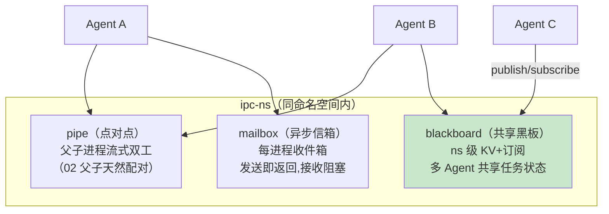
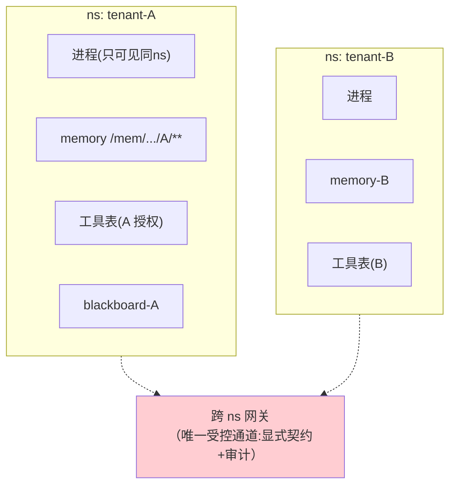

# 07-IPC 与命名空间——Agent 间通信 / 租户隔离 / 共享黑板

> **定位**：完成内核六大机制的最后一块：**IPC**（进程间通信——管道 pipe/共享黑板 blackboard/信箱 mailbox 三形态）与**命名空间**（ns——租户视图隔离：同租户进程互相可见、跨租户不可见；配额组与 ns 绑定）。读者画像：要多 Agent 协作又要硬隔离的读者。前置阅读：[06-中断与信号系统](06-中断与信号系统.md)、[教程 00-基础与核心/09-多Agent协作]、[教程 04-企业级架构主干/06-多租户隔离与资源治理]。
>
> **铁律 0**：SEND_MSG 经 03 syscall；机制自研。

---

## 一、四问

| 问 | 答 |
|----|----|
| **新增了什么需求** | ① IPC 三形态（pipe 点对点/mailbox 异步信箱/blackboard 共享黑板）② 命名空间（进程/记忆/工具/IPC 四类 ns 按租户隔离）③ 跨 ns 边界=显式网关（租户间仅经受控通道）④ IPC 与信号联动（消息到达=SIG_MSG 唤醒） |
| **影响了哪些模块** | `ipc-ns`（通道/ns 注册表）；SEND_MSG syscall 实现；memory-fs/工具表挂 ns 维度 |
| **架构如何演进** | 单进程孤岛 → 同 ns 协作 + 跨 ns 隔离 |
| **上一版痛点** | 进程无法协作、租户边界靠散落的过滤（06 §七） |

**本迭代验收**：① pipe 双工通信+背压 ② 跨租户 SEND_MSG EPERM ③ 黑板变更通知订阅者 ≤50ms ④ 同 ns 协作任务（主管+两 worker）跑通。

### 一.1 本节核对（需求与验收范围）

- [ ] 能说出来四项新增需求落点（IPC 三形态→二/命名空间→三/协作示例→四）
- [ ] 四次验收（pipe 背压/跨 ns EPERM/黑板通知/协作端到端）与 §二~§四 断言一一对应

---

## 二、IPC 三形态



| 形态 | 适用 | 背压/可靠性 |
|------|------|------------|
| pipe | 父子流式（主管↔worker） | 有界缓冲，满则阻塞发送 |
| mailbox | 异步任务分发 | 持久信箱（进程挂起不丢信）+ SIG_MSG 唤醒 |
| blackboard | 群体协作状态（[教程 00-基础与核心/09-多Agent协作] 黑板模式） | 变更日志（append-only）+ 订阅通知 |

```java
package com.example.kernel.ipc;

import java.util.concurrent.*;

/** 黑板——ns 级共享 KV + 订阅通知。 */
public class Blackboard {

    private final ConcurrentMap<String, String> entries = new ConcurrentHashMap<>();
    private final Map<String, CopyOnWriteArrayList<Subscriber>> subs = new ConcurrentHashMap<>();

    public void put(String key, String value, String ns) {
        entries.put(nsKey(ns, key), value);
        subs.getOrDefault(nsKey(ns, key), new CopyOnWriteArrayList<>())
            .forEach(s -> s.onChange(key, value));   // 通知 → 触发 SIG_MSG 唤醒订阅进程
    }

    public String get(String key, String ns) { return entries.get(nsKey(ns, key)); }

    private String nsKey(String ns, String key) { return ns + ":" + key; }

    public interface Subscriber { void onChange(String key, String value); }
}
```

### 二.1 本节测试与验证（IPC 三形态）

**前置条件**：pipe（有界缓冲）+ mailbox（持久信箱 + SIG_MSG 唤醒）+ blackboard（KV + 订阅通知）实现。

**材料 C——黑板通知剧本**：进程 A 对某 key 订阅，进程 B put 该 key。

**步骤与断言**：

| # | 操作 | 预期（PASS 判据） |
|---|------|------------------|
| 1 | pipe 流式传结果 | 缓冲满时发送阻塞（背压）；读端按序收全 |
| 2 | 材料C 黑板 put | 订阅者 ≤50ms 收到通知并唤醒（唤醒=自动开步，SIG_MSG） |
| 3 | mailbox 异步发信后挂起进程 | 进程挂起期间信件不丢；恢复后收信（持久信箱） |

**失败排查**：①无背压→缓冲无界（OOM 风险，pipe 应设容量上限满则阻塞）；③唤醒慢→通知走轮询（应事件推送而非投票）；③邮件丢失→信箱非持久（挂起进程的信未落盘）。

## 三、命名空间（四类隔离）



| ns 类型 | 隔离对象 | 实现 |
|---------|---------|------|
| pid ns | 进程可见性（/proc 只见同租户） | 进程表挂 ns 过滤 |
| memory ns | memory-fs 路径前缀（04 已有 scope） | `/mem/*/tenant/**` 强制前缀 |
| tool ns | 工具表按租户授权子集 | 能力表 ∩ 租户工具集 |
| ipc ns | pipe/信箱/黑板按租户分域 | 通道名带 ns 校验 |

```java
// SEND_MSG syscall 实现：先查同 ns → 跨 ns 走网关（契约注册+审计）→ 未注册 EPERM
```

### 三.1 本节测试与验证（租户命名空间隔离）

**前置条件**：四类 ns（pid/memory/tool/ipc）按 §三 隔离实现；SEND_MSG 先查同 ns，跨 ns 走注册网关。

**材料 A——跨租户剧本**：租户 A 进程 SEND_MSG 到租户 B 进程。

**步骤与断言**：

| # | 操作 | 预期（PASS 判据） |
|---|------|------------------|
| 1 | 材料A：A 进程 SEND_MSG 到 B（未注册） | EPERM（跨 ns 未受控） |
| 2 | 先经跨 ns 网关注册后再发 | 可通过且审计留痕（有显式契约+审计） |

**失败排查**：①未注册也能直发→SEND_MSG 未做 ns 校验（应先在 ipc ns 内查目标，跨 ns 必须走网关）。

## 四、多 Agent 协作示例（同 ns）

```bash
# 主管进程 spawn 检索/分析两个 worker（02 父子）
# 主管把任务写黑板 → worker 订阅唤醒 → 完成写回 + 信箱通知主管 → 主管 wait 收结果聚合
# 全程：进程模型(02) + syscall(03) + 黑板/信箱(本迭代) + 信号(06) 六机制齐用
```

### 四.1 本节测试与验证（协作端到端）

**前置条件**：同 ns 内已备好 pipe/信箱/黑板/wait 实现（本迭代组合 02/03/06）。

**材料 B——端到端剧本**：主管 spawn 检索+分析两 worker（黑板+信箱+wait 组合）。

**步骤与断言**：

| # | 操作 | 预期（PASS 判据） |
|---|------|------------------|
| 1 | 材料B 全流程 | 协作任务完整跑通（结果聚合正确） |

**失败排查**：①死锁→wait 与信箱顺序反了（应先收信箱结果再 wait 退出码，避免互相等待）。

## 五、全篇回归验证

> 各节验证材料与断言已上移至 §二.1（IPC 三形态）、§三.1（ns 隔离）、§四.1（协作端到端）；本表为整篇迭代的回归验收，不重复材料。

| # | 验收项 | 标准 |
|---|--------|------|
| 1 | IPC 三形态 | pipe/mailbox/blackboard 均可用（背压/持久/通知） |
| 2 | ns 四类隔离 | 跨 ns EPERM / 网关注册可通且审计 |
| 3 | 通知延迟 | 黑板订阅通知 ≤50ms |
| 4 | 协作端到端 | 主管+两 worker 跑通并聚合正确 |

## 六、本迭代痛点（内核完成度自评）

六大机制齐了，但关键代码散在各篇 → 08 核心代码讲解统一复盘。

### 六.1 本节核对（痛点承接）

- [ ] 痛点"六机制代码散在各篇"与 08 的主题（核心代码讲解统一复盘）对应，痛点驱动下一篇成立

## 七、验收对照

### 七.1 本节核对（验收 vs 落地）

> §2 验收目标已在 §二.1/§三.1/§四.1 断言通过；四行验收与 §五 回归表一一对应即 PASS。

| 验收项 | 标准 | 状态 |
|--------|------|------|
| IPC 三形态 | pipe/mailbox/blackboard | ✅ |
| ns 四类隔离 | 跨 ns EPERM+网关 | ✅ |
| 通知延迟 | 黑板 ≤50ms | ✅ |
| 协作端到端 | 主管+worker 跑通 | ✅ |

**下一篇**：[08-进程编排与守护进程](08-进程编排与守护进程.md)。
