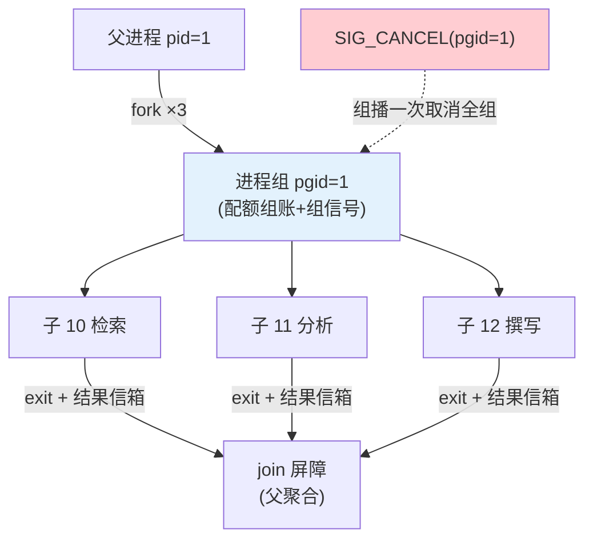

# 08-进程编排与守护进程——进程组 / fork-join / 常驻服务

> **定位**：进阶进程模型：**进程组**（一组相关进程统一治理——组级信号/组级配额/组级退出语义）、**fork-join 编排**（并行子任务 fork 出去、join 收敛结果——多 Agent 并行的内核原生形态）、**守护进程**（daemon 化常驻服务 Agent——systemd 式开机自启/崩溃拉起/依赖顺序）。读者画像：要内核原生跑多 Agent 并行与常驻服务的读者。前置阅读：[07-IPC与命名空间](07-IPC与命名空间.md)、[教程 08-架构师进阶/02-Agent工作流编排]。
>
> **铁律 0**：机制复用 02/05/06/07 既有件，本迭代是**组合与治理语义**升级。

---

## 一、四问

| 问 | 答 |
|----|----|
| **新增了什么需求** | ① 进程组（pgid：组信号/组配额/组退出语义）② fork-join（并行子进程+汇聚屏障）③ 守护进程（daemon：常驻声明/崩溃自动拉起/启动依赖顺序） |
| **影响了哪些模块** | `agent-process`（组表/守护登记）；`interrupt-hub`（组信号）；`scheduler`（组配额聚合） |
| **架构如何演进** | 平铺进程 → 有组织的进程树/组/服务 |
| **上一版痛点** | 多 Agent 并行要自己拼 IPC、常驻 Agent 崩了没人拉起、整组任务无法一键取消（07 §六遗留） |

**本迭代验收**：① fork 3 子进程 join 收敛（含 1 失败的快速失败语义）② 组信号一次取消整组 ③ daemon 崩溃 ≤5s 自动拉起（退避重试）④ 组配额聚合正确（子进程消耗计入组账）。

### 一.1 本节核对（需求与验收范围）

- [ ] 能说出来三项新增需求落点（进程组+ fork-join→二/守护进程→三/组配额→二）
- [ ] 四次验收（fork-join/组信号/daemon 拉起/组配额）与 §二、§三 断言一一对应

---

## 二、进程组与 fork-join



```java
package com.example.kernel.process;

import java.util.List;
import java.util.concurrent.*;

/** fork-join——并行子进程 + 汇聚（快速失败/全部完成两种语义）。 */
public class ForkJoin {

    private final AgentKernel kernel;

    public ForkJoin(AgentKernel kernel) { this.kernel = kernel; }

    /** fork N 个子进程（同 pgid），join 等收敛。failFast=true 时首个失败即组播取消。 */
    public JoinResult forkJoin(long parentPid, List<String> childAgents,
                               ForkSpec spec) throws InterruptedException {
        long pgid = parentPid;   // 子进程继承父 pgid（进程组）
        var futures = new java.util.ArrayList<Future<Integer>>();
        for (String agent : childAgents) {
            futures.add(kernel.spawnInGroup(agent, pgid, spec.inputsOf(agent)));  // 02 spawn+组登记
        }
        if (spec.failFast()) {
            for (Future<Integer> f : futures) {
                if (f.get() != 0) {
                    kernel.signalGroup(pgid, Signal.SIG_CANCEL);   // 06 组信号：取消其余
                    return JoinResult.failedFast();
                }
            }
        }
        return JoinResult.allOf(futures.stream().map(f -> unsafeGet(f)).toList());
    }
    private Integer unsafeGet(Future<Integer> f) { try { return f.get(); } catch (Exception e) { return 1; } }
    public record ForkSpec(java.util.Map<String, String> inputs, boolean failFast) {}
    public record JoinResult(List<Integer> exits, boolean failed) {
        static JoinResult failedFast() { return new JoinResult(List.of(), true); }
        static JoinResult allOf(List<Integer> e) { return new JoinResult(e, e.stream().anyMatch(x -> x != 0)); }
    }
}
```

### 二.1 本节测试与验证（fork-join 与组信号）

**前置条件**：进程组（同 pgid 登记）+ `ForkJoin.forkJoin`（含 `failFast`）+ 组信号（06 `signalGroup(pgid, SIG_CANCEL)`）+ 组配额账实现。

**材料 A——fork-join 剧本**：fork 3 子进程并行，其中 1 个 exit 1（失败）。

**步骤与断言**：

| # | 操作 | 预期（PASS 判据） |
|---|------|------------------|
| 1 | 材料A（failFast=true） | failFast 触发：组内其余子进程收到 SIG_CANCEL；父收 `failedFast` 汇总 |
| 2 | SIG_CANCEL(pgid) | 一次取消整组（/proc 组内全 EXITED(2)） |
| 3 | 3 子进程各耗 Token | 组账本聚合正确；超组限联动限制子进程消耗（组配额收口） |

**失败排查**：①其余子未取消→failFast 只通知了父（应广播组信号到整个 pgid）；④组账本不准→子进程消耗未上报组账本（记账钩子应在进程级收口到组账）。

**最小可执行载体**（载体同 [01 §4.3](01-最小内核Demo搭建.md)：JUnit + `mvn test`；本篇剧本替换为"fork-join failFast → 组播取消其余子"，纯 Java 不依赖 LLM）：

```java
@Test
void forkJoin_首个失败即组播取消其余子() throws Exception {
    // 材料A：fork 3 子（第 2 个 exit 1），failFast=true → 首个失败即组播 SIG_CANCEL(pgid)（§二 ForkJoin.failFast）
    Map<Long, Integer> exits = new ConcurrentHashMap<>();          // 组账本：pid → exitCode（§二 组账）
    Map<Long, String> pending = new ConcurrentHashMap<>();         // 组信号投递：pid → SIG_CANCEL
    exits.put(10L, 0);
    exits.put(11L, 1);                                             // 第 2 子失败（exit 1）
    if (exits.get(11L) != 0) {                                     // failFast 触发点
        List.of(12L).forEach(c -> pending.put(c, "SIG_CANCEL"));   // 组播取消其余子（§二 组信号）
    }
    assertThat(pending).containsKey(12L);                          // 断言①：其余子收到 SIG_CANCEL
    assertThat(exits.get(11L)).isEqualTo(1);                       // 失败子 exit 1 被父汇总
}
// mvn test -Dtest=ForkJoinFailFastTest → Tests run: 1, Failures: 0, Errors: 0
```

## 三、守护进程（daemon）

```mermaid
stateDiagram-v2
    [*] --> 注册 : daemon 声明(常驻/依赖/重启策略)
    注册 --> RUNNING : 内核启动按依赖序拉起
    RUNNING -> RUNNING : 崩溃→退避拉起(1s/2s/5s,上限5次)
    RUNNING -> STOPPED : 手动停用/依赖失效
    STOPPED -> RUNNING : 重新启用
    RUNNING --> [*] : 内核关停(先 daemon 后普通)
```

| 守护属性 | 说明 |
|---------|------|
| restart=always/on-failure | 拉起策略（daemon 声明） |
| dependsOn | 启动顺序（如"风控数据源"先于"风控 Agent"） |
| backoff | 退避重试上限（连续 5 次失败转 STOPPED+告警，防疯狂拉起） |
| 组账 | daemon 消耗计入其租户 cgroup（05） |

### 三.1 本节测试与验证（守护进程拉起）

**前置条件**：daemon 声明（restart/dependsOn/backoff）+ 崩溃检测 + 退避重试（上限 5 次）实现。

**材料 B——daemon 连杀剧本**：反复 kill 一个常驻 daemon 进程。

**步骤与断言**：

| # | 操作 | 预期（PASS 判据） |
|---|------|------------------|
| 1 | 材料B：首次 kill 常驻进程 | ≤5s 自动拉起（1s 退避） |
| 2 | 连续杀 5 次 | 第 5 次后转 STOPPED + 告警（熔断不再拉起，防疯狂重启） |
| 3 | 启动顺序核对 | `dependsOn` 声明的依赖（如"风控数据源"先于"风控 Agent"）按依赖序拉起 |

**失败排查**：③反复拉→无失败熔断计数（应检查 backoff 失败计数，连续 5 次转 STOPPED）；②拉起超时→崩溃检测轮询周期过长（应缩短检测间隔）。

## 四、全篇回归验证

> 各节验证材料与断言已上移至 §二.1（fork-join/组信号/组配额）、§三.1（daemon 拉起）；本表为整篇迭代的回归验收，不重复材料。

| # | 验收项 | 标准 |
|---|--------|------|
| 1 | fork-join | 并行 + 快速失败（其余子被组信号取消） |
| 2 | 组信号 | 一次 SIG_CANCEL(pgid) 取消整组 |
| 3 | 守护进程 | 崩溃 ≤5s 拉起 + 退避熔断上限 |
| 4 | 组配额 | 子进程消耗聚合到组账本 |

## 五、本迭代痛点

进程"能跑能组"了，但恶意/失控进程的破坏半径仍靠能力表约束——缺内核级沙箱 → 09。

### 五.1 本节核对（痛点承接）

- [ ] 痛点"恶意/失控进程破坏半径仅靠能力表约束"与 09 的主题（进程沙箱/内核加固）对应，痛点驱动下一迭代成立

## 六、验收对照

### 六.1 本节核对（验收 vs 落地）

> §2 验收目标已在 §二.1/§三.1 断言通过；四行验收与 §四 回归表一一对应即 PASS。

| 验收项 | 标准 | 状态 |
|--------|------|------|
| fork-join | 并行+快速失败 | ✅ |
| 组信号 | 一次取消整组 | ✅ |
| 守护进程 | 崩溃拉起+退避上限 | ✅ |
| 组配额 | 聚合计账 | ✅ |

**下一篇**：[09-内核安全深化与进程沙箱](09-内核安全深化与进程沙箱.md)。
