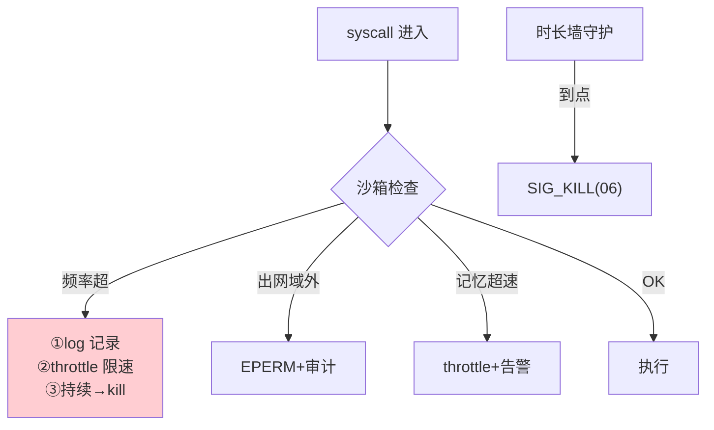

# 09-迭代八：内核安全深化与进程沙箱——能力沙箱 / 内核加固 / 观测防泄露

> **定位**：给内核加**纵深安全**：**进程沙箱**（能力表之外的运行时限制——syscall 频率/记忆写入速率/出网域白名单/执行时长上限，seccomp 式声明）、**内核加固**（内核自身攻击面收敛——管理面最小权限/配置签名防篡改/审计链防删改）、**观测防泄露**（/proc 脱敏——进程表不泄 Prompt 内容、syscall trace 只落哈希）。读者画像：要让内核本身"可信且不可被进程攻击"的读者。前置阅读：[08-迭代七-进程编排与守护进程](08-迭代七-进程编排与守护进程.md)、[教程 31-安全与权限控制]。
>
> **铁律 0**：机制自研（seccomp/LSM 为 OS 层类比，概念标注）。

---

## 一、四问

| 问 | 答 |
|----|----|
| **新增了什么需求** | ① 进程沙箱（runtime 限制四件套：syscall 频率/记忆速率/出网白名单/时长墙）② 内核加固（管理面最小权限/内核配置签名/审计 append-only）③ 观测防泄露（/proc 脱敏+trace 哈希化）④ 沙箱违规三级响应（记日志→限速→杀进程） |
| **影响了哪些模块** | `syscall-gateway`（限速/白名单）、`agent-process`（时长墙）、`kernel-obs`（脱敏）、内核配置面（签名） |
| **架构如何演进** | 能力表（能做什么）+ 沙箱（做的方式与量级上限）双层 |
| **上一版痛点** | 失控进程即使全在能力表内也可高频调用/狂写记忆/长跑不退（08 §五） |

**本迭代验收**：① 超频 syscall 被限速（EPERM→限速→杀 三级）② 出网域白名单外拒绝 ③ 时长墙到点 SIG_KILL ④ /proc 与 trace 中无 Prompt 明文 ⑤ 内核配置篡改被签名校验发现。

---

## 二、进程沙箱（声明式）

```yaml
# SandboxSpec —— 随进程定义声明（内核强制）
sandbox:
  syscallRate:   { maxPerMin: 200 }          # ① 频率
  memoryWrite:   { maxBytesPerMin: 1MB }     # ② 记忆速率
  network:                                    # ③ 出网白名单
    allowDomains: [api.internal.tools]
  wallClock:     { maxMinutes: 30 }          # ④ 时长墙
  violation:     log | throttle | kill       # 响应级别
```



## 三、内核加固与观测防泄露

```java
// 内核加固三件：
// ① 管理面最小权限：内核管理接口（kill/改配额）独立鉴权+双人评审动作审计
// ② 内核配置签名：调度策略/能力默认值等内核配置下发需签名，Sidecar/内核启动验签（防中间人改内核行为）
// ③ 审计 append-only：syscall 审计与信号审计只增不改（哈希链，防抹痕迹）
// 观测防泄露：
//   /proc：进程表只有 pid/name/state（无输入参数）
//   /proc/syscalls：args 只落 SM3 哈希（原文永不进观测面）
//   例外通道：合规调查走受控脱敏导出（双人授权）
```

## 四、测试与验证

```bash
# 1. 沙箱：进程 1 分钟打 300 次 syscall → log→throttle→kill 三级依次触发
# 2. 出网：工具回连白名单外域名 → EPERM+审计
# 3. 时长墙：daemon 声明 30min 墙 → 到点 SIG_KILL → 按 daemon 策略决定是否拉起
# 4. 防泄露：grep /proc 输出与 trace 存储 → 无 Prompt 明文（哈希抽样核对）
# 5. 加固：篡改一份内核配置（去签名）→ 启动验签失败拒绝加载
```

## 五、本迭代痛点

单内核是单点——内核崩则全停 → 10 分布式内核。

## 六、验收对照

| 验收项 | 标准 | 状态 |
|--------|------|------|
| 沙箱四件套 | 频率/速率/白名单/时长 | ✅ |
| 三级响应 | log→throttle→kill | ✅ |
| 观测防泄露 | 零明文 | ✅ |
| 内核加固 | 配置签名+审计防删改 | ✅ |

**下一篇**：[10-迭代九-分布式内核与高可用](10-迭代九-分布式内核与高可用.md)。
