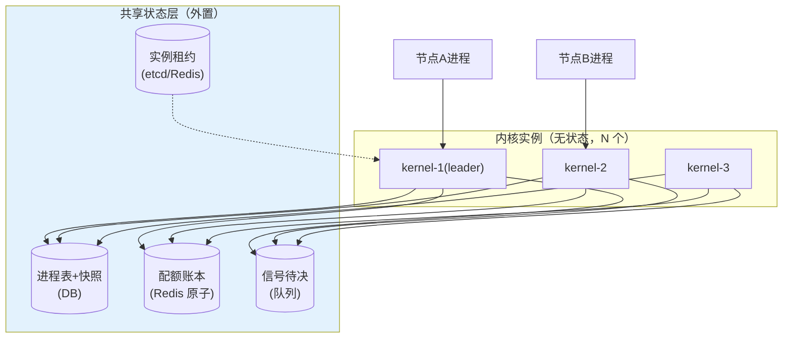
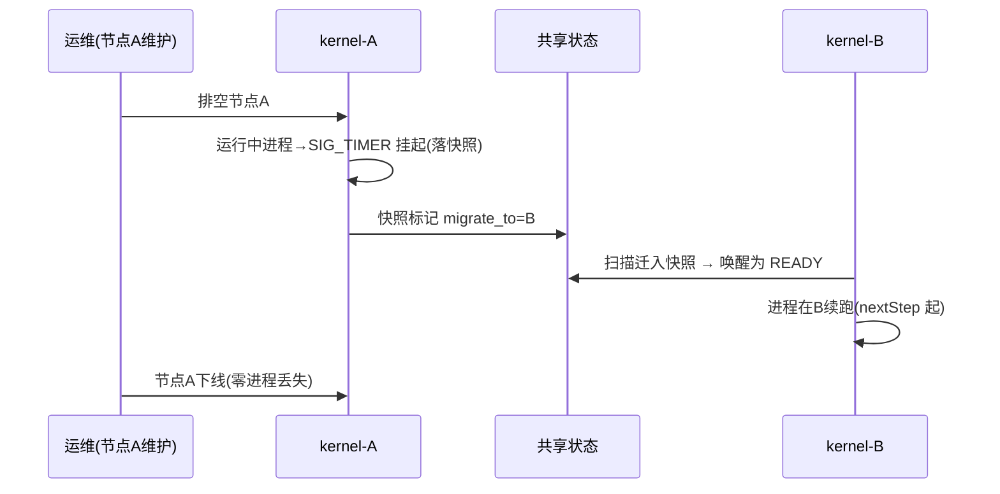

# 10-分布式内核与高可用——内核 HA / 进程迁移 / 热升级

> **定位**：消除内核单点：**内核 HA**（多内核实例+共享状态层——进程表/配额账本外置，任一内核实例崩不丢进程）、**进程迁移**（节点过载/维护时把挂起态进程迁到其他节点续跑）、**内核热升级**（内核自身不停机升级——双内核进程热切，呼应 16 网格 Sidecar 热切思想但此处是控制面自身）。读者画像：内核要 99.9%+ 的读者。前置阅读：[09-内核安全深化与进程沙箱](09-内核安全深化与进程沙箱.md)。
>
> **铁律 0**：状态外置复用既有存储（进程快照表/配额 Redis）；机制自研。

---

## 一、四问

| 问 | 答 |
|----|----|
| **新增了什么需求** | ① 内核多实例（无状态化：进程表/信号待决/配额账全部外置共享）② 进程迁移（跨节点：快照搬迁+目标节点唤醒）③ 内核热升级（双实例热切+在途 syscall 排空）④ 脑裂防护（实例间租约，分区时少数派停写） |
| **影响了哪些模块** | 全部 Control 面服务（外置状态改造）；新增 `kernel-ha` 协调 |
| **架构如何演进** | 单内核 → 内核集群（数据面进程无感） |
| **上一版痛点** | 内核单点；节点维护=进程中断（09 §五） |

**本迭代验收**：① 杀任一内核实例 → 进程与在途 syscall 无损 ② 节点维护：挂起进程迁移到健康节点 ≤10s 续跑 ③ 内核热升级全程零中断 ④ 分区时少数派自动停写（无双重调度）。

### 一.1 本节核对（需求与验收范围）

- [ ] 能说出来四项新增需求落点（HA 架构→二/进程迁移→三/热升级与脑裂→四）
- [ ] 四次验收（实例无损/迁移续跑/零中断/少数派停写）与 §二~§四 断言一一对应

---

## 二、内核 HA 架构



**无状态化改造清单**：进程表→DB（含状态/退出码）；配额扣减→Redis 原子（本就外置）；信号 pending→持久队列；调度决策→基于共享租约的分布式锁（防双实例调起同一进程）。

### 二.1 本节核对（内核 HA 架构）

| # | 核对项 | 判据 |
|---|--------|------|
| 1 | 无状态化 | 内核实例不持有本地状态（进程表/配额/信号全外置到共享状态层，防单实例崩丢进程） |
| 2 | 防双重调度 | 进程表→DB、配额→Redis 原子、信号→持久队列、调度→共享租约分布式锁，四项均有明确落点 |

## 三、进程迁移



### 三.1 本节测试与验证（进程迁移）

**前置条件**：多节点内核（leader 选举）+ 挂起快照带 `migrate_to` 标记 + 目标节点迁入唤醒实现。

**材料 B——迁移剧本**：节点 A 3 个挂起进程迁移到节点 B。

**步骤与断言**：

| # | 操作 | 预期（PASS 判据） |
|---|------|------------------|
| 1 | 材料B | 迁移 ≤10s 全部续跑（nextStep 正确——无步骤重做） |
| 2 | 排空节点 A 后下线 | 节点 A 零进程丢失（挂起进程已全部迁出） |

**失败排查**：①重做步骤→快照缺步骤级 nextStep（应逐步骤边界落快照再标记迁移）；②丢失→挂起进程未先落 migrate_to 快照就被清理。

## 四、热升级与脑裂

```java
// 热升级（控制面自身）：同节点双内核进程
//   旧内核：停止接新 syscall → 在途排空（≤30s）→ 状态已在外置层（无需迁移）
//   新内核：启动→租约接管→继续服务；异常→旧内核秒回切
// 脑裂防护：实例写共享状态前必须持租约（TTL 10s）；分区少数派租约过期→自动停写降级为只读
//   （宁可只读不可双写——配额/调度的双重执行比短暂不可用更危险）
```

### 四.1 本节测试与验证（热升级与脑裂）

**前置条件**：双内核热切 + 租约（TTL 10s）+ 分区停写/追平实现；3 节点测试环境。

**材料 A——HA 剧本**：kill leader；**材料 C——脑裂剧本**：网络分区 2+1。

**步骤与断言**：

| # | 操作 | 预期（PASS 判据） |
|---|------|------------------|
| 1 | 材料A：kill 当前 leader | 新 leader ≤5s 选出；运行进程零丢失；在途 syscall 全部完成（无半途丢弃） |
| 2 | 滚动升级内核 v2.1（期间持续压测） | 零失败（逐节点摘流-升级-回流的时序日志） |
| 3 | 材料C 网络分区 2+1 | 少数派停写 + 告警；分区恢复后自动追平（数据无分叉） |

**失败排查**：①在途丢→syscall 无幂等重放（应在途调用持久化 pending 以便新 leader 续跑）；④数据分叉→少数派没停写（quorum 写约束缺失——严重，分区时须停写只读）。

## 五、全篇回归验证

> 各节验证材料与断言已上移至 §三.1（进程迁移）、§四.1（热升级/脑裂）；本表为整篇迭代的回归验收，不重复材料。

| # | 验收项 | 标准 |
|---|--------|------|
| 1 | 内核 HA | 任一实例崩，进程与在途 syscall 无损 |
| 2 | 进程迁移 | ≤10s 迁移续跑（无步骤重做） |
| 3 | 热升级 | 全程零中断 |
| 4 | 脑裂防护 | 分区时少数派停写（无双重调度） |

## 六、本迭代痛点

内核全景齐备但代码散在各篇 → 11 核心代码讲解统一复盘。

### 六.1 本节核对（痛点承接）

- [ ] 痛点"内核全景齐备但代码散在各篇"与 11 的主题（核心代码讲解统一复盘）对应，痛点驱动下一篇成立

## 七、验收对照

### 七.1 本节核对（验收 vs 落地）

> §2 验收目标已在 §三.1/§四.1 断言通过；四行验收与 §五 回归表一一对应即 PASS。

| 验收项 | 标准 | 状态 |
|--------|------|------|
| 内核 HA | 任一实例崩无损 | ✅ |
| 进程迁移 | ≤10s 续跑 | ✅ |
| 热升级 | 零中断 | ✅ |
| 脑裂防护 | 少数派停写 | ✅ |

**下一篇**：[11-核心代码讲解](11-核心代码讲解.md)。
