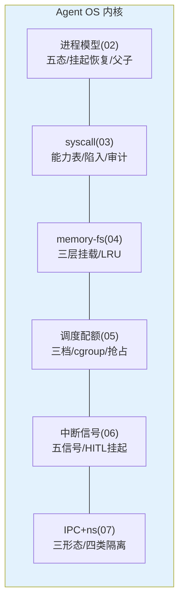
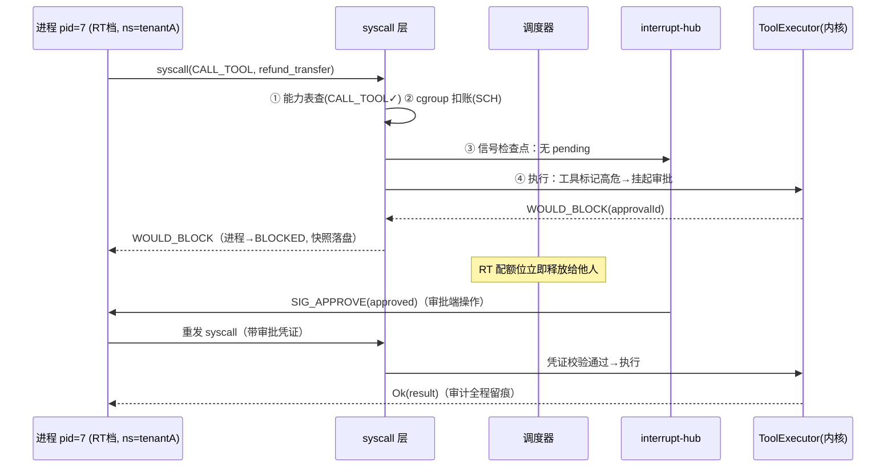

# 11-核心代码讲解：内核六大机制代码全景

> **定位**：把 01-07 的内核关键实现集中复盘——每段讲"设计意图→实现要点→与 OS 原型的异同"，并给出一条 **syscall 的完整旅程**（把六机制串起来）。读者画像：读完迭代想统一消化的读者。前置阅读：[02-进程模型与生命周期](02-进程模型与生命周期.md) 至 [07-IPC与命名空间](07-IPC与命名空间.md)。
>
> **铁律 0**：Spring AI API 与基准一致。

---

## 一、六大机制速查



| 机制 | OS 原型 | Agent 特有差异 |
|------|---------|---------------|
| 进程 | POSIX 进程/线程 | 长任务常态（挂起数小时/数天）；虚拟线程承载 |
| syscall | 系统调用表 | INVOKE_MODEL 是第一公民（LLM 调用=最重的"IO"） |
| memory-fs | VFS/页缓存 | 语义检索（相似度）也是"读"的一种 |
| 调度 | CFS/cgroup | Token 是新货币（CPU 之外的第一配额维度） |
| 信号 | POSIX signals | SIG_APPROVE（人机协作）是 OS 没有的 |
| IPC/ns | pipe/shm/namespace | 黑板=共享内存+发布订阅混合体 |

### 一.1 本节核对（六大机制速查）

| # | 核对项 | 判据 |
|---|--------|------|
| 1 | 机制与来源篇对齐 | 六机制（进程/syscall/memory-fs/调度/信号/IPC）分别对应 02/03/04/05/06/07，图表无串位 |
| 2 | Agent 特有差异 | 每行能指出一处 Agent 特有差异（长任务、INVOKE_MODEL 第一公民、语义检索、Token 货币、SIG_APPROVE、黑板混合体） |

---

## 二、一条 syscall 的完整旅程（六机制串联）



**一句话**：一次工具调用走完 能力检查→配额扣减→信号检查→挂起-唤醒→执行-审计——六机制在一条路径上各司其职。

### 二.1 本节测试与验证（一条 syscall 的完整旅程）

**前置条件**：六机制服务（02-07）均为可运行实现，已具备一次性跑完整旅程的环境。

**步骤与断言**（对照 §二 journey 逐点断言）：

| # | 操作 | 预期（PASS 判据） |
|---|------|------------------|
| 1 | 发起一次高危工具 syscall | ① 能力表查通过 ② cgroup 扣账 ③ 信号检查点无 pending ④ 执行 → 高危挂起 WOULD_BLOCK |
| 2 | 审批端 approve | SIG_APPROVE 唤醒 → 带审批凭证重发系统调用 → 凭证校验通过执行 → 返 `Ok(result)` |
| 3 | 全程走完 | 审计全程留痕（六机制各在其位，无一步缺失） |

**失败排查**：①能力/配额/信号/挂起/执行/审计任一环节缺→对应迭代篇（02-07）验证未通过，回查该篇回归表。

## 三、关键实现要点（复盘清单）

### 3.1 进程挂起为什么"快照+虚拟线程"

挂起=**状态外化**（快照落盘）+ 线程退出（不占资源）；恢复=新虚拟线程从 nextStep 续跑。对比"线程一直睡等"：审批可能 24h 后来，睡=泄漏。

### 3.2 syscall 为什么"内核代理工具"

Spring AI 的 `ToolCallingAdvisor`+`ToolCallingManager` 循环保留（[教程 00-基础与核心/03-工具调用]），但每个能力对应**内核代理 ToolCallback**（内部发 syscall）——框架语义不变，执行收口到内核（机制替换、对业务透明）。

### 3.3 memory-fs 为什么"tmpfs+disk+只读"三层

| 层 | 对应 [教程 08-架构师进阶/05-高级记忆架构] | 挂载时机 |
|----|---------------|---------|
| /mem/session | 短期（会话窗口） | spawn 时自动 |
| /mem/longterm | 长期（跨会话事实） | Agent 定义声明 |
| /mem/shared | 外部知识（RAG） | 租户绑定 |

### 3.4 调度为什么"抢占只在排队边界"

模型调用发出即计费——撕毁=白花钱；排队位抢占=零成本插队。RT ≤100ms 目标由此达成。

### 3.5 信号为什么"syscall 边界检查"

异步信号随时到，但**处理必须在安全点**（内核边界）——与 OS"中断返回检查"同构，避免进程在任意点被撕状态。

### 3.6 本节核对（复盘清单）

| # | 核对项 | 判据 |
|---|--------|------|
| 1 | 五条复盘与迭代篇一致 | 3.1→02、3.2→03、3.3→04、3.4→05、3.5→06 的解释与各迭代篇口径一致（无矛盾） |
| 2 | 每条能回答"为什么" | 抽任一条能复述"为什么"（挂起外化/内核代理/三层/排队边界/边界检查） |

---

## 四、内核观测（/proc 全家）

```bash
/proc                # 进程表（pid/状态/退出码）
/proc/syscalls       # syscall trace（strace 式）
/proc/interrupts     # 信号统计（审批等待/取消/KILL）
/proc/cgroups        # 配额组用量（Token/并发/记忆）
/proc/mounts         # memory-fs 挂载表
```

### 四.1 本节测试与验证（/proc 观测面板）

**前置条件**：内核服务运行，已有若干进程/syscall/信号/配额组/memory-fs 挂载产生观测数据。

**步骤与断言**：

| # | 操作 | 预期（PASS 判据） |
|---|------|------------------|
| 1 | 逐项查询 /proc 五个视图 | 每项能返回对应实时数据（进程表/syscall trace/信号统计/配额用量/挂载表） |
| 2 | 跑一轮高危工具 syscall | /proc/syscalls 出现该条记录、/proc/interrupts 出现审批等待统计（观测与行为一致） |

**失败排查**：①视图为空→对应埋点未接通（应核对各迭代篇的采集实现）；②数据与实际不符→观测采样与事件产生点脱节。

---

## 五、全篇回归验证

> 各节验证/核对已上移至 §一.1、§二.1、§3.6、§四.1；本表为整篇代码讲解的回归验收，不重复材料。

| # | 验收项 | 标准 |
|---|--------|------|
| 1 | 六机制旅程 | 一条 syscall 走完能力/配额/信号/挂起/执行/审计六环节 |
| 2 | 复盘一致性 | 五条关键实现要点与 02-07 迭代篇口径一致 |
| 3 | /proc 观测 | 五视图逐项可查且与实际行为一致 |

**下一篇**：[12-ADR架构决策记录](12-ADR架构决策记录.md)。
