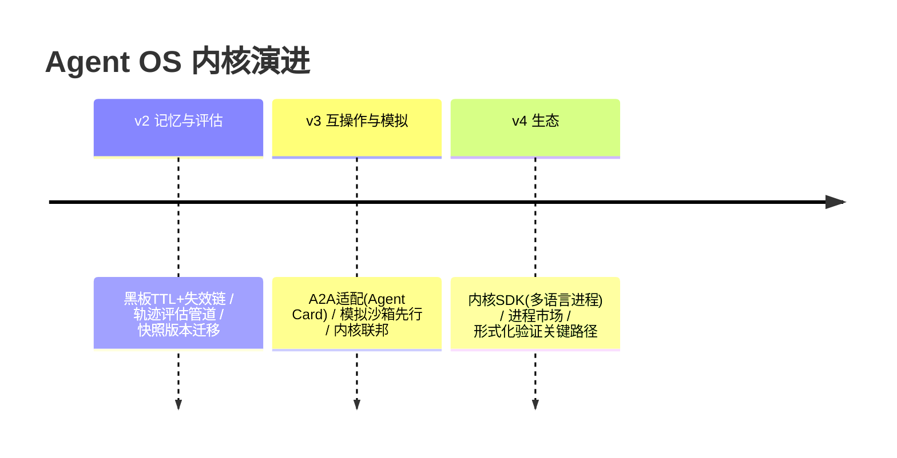

# 13-工业前沿与演进方向：Agent OS 的 2026 校准与收官

> **定位**：用 2026 真实工业实践校准 Agent OS 内核方向，给出缺口与 v2-v4 演进，项目收官。读者画像：读完 00-12 想知道"内核接下来往哪长"的读者。前置阅读：[12-ADR架构决策记录](12-ADR架构决策记录.md)、[前沿 01-Agent操作系统]。
>
> **来源**：真实外部资料（链接文内）。

---

## 一、行业信号：业界正在走向"Agent 运行时/OS"

2026 年共识正在形成："难的不再是模型，是**托管与运行 Agent 的系统工程**"：

- **Google**（[五指南](https://cloud.google.com/blog/topics/developers-practitioners/five-guides-to-building-and-scaling-production-ready-ai-agents)）：Agent Runtime 支持**状态持久化最长 7 天**、委托审批零计算暂停——正是本项目 02/06 的"挂起快照 + SIG_APPROVE"路径；其"编排层=Session State/Memory/Tool Use/安全框架"四件套与内核六机制高度同构。
- **Nebius**（[Agents Blueprint](https://nebius.com/blog/posts/introducing-the-nebius-agents-blueprint)）：六组件（Inference/Orchestration/Observability/Knowledge/Grounding/Simulation）中 Orchestration+Observability+Knowledge 即本内核的调度+观测+memory-fs；"95%^10≈60% 步进衰减"论证了**进程级检查点/重试**（02）的必要性。
- **AWS**（[企业生产级指南](https://cloud.it168.com/a2026/0708/6939/000006939041.shtml)）：评估驱动六步闭环——内核的 cgroup 账本天然是评估的计量底座（Token/轮次/成本按进程聚合）。
- **PagerDuty**（[Production AI Agents](https://www.pagerduty.com/eng/production-ai-agents-closing-the-gaps-between-idea-and-reality/)）：共享事实失效问题→黑板（07）需加**失效标记（supersededBy）**；多跳关系→知识图谱挂载为 memory-fs 第四层。

### 一.1 本节核对（行业信号）

| # | 核对项 | 判据 |
|---|--------|------|
| 1 | 信号→机制映射 | 至少能从 Google/Nebius/AWS/PagerDuty 四来源各指出一条与本内核机制的对应（挂起快照/调度观测/账本计量/黑板失效标记） |
| 2 | 来源可追溯 | 每条信号均给出外部链接（真实来源），非凭空断言 |

---

## 二、内核现状对照（N1-N6）

| # | 前沿能力 | 内核现状 | 缺口/演进 |
|---|---------|---------|----------|
| N1 | 长状态持久化（7 天级） | ✅ 挂起快照（02）任意时长 | 🔶 快照版本兼容自动化（定义演进时旧快照迁移） |
| N2 | 委托审批零计算暂停 | ✅ SIG_APPROVE（06） | ✅ 同构 |
| N3 | 记忆失效感知（TTL/supersededBy） | 🔶 黑板 append-only | 🔷 v2：黑板条目加 TTL+失效链（PagerDuty 洞见） |
| N4 | 评估驱动（轨迹级） | 🔶 syscall 审计=原始轨迹 | 🔷 v2：轨迹→评估管道（进程每轮质量打分进 cgroup 画像） |
| N5 | A2A 互操作 | ❌ IPC 仅内部 | 🔷 v3：跨内核 IPC=A2A 适配（Agent Card=进程能力表外化） |
| N6 | 模拟先行 | ❌ | 🔷 v3：spawn 前模拟跑（Snowglobe 式沙箱批量任务，产出回归基线） |

### 二.1 本节核对（现状对照）

| # | 核对项 | 判据 |
|---|--------|------|
| 1 | 现状评估准确 | N1-N6 的"内核现状"（✅/🔶/❌）与对应迭代篇能力一致（如 N1=02 挂起快照、N2=06 SIG_APPROVE） |
| 2 | 缺口承接演进 | N3/N4 指向 v2、N5/N6 指向 v3，与 §三 timeline 的 v2/v3 演进项一致 |

---

## 三、演进路线



**优先级依据**：质量（v2 记忆失效+评估）> 生态（v3 互操作）> 规模化（v4）。

### 三.1 本节核对（演进路线）

- [ ] 优先级依据（质量 > 生态 > 规模化）与 timeline 的 v2→v3→v4 顺序一致，无演进项错位
- [ ] 每条演进项能回指到现状缺口（N3/N4→v2、N5/N6→v3）

---

## 四、检验方式

```bash
# 对照检验：把 06 的 HITL 旅程与 Google "零计算暂停"描述逐句比对（同构性自查）
# N3 PoC：黑板加 supersededBy 字段→订阅者读到失效链→Agent 引用时降权
```

### 四.1 本节测试与验证（前沿同构校验与 PoC）

**前置条件**：06 的 HITL 旅程可运行；07 黑板实现存在（可加字段）。

**步骤与断言**：

| # | 操作 | 预期（PASS 判据） |
|---|------|------------------|
| 1 | §一 中 Google"委托审批零计算暂停"与 06 HITL 旅程逐句比对手工核查 | 语义同构（挂起零计算/唤醒续跑）一致，无矛盾 |
| 2 | N3 PoC：黑板加 `supersededBy` 字段 | 订阅者能读到失效链；Agent 引用失效条目时降权（行为可验证） |

**失败排查**：①同构不符→对照 06 信号表与 Google 描述的口径差异（核对 SIG_APPROVE 处置）；②失效链不读→黑板 put 未写 supersededBy 或订阅者未解析。

---

## 五、项目收官

| 阶段 | 篇目 | 交付 |
|------|------|------|
| 基础（00-01） | 需求架构/最小内核 | OS 隐喻 + 内核态用户态分离 + 进程骨架 |
| 六机制（02-07） | 进程/syscall/记忆FS/调度配额/中断信号/IPC-ns | 完整内核 |
| 进阶（08-10） | 进程编排/内核安全/分布式内核 | fork-join 与守护、沙箱加固、内核 HA |
| 资产（11-13） | 代码讲解/ADR/前沿 | 内核全景复盘 + 16 条决策 DNA + v2-v4 路线 |

### 五.1 本节核对（项目收官）

- [ ] 四阶段（基础/六机制/进阶/资产）的篇目覆盖 00-13 全部文件，无缺漏
- [ ] 收官口径（六机制 + 内核态/用户态分离，每机制可测试、每决策有 ADR）与全项目实际情况一致

项目 15 到此收官：一个**用操作系统四十年答案组织 Agent 运行时**的工业级内核蓝图——六机制 + 内核态/用户态分离，每机制可测试、每决策有 ADR。独立项目，无后续依赖。
