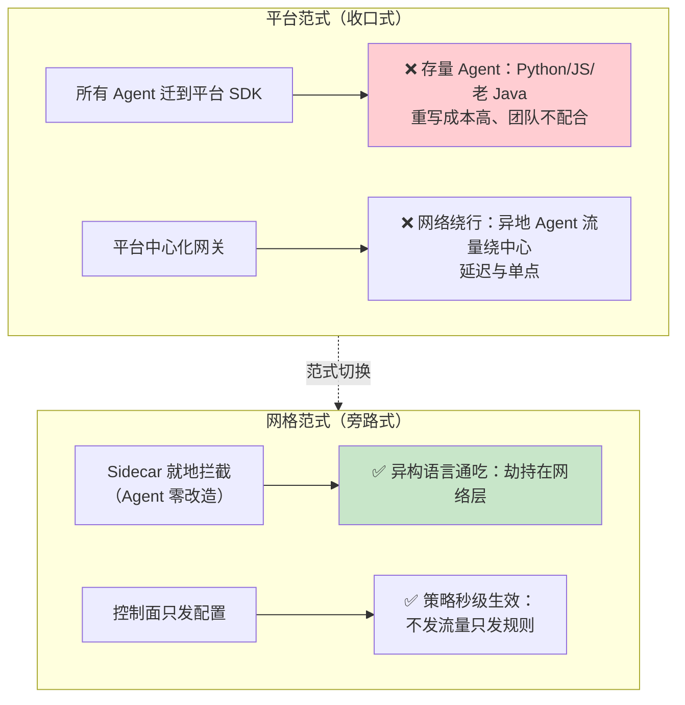
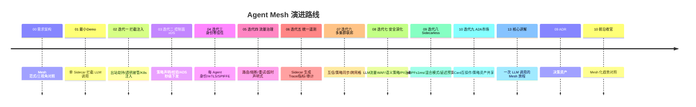

# 00-需求分析与架构设计：企业级 Agent 服务网格

> **定位**：用**服务网格（Service Mesh）范式**构建 Agent 治理基础设施：**数据面=Sidecar**（与每个 Agent 进程同生命周期的本地代理，劫持其全部 LLM/工具/检索流量）、**控制面=xDS 式动态下发**（路由/熔断/配额/身份策略秒级生效、Agent 零改造）。它解决"**异构、多语言、多团队、已存在**的 Agent 群如何统一治理"——平台（中心化收口）做不到的场景。读者画像：理解管控分离（[教程 29-管控分离架构 §Agent Mesh/Sidecar]）、要治理"不该重写"的存量 Agent 群的架构师。前置阅读：[教程 29-管控分离架构]、[教程 30-微服务拆分与Agent部署]、[教程 63-容错与弹性设计]。
>
> **铁律 0**：Spring AI 2.0 API 与基准一致；Envoy/xDS 为第三方（标真实坐标/概念）。
> **项目独立性**：与项目 14（平台视角）、15（内核视角）互补且互不引用——三视角对照见 §八。

---

## ★ 阅读顺序总览（序号 = 你的实际阅读顺序）

> 本子文件夹 14 个文件，**文件名编号 00-15 即阅读顺序**（08-10 为进阶迭代，13-15 为讲解/ADR/前沿）：

| 阶段 | 文件 | 读者定位 |
|------|------|---------|
| ① 全貌 | 00-需求分析与架构设计 | **先读**：Mesh 范式、Sidecar/xDS、控制面微服务清单 |
| ② 起步 | 01-最小Demo | **动手**：单 Sidecar 拦截一次 LLM 调用 |
| ③ 主体迭代 | 02~07（拦截注入/控制面xDS/身份零信任/流量治理/遥测/多集群联邦） | **严格顺序**：六层机制 |
| ③+ 进阶迭代 | 08~10（网格安全语义策略/Sidecarless性能/A2A互操作市场） | **进阶**：LLM流量WAF、eBPF≤1ms、策略市场 |
| ④ 代码讲解 | 11-核心代码讲解 | **回顾**：一次 LLM 调用过 Mesh 的完整旅程 |
| ⑤ 决策资产 | 12-ADR架构决策记录 | **按需查阅**：改 Mesh 前先查 |
| ⑥ 前沿收官 | 13-工业前沿与演进方向 | **扩展**：Mesh 化趋势对照 |

---

## 一、为什么是服务网格

### 1.1 平台范式的盲区



**判断标准**（什么时候选 Mesh 而不是平台）：
- Agent 群**异构**（多语言/多框架/多团队自治）→ Mesh
- Agent **已存在且不允许重写**（存量改造）→ Mesh
- Agent **地理分散**（工厂/门店/边缘，流量不该绕中心）→ Mesh
- 全新绿地、单一技术栈 → 平台（14 式）更简单

### 1.2 Mesh 概念映射

| Service Mesh 概念 | Agent Mesh 对应 | 本项目模块 |
|-------------------|----------------|-----------|
| Sidecar（数据面） | Agent 本地代理：劫持 LLM/工具/检索流量 | `agent-sidecar` |
| 控制面（Pilot/xDS） | 策略/路由/配额动态下发 | `mesh-control` |
| Citadel（身份） | 每 Agent 一个加密身份（mTLS） | `mesh-identity` |
| 遥测 | Sidecar 统一上报指标/日志/Trace | `mesh-telemetry` |
| Galley（配置校验） | 策略语法/语义校验后下发 | `mesh-config` |
| 多集群联邦 | 跨集群 Mesh 互信与策略同步 | `mesh-federation` |

### 一.1 本节核对（为什么是服务网格）

- [ ] 能不看正文说出 Mesh 的三个适用判断标准（异构/存量不改写/地理分散），并指出绿地统一栈应选平台的场景（借 1.1 判断标准与 §八 对照表）
- [ ] 1.2 的六个概念映射（Sidecar/Pilot/xDS/Citadel/遥测/Galley 联邦）与 §四 微服务清单的六个模块一一对应，命名无错位

---

## 二、四问（需求分析阶段）

| 问 | 答 |
|----|----|
| **新增了什么需求** | Mesh 边界：Sidecar 拦截、xDS 动态下发、身份零信任、流量治理、统一遥测、多集群联邦 |
| **影响了哪些模块** | 新基础设施（存量 Agent 零改造） |
| **架构如何演进** | 本文定目标架构 → 01 最小拦截 → 02-07 六层机制 |
| **上一版痛点** | 平台范式三个盲区（§1.1） |

### 二.1 本节核对（四问）

- [ ] 四问四行均无空答：新增需求（六项边界）、影响模块（新基础设施）、架构演进（本文定目标→01-07）、上一版痛点（§1.1 三盲区）自洽
- [ ] "架构演进"行与 §五 迭代路线（01 最小拦截 → 02-07 六层）方向一致，无互相矛盾

---

## 三、总体架构

```mermaid
graph TB
    subgraph cluster1["集群 A"]
        subgraph pod1["Agent Pod（任意语言）"]
            APP1["Agent 应用<br/>(Python/Java/JS,零改造)"]
            SC1["agent-sidecar<br/>localhost 劫持"]
            APP1 ---|"127.0.0.1<br/>出站劫持"| SC1
        end
        SC2["agent-sidecar(其他Agent)"]
    end

    subgraph cp["控制面（管控面）"]
        MCC["mesh-control<br/>xDS 下发(路由/熔断/配额)"]
        MID["mesh-identity<br/>身份签发/mTLS"]
        MTL["mesh-telemetry<br/>遥测汇聚"]
        MCF["mesh-config<br/>策略校验(Galley 式)"]
    end

    SC1 -->|"mTLS + 遥测"| MTL
    SC1 <-.|"xDS 订阅"| MCC
    SC1 -->|"出站(LLM/工具)"| LLM["LLM/工具/检索<br/>(经 Sidecar 策略执行)"]
    MCF --> MCC

    style cp fill:#e3f2fd
    style SC1 fill:#e8f5e9
```

**控制面/数据面纪律**：**策略在控制面、执行在 Sidecar**——数据面不发流量到中心（除遥测/订阅），治理决策全部本地执行（延迟零绕行）。

### 三.1 本节核对（总体架构）

- [ ] 架构图中控制面四个框（mesh-control/identity/telemetry/config）能在 §四 微服务清单找到对应服务，Sidecar 在 §四 标记为数据面
- [ ] "控制面/数据面纪律"（策略在控制面、执行在 Sidecar）复述得出口——与 1.2 及 [ADR 16-01] 本地执行决策不矛盾

---

## 四、微服务清单

| 服务 | 平面 | 职责 | 迭代 |
|------|------|------|------|
| `agent-sidecar` | 数据面 | 流量劫持/本地策略执行/遥测生成 | 01/02 |
| `mesh-control` | 控制面 | xDS（ADS 聚合）策略下发、Sidecar 生命周期感知 | 03 |
| `mesh-identity` | 控制面 | Agent 身份签发/轮换/mTLS 材料分发 | 04 |
| `mesh-telemetry` | 数据面侧 | 遥测汇聚/指标/Trace 对接 OTel | 05 |
| `mesh-config` | 控制面 | 策略声明(YAML)校验/版本/灰度 | 03/06 |
| `mesh-federation` | 皆可 | 多集群互信/策略同步/跨网格路由 | 07 |

### 四.1 本节核对（微服务清单）

- [ ] 六个服务的平面归属（数据面/控制面/皆可）与 §三 总体架构一致；每个服务的职责一句话即可对应到迭代篇目
- [ ] "迭代"列与 §五 迭代路线一一衔接，无清单里有但路线没有（或反之）的服务

---

## 五、迭代路线



### 五.1 本节核对（迭代路线）

- [ ] timeline 中 01-10 各阶段与后续各迭代篇（01-10 四个文档）标题一一对应，无缺漏错位
- [ ] 演进是递增的（最小拦截→注入→控制面→身份→治理→遥测→联邦→进阶），每一阶段是下一阶段的准入条件，表述自洽

---

## 六、量化验收（项目级）

| 类别 | 指标 | 目标 |
|------|------|------|
| 拦截 | Sidecar 引入延迟增量 | ≤5ms（本地策略命中） |
| 下发 | 策略变更全网格生效 | ≤2s（xDS 推送） |
| 零改造 | 存量 Agent 接入改造量 | 0 行代码（仅部署注入） |
| 身份 | Agent 间调用 mTLS 覆盖 | 100% |
| 弹性 | 单 Sidecar 故障影响 | 仅本 Pod（旁路可一键 bypass） |
| 遥测 | LLM/工具调用 Trace 覆盖 | 100% 自动生成 |

### 六.1 本节核对（量化验收）

- [ ] 六个指标均带可度量目标（≤5ms / ≤2s / 0 行 / 100% / 仅本 Pod / 100%），无空泛承诺
- [ ] 每条指标都能在 §五 对应迭代篇找到验证落点（如拦截→01±§四.1 计时、下发→03 §四.1 ≤2s、身份→04），无"提了但无篇目承载"的指标

---

## 七、与教程体系的锚点

| 教程 | 落点 |
|------|------|
| [教程 29-管控分离架构 §Agent Mesh/Sidecar] | 总架构 |
| [教程 63-容错与弹性设计] | 流量治理（熔断/重试） |
| [教程 31-全链路可观测性] | Sidecar 遥测 |
| [教程 64-安全与权限控制] | 身份零信任 |
| [教程 60-成本治理与Token计量] | Sidecar 侧 Token 计量 |
| [教程 66-部署与运维] | K8s 注入与多集群 |

### 七.1 本节核对（教程锚点）

- [ ] 六个锚点名称与总架构/流量治理/遥测/安全/成本/部署各章主题对应准确，无串位
- [ ] 任意锚点在对应教程中存在（如 [教程 29] 确有 §Agent Mesh/Sidecar 小节），文件名与章节引用格式规范

---

## 八、三视角对照（16 vs 14 vs 15，独立互补）

| 维度 | 项目 14（平台） | 项目 15（内核） | 本项目 16（网格） |
|------|---------------|---------------|-----------------|
| 治理位置 | 中心网关收口 | 内核 syscall | Sidecar 就地 |
| Agent 改造 | 迁 SDK | 跑在内核上 | **零改造** |
| 适配形态 | 绿地统一栈 | 长生命周期进程 | **异构存量群** |
| 策略执行 | 中心执行 | 内核执行 | **本地执行** |

### 八.1 本节核对（三视角对照）

- [ ] 三个项目（14 平台 / 15 内核 / 16 网格）在治理位置、Agent 改造、适配形态、策略执行四个维度互有区分，无两格相同
- [ ] 本项目 16 与 14/15 属独立互补（文中明确"互不引用"），对照表仅作场景选型参考，不构成项目间依赖

---

## 九、总结

Agent Mesh 用服务网格二十年答案治理异构 Agent 群：**零改造接入、策略秒级下发、身份全覆盖、遥测全自动**。下一篇从一次拦截跑起。

> 本节核对（一句话）：四句总结（零改造/秒级下发/身份全覆盖/遥测全自动）分别对应 §一 三个盲区、§六 量化验收与 §八 对照表口径，无与正文矛盾的措辞即 PASS。

**下一篇**：[01-最小Demo](01-最小Demo.md)。
