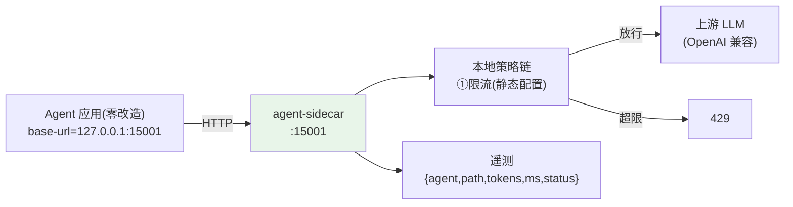

# 01-最小 Demo：第一次拦截——Sidecar 接管一次 LLM 调用

> **定位**：跑通 Mesh 最小闭环：Agent（零改造，环境变量指向 localhost 代理）→ **agent-sidecar** 劫持出站 LLM 调用 → 本地执行一条策略（限流）→ 透传上游 → 遥测一条记录。读者画像：想看到"零改造被接管"的开发者。前置阅读：[00-需求分析与架构设计](00-需求分析与架构设计.md)。
>
> **铁律 0**：Sidecar 为自研代理（WebFlux WebClient 转发）；上游对接复用 OpenAI 兼容协议。

---

## 一、四问

| 问 | 答 |
|----|----|
| **新增了什么需求** | 最小拦截闭环：劫持→本地策略→转发→遥测 |
| **影响了哪些模块** | `agent-sidecar`（雏形：单条路由+一条限流策略+一条遥测） |
| **架构如何演进** | Agent 直连上游 → 本地代理接管 |
| **上一版痛点** | 无（首个版本） |

**本迭代验收**：① Agent 零代码改动（仅 `base-url` 指向 `127.0.0.1:15001`）② 限流策略本地生效（超限 429）③ 每次调用生成一条遥测（含 Token 数）④ Sidecar 挂掉可一键 bypass 直连（逃生门）。

---

## 二、最小链路



## 三、核心代码（Sidecar 转发骨架）

```java
package com.example.mesh.sidecar;

import org.springframework.http.HttpStatus;
import org.springframework.web.reactive.function.server.RouterFunction;
import org.springframework.web.reactive.function.server.ServerResponse;
import reactor.core.publisher.Mono;

/** 最小 Sidecar——一个路由：劫持 /v1/chat/completions，本地限流后转发。 */
public class LlmProxyHandler {

    private final org.springframework.web.reactive.function.client.WebClient upstream;
    private final RateLimiter limiter = new TokenBucket(10, 5);   // 10 QPS，突发 5

    public LlmProxyHandler(WebClient.Builder wb) {
        this.upstream = wb.baseUrl(System.getenv("LLM_UPSTREAM")).build();
    }

    public RouterFunction<ServerResponse> route() {
        return org.springframework.web.reactive.function.server.RouterFunctions.route()
                .POST("/v1/chat/completions", req -> {
                    if (!limiter.tryAcquire()) {
                        return ServerResponse.status(HttpStatus.TOO_MANY_REQUESTS)
                                .bodyValue("{\"error\":\"mesh: local rate limited\"}");
                    }
                    long start = System.nanoTime();
                    return req.bodyToMono(String.class).flatMap(body ->
                            upstream.post().uri("/v1/chat/completions")
                                    .header("Content-Type", "application/json")
                                    .bodyValue(body)
                                    .retrieve()
                                    .bodyToMono(String.class)
                                    .flatMap(resp -> {
                                        emit(start, 200);      // 遥测（含耗时）
                                        return ServerResponse.ok().bodyValue(resp);
                                    }));
                })
                .build();
    }

    private void emit(long startNanos, int status) {
        // 最小遥测：stdout；06 迭代换 OTel 标准管道
        System.out.printf("[MESH] path=/v1/chat/completions status=%d ms=%d%n",
                status, (System.nanoTime() - startNanos) / 1_000_000);
    }
}
```

> **为什么从"显式代理地址"起步**：透明劫持（iptables/eBPF/出口拦截）是 02 迭代——先证明策略价值，再消除接入成本。

## 四、逃生门（Bypass）

```yaml
# sidecar 自身故障时：本地配置 mesh.bypass=true → Agent 直连上游（治理降级但不中断业务）
# 工业纪律：旁路系统的第一设计原则——治理可失联，业务不可中断
```

## 五、验证包（手工测试与验证）
**前置条件**：单机 Sidecar（限流+遥测+逃生开关）实现；一个示例 Agent（OpenAI 兼容客户端）。

**材料 A——压测器**：wrk/hey 发 15 QPS 持续 30s；**材料 B——限流配置**（10 QPS 桶）。

**步骤与断言**：

| # | 操作 | 预期（PASS 判据） |
|---|------|------------------|
| 1 | Agent 只改 base-url 指向 Sidecar | 调用成功；Sidecar 遥测有该次记录（零代码改造验证） |
| 2 | 材料A 压测（桶 10） | 超桶速请求 429（本地限流生效）；≤10 QPS 正常通过 |
| 3 | kill Sidecar 且 bypass=true | Agent 仍可直连上游（逃生门可用） |
| 4 | 直连 vs 走 Sidecar 各 100 次计时 | Sidecar 增量延迟 ≤5ms |

**失败排查**：①改 base-url 不通→Header 透传缺 Authorization；②限流不生效→桶算法全放行（检查窗口重置逻辑）；④超 5ms→每请求新建连接（上游连接池复用）。


## 六、本迭代痛点

① 策略写死 Sidecar（静态）→ 03 xDS 动态下发 ② 仅显式代理接入 → 02 透明劫持 ③ 遥测太原始 → 06 统一遥测。

## 七、验收对照

| 验收项 | 标准 | 状态 |
|--------|------|------|
| 零改造 | 仅改 base-url | ✅ |
| 本地策略 | 限流 429 | ✅ |
| 遥测 | 每调用一条 | ✅ |
| 逃生门 | bypass 可用 | ✅ |

**下一篇**：[02-迭代一-透明拦截与注入](02-迭代一-透明拦截与注入.md)。
