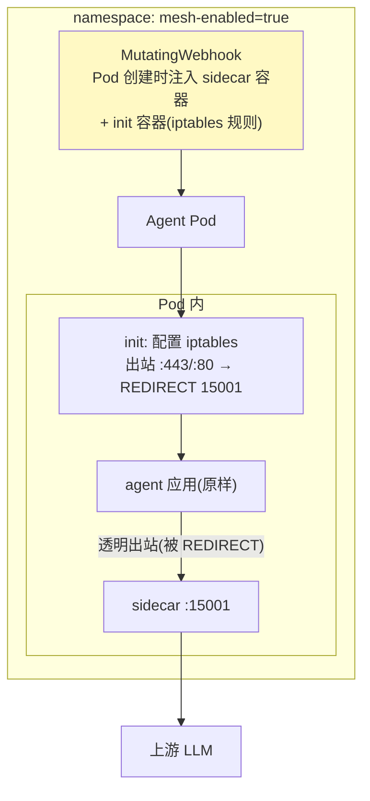

# 02-透明拦截与注入——零改造的最后一步

> **定位**：从"显式代理"升级到**透明接管**：K8s **Sidecar 自动注入**（命名空间打标签即生效，Agent 部署零改动）、**出站流量透明劫持**（iptables/出口重定向，Agent 连 base-url 都不用改）、**就绪探针与启动顺序**（Sidecar 先于 Agent 就绪，防启动期流量逃逸）。读者画像：要规模化接入存量 Agent 的运维/架构读者。前置阅读：[01-最小Demo](01-最小Demo.md)、[教程 33-部署与运维]。
>
> **铁律 0**：注入机制为 K8s 原生（MutatingWebhook/iptables 概念标注）；Sidecar 本体延续 01 实现。

---

## 一、四问

| 问 | 答 |
|----|----|
| **新增了什么需求** | ① K8s MutatingWebhook 自动注入（ns 标签开关）② 出站透明劫持（iptables REDIRECT 到 15001）③ 启动顺序保障（hold until sidecar ready）④ 逃逸检测（Agent 绕过 Sidecar 直连上游的发现） |
| **影响了哪些模块** | `agent-sidecar`（就绪语义）；新增注入 Webhook 配置 |
| **架构如何演进** | 显式代理（改 base-url）→ 透明接管（零任何修改） |
| **上一版痛点** | 接入仍要改配置（01 §六）；规模化时逐个改不现实 |

**本迭代验收**：① 打标签 ns 内新 Pod 自动带 Sidecar（存量滚动重启注入）② Agent 代码与配置**完全不变**被接管 ③ 启动期流量不逃逸（Sidecar 未就绪 Agent 等待）④ 直连逃逸被检测告警。

### 一.1 本节核对（四问与迭代验收）

| # | 核对项 | 判据 |
|---|--------|------|
| 1 | 四问口径齐全 | 新增需求四项（webhook 注入/iptables 劫持/启动顺序/逃逸检测）→影响模块→演进（显式→透明）→上一版痛点（01 §六 改配置）四行均有 |
| 2 | 本迭代验收可判定 | ①ns 打标签即注入 ②代码配置零改动被接管 ③启动期无逃逸 ④直连被检测——四项均为可观测动作 |

---

## 二、注入与劫持



```yaml
# 注入开关（运维面）
kubectl label namespace agent-prod mesh-enabled=true
# 存量接入：滚动重启即注入（kubectl rollout restart deployment/<agent>）
```

### 二.1 本节测试与验证（透明注入与劫持）

**前置条件**：MutatingWebhook + init(iptables REDIRECT) + sidecar 注入能力实现；一个测试集群。

**材料 A——存量 Deployment**：3 个现有 Agent 应用清单。

**步骤与断言**：

| # | 操作 | 预期（PASS 判据） |
|---|------|------------------|
| 1 | `kubectl label namespace agent-prod mesh-enabled=true` | ns 内新 Pod 自动带 sidecar + init 容器 |
| 2 | `kubectl rollout restart deployment/<agent>`（存量） | 滚动重启后 Pod 描述可见 sidecar/init 容器；Agent 业务代码与配置 0 改动被接管 |

**失败排查**：①滚动后 Pod 无 sidecar→webhook 未注册或 ns 标签未生效/未匹配；②注入后业务容器启动异常→init 的 iptables `REDIRECT` 规则时机在应用启动之后才写入。

## 三、启动顺序与逃逸检测（工业关键）

| 机制 | 实现 | 防的事故 |
|------|------|---------|
| Sidecar 先就绪 | init 容器等待 15001 健康 → 才启 Agent | 启动期流量绕过治理直连 |
| 逃逸检测 | iptables 只放行 sidecar 出网；上游侧校验 mTLS 身份（04 迭代闭环） | Agent 用第二张网卡/SDK 内直连绕过 |
| 优雅退出 | Agent 先停 → Sidecar 排空在途流量再停 | 停机期请求半途而废 |

### 三.1 本节测试与验证（启动顺序与逃逸检测）

**前置条件**：init 等待 15001 健康后再启 Agent；iptables 只放行 sidecar 出网（或上游 mTLS 校验）。

**材料 A——直连尝试**：Agent 容器内 `curl` 上游 LLM。

**步骤与断言**：

| # | 操作 | 预期（PASS 判据） |
|---|------|------------------|
| 1 | Sidecar 就绪探针延迟 10s 启动 Agent | Agent 等 Sidecar 就绪后才发首请求（无启动期逃逸窗口） |
| 2 | 材料 A：Agent 容器内 curl 直连上游 | 被 iptables REDIRECT 拦截（或上游 mTLS 拒绝）——逃逸被阻断 |
| 3 | 触发射优雅退出（滚动） | 在途请求被排空后再停 Sidecar，无半途而废 |

**失败排查**：①首请求逃逸→init 未拦出站（iptables 规则写在应用启动之后）；③直连仍成功→上游未开 mTLS 强制（双保险缺一，应显式豁免健康检查端口）。

## 四、全篇回归验证

> §二.1（注入）与 §三.1（启动/逃逸）均通过后的整体验收。

**材料**：存量 Deployment 3 个 + 规模化批 50 个 Deployment。

| # | 操作 | 预期（PASS 判据） |
|---|------|------------------|
| 1 | 打标签→滚动重启 | Pod 描述可见 sidecar/init 容器；Agent 业务代码 0 改动被接管 |
| 2 | 规模化批注入（50 个） | 50 个滚动完成，服务零报错（错误率无毛刺） |

**回归失败排查**：①报错→滚动策略 AllAtOnce（改 `RollingUpdate`）；②部分 Pod 无 sidecar→webhook 匹配规则或标签缺失。

## 五、本迭代痛点

策略仍静态写死在 Sidecar → 03 xDS 动态下发。

> 本节核对（一句话）：痛点（静态策略）与下一迭代 [03] xDS 动态下发一一对应，无搁置即 PASS。

## 六、验收对照

| 验收项 | 标准 | 状态 |
|--------|------|------|
| 自动注入 | ns 标签即生效 | ✅ |
| 透明劫持 | 零任何修改 | ✅ |
| 启动顺序 | 无逃逸 | ✅ |
| 逃逸检测 | 绕过可发现 | ✅ |

> 本节核对（一句话）：四项验收均能在 §二.1/§三.1 找到对应测试落点，无"验收了但没验证"项。

**下一篇**：[03-控制面与xDS动态下发](03-控制面与xDS动态下发.md)。
