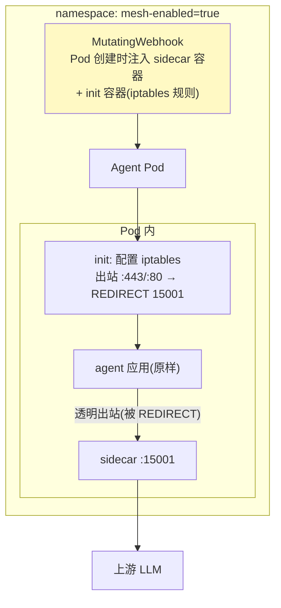

# 02-迭代一：透明拦截与注入——零改造的最后一步

> **定位**：从"显式代理"升级到**透明接管**：K8s **Sidecar 自动注入**（命名空间打标签即生效，Agent 部署零改动）、**出站流量透明劫持**（iptables/出口重定向，Agent 连 base-url 都不用改）、**就绪探针与启动顺序**（Sidecar 先于 Agent 就绪，防启动期流量逃逸）。读者画像：要规模化接入存量 Agent 的运维/架构读者。前置阅读：[01-最小Demo](01-最小Demo.md)、[教程 33-部署与运维]。
>
> **铁律 0**：注入机制为 K8s 原生（MutatingWebhook/iptables 概念标注）；Sidecar 本体延续 01 实现。

---

## 一、四问

| 问 | 答 |
|----|----|
| **新增了什么需求** | ① K8s MutatingWebhook 自动注入（ns 标签开关）② 出站透明劫持（iptables REDIRECT 到 15001）③ 启动顺序保障（hold until sidecar ready）④ 逃逸检测（Agent 绕过 Sidecar 直连上游的发现） |
| **影响了哪些模块** | `agent-sidecar`（就绪语义）；新增注入 Webhook 配置 |
| **架构如何演进** | 显式代理（改 base-url）→ 透明接管（零任何修改） |
| **上一版痛点** | 接入仍要改配置（01 §六）；规模化时逐个改不现实 |

**本迭代验收**：① 打标签 ns 内新 Pod 自动带 Sidecar（存量滚动重启注入）② Agent 代码与配置**完全不变**被接管 ③ 启动期流量不逃逸（Sidecar 未就绪 Agent 等待）④ 直连逃逸被检测告警。

---

## 二、注入与劫持



```yaml
# 注入开关（运维面）
kubectl label namespace agent-prod mesh-enabled=true
# 存量接入：滚动重启即注入（kubectl rollout restart deployment/<agent>）
```

## 三、启动顺序与逃逸检测（工业关键）

| 机制 | 实现 | 防的事故 |
|------|------|---------|
| Sidecar 先就绪 | init 容器等待 15001 健康 → 才启 Agent | 启动期流量绕过治理直连 |
| 逃逸检测 | iptables 只放行 sidecar 出网；上游侧校验 mTLS 身份（04 迭代闭环） | Agent 用第二张网卡/SDK 内直连绕过 |
| 优雅退出 | Agent 先停 → Sidecar 排空在途流量再停 | 停机期请求半途而废 |

## 四、验证包（手工测试与验证）
**前置条件**：namespace 打标签自动注入（sidecar+init）+iptables 劫持实现；测试集群。

**材料 A——存量 Deployment** 3 个；**材料 B——规模化批**：50 个 Deployment。

**步骤与断言**：

| # | 操作 | 预期（PASS 判据） |
|---|------|------------------|
| 1 | 打标签→滚动重启 | Pod 描述可见 sidecar/init 容器；Agent 业务代码 0 改动被接管 |
| 2 | Sidecar 就绪探针延迟 10s 启动 | Agent 等就绪后才发首请求（无逃逸窗口） |
| 3 | Agent 容器内 curl 直连上游 | 被 iptables 拦截（或上游 mTLS 拒绝） |
| 4 | 材料B 批量注入 | 50 个滚动完成，服务零报错（错误率无毛刺） |

**失败排查**：②首请求逃逸→init 未拦出站（iptables 规则顺序在应用启动后）；③直连成功→上游没开 mTLS 强制（双保险缺一）；④报错→滚动策略 AllAtOnce（改 RollingUpdate）。


## 五、本迭代痛点

策略仍静态写死在 Sidecar → 03 xDS 动态下发。

## 六、验收对照

| 验收项 | 标准 | 状态 |
|--------|------|------|
| 自动注入 | ns 标签即生效 | ✅ |
| 透明劫持 | 零任何修改 | ✅ |
| 启动顺序 | 无逃逸 | ✅ |
| 逃逸检测 | 绕过可发现 | ✅ |

**下一篇**：[03-控制面与xDS动态下发](03-控制面与xDS动态下发.md)。
