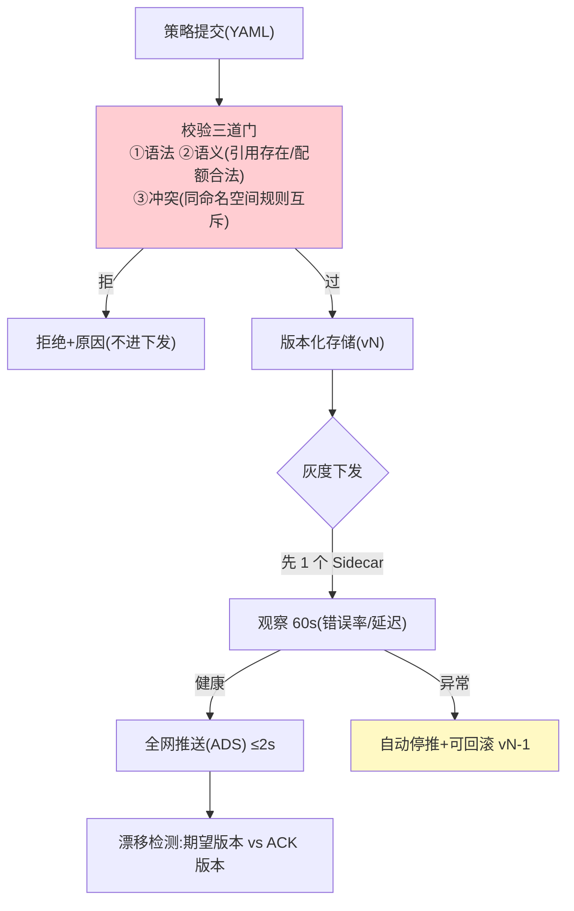

# 03-控制面与 xDS 动态下发——策略秒级生效 + 配置治理

> **定位**：建立**控制面（mesh-control）**：策略声明（YAML：路由/限流/熔断/配额）、**校验后版本化下发**（Galley 式准入——语法/语义/冲突校验，防一条坏配置打挂全网）、**ADS 聚合订阅**（Sidecar 长连接，变更 ≤2s 推送生效）、**配置漂移检测与回滚**（Sidecar 实际生效版本 vs 期望版本对账；一键回滚上一版本）。这是工业落地的"配置安全"核心。读者画像：经历过"一条配置引发全网故障"的读者。前置阅读：[02-透明拦截与注入](02-透明拦截与注入.md)。
>
> **铁律 0**：下发机制自研（gRPC stream / SSE 均可，概念标注 Envoy xDS 同构）。

---

## 一、四问

| 问 | 答 |
|----|----|
| **新增了什么需求** | ① 策略声明（MeshPolicy YAML：限流/路由/熔断/Token 配额）② 校验准入（语法/语义/冲突三道门）③ ADS 订阅推送（≤2s 全网格生效）④ 配置版本化 + 漂移检测 + 一键回滚 |
| **影响了哪些模块** | 新增 `mesh-control`/`mesh-config`；Sidecar 策略引擎改为订阅热更 |
| **架构如何演进** | 静态策略 → 声明式动态（Sidecar 不重启换策略） |
| **上一版痛点** | 策略写死 Sidecar、改策略要重新发布（02 §五） |

**本迭代验收**：① 策略提交→校验→全网生效 ≤2s ② 非法策略被校验拦截（不进下发）③ 漂移（Sidecar 版本≠期望）被发现告警 ④ 回滚到上一版本 ≤2s。

---

## 二、配置生命周期（防"一条配置打死全网"）



## 三、策略声明（示例）

```yaml
# mesh-policy.yaml —— 声明式治理（对应 vLLM 限流+配额）
apiVersion: mesh/v1
kind: MeshPolicy
metadata:
  name: cs-agents-llm
  namespace: tenant-a
spec:
  targets: { agent: "customer-service-*" }
  llmRoute:
    default: deepseek-chat
    fallbacks: [deepseek-reasoner]
  rateLimit: { qps: 20, burst: 10 }
  tokenQuota: { daily: 1_000_000 }
  circuitBreaker: { errorRate: 0.5, minSamples: 100, halfOpenProbes: 3 }
  timeouts: { connectMs: 2000, streamIdleMs: 30000 }
```

## 四、ADS 订阅与 ACK

```java
// Sidecar 侧（骨架）：长连接订阅 + ACK 版本 + 热更策略引擎
// grpc Stream subscribe(nonce=lastAckVersion)
//   ← DiscoveryResponse(version=vN, policies)
//   → Sidecar 校验→原子替换策略引擎→ACK(vN)
// mesh-control 汇总 ACK 计算全网生效进度（收敛度可观测）
```

## 五、漂移检测与回滚（工业配置安全）

```java
// 漂移：期望版本 vN vs 某 Sidecar ACK 停在 vN-1（订阅断连/本地失败）
//   → 告警 + 自动重推；持续漂移 → 标记该节点不健康
// 回滚：mesh-config 保留最近 10 版本；一键 rollback(vN-1) 走同一灰度管道
// 审计：谁/何时/改了哪条/影响范围(哪些 Agent)全留痕
```

## 六、验证包（手工测试与验证）
**前置条件**：控制面（策略存储+语义校验+xDS 订阅推送+版本 ACK）实现。

**材料 A——策略变更**：限流 20→50 QPS；**材料 B——非法策略**：引用不存在的 fallback；**材料 C——断连注入**：断一个 Sidecar 的 xDS 订阅。

**步骤与断言**：

| # | 操作 | 预期（PASS 判据） |
|---|------|------------------|
| 1 | 材料A 提交 | 校验过→推送→全网 ACK ≤2s→压测确认 50 生效 |
| 2 | 材料B 提交 | 语义校验拒绝；全网零感知（无半下发状态） |
| 3 | 材料C | 漂移告警；重连后自动追平到最新版本 |
| 4 | 回滚演练：vN 引发错误率上升 | 停推+rollback vN-1 ≤2s 恢复 |

**失败排查**：①部分 Sidecar 未生效→ACK 未聚合就认为完成（加 ACK 比例断言）；②半下发→推送非原子（应按版本整体下发）；④回滚慢→版本历史未保留（只能改不能回）。


## 七、本迭代痛点

策略下发通了但 Sidecar 间互不信任（明文）→ 04 身份零信任。

## 八、验收对照

| 验收项 | 标准 | 状态 |
|--------|------|------|
| 动态生效 | ≤2s 全网 | ✅ |
| 校验准入 | 非法策略拦截 | ✅ |
| 灰度下发 | 先单点观察再全网 | ✅ |
| 漂移/回滚 | 检测告警 + 一键回滚 | ✅ |

**下一篇**：[04-身份零信任与mTLS](04-身份零信任与mTLS.md)。
