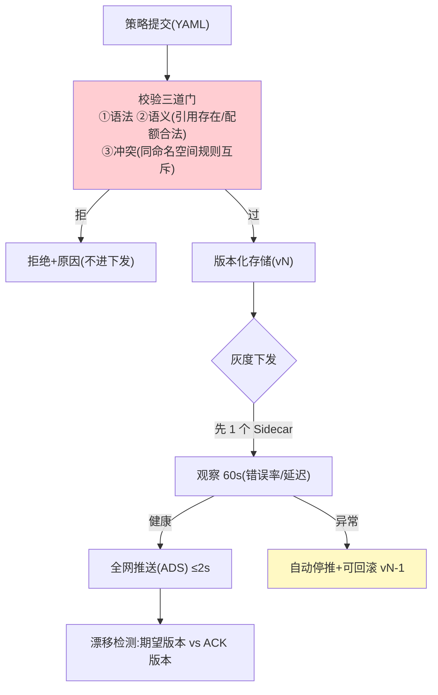

# 03-控制面与 xDS 动态下发——策略秒级生效 + 配置治理

> **定位**：建立**控制面（mesh-control）**：策略声明（YAML：路由/限流/熔断/配额）、**校验后版本化下发**（Galley 式准入——语法/语义/冲突校验，防一条坏配置打挂全网）、**ADS 聚合订阅**（Sidecar 长连接，变更 ≤2s 推送生效）、**配置漂移检测与回滚**（Sidecar 实际生效版本 vs 期望版本对账；一键回滚上一版本）。这是工业落地的"配置安全"核心。读者画像：经历过"一条配置引发全网故障"的读者。前置阅读：[02-透明拦截与注入](02-透明拦截与注入.md)。
>
> **铁律 0**：下发机制自研（gRPC stream / SSE 均可，概念标注 Envoy xDS 同构）。

---

## 一、四问

| 问 | 答 |
|----|----|
| **新增了什么需求** | ① 策略声明（MeshPolicy YAML：限流/路由/熔断/Token 配额）② 校验准入（语法/语义/冲突三道门）③ ADS 订阅推送（≤2s 全网格生效）④ 配置版本化 + 漂移检测 + 一键回滚 |
| **影响了哪些模块** | 新增 `mesh-control`/`mesh-config`；Sidecar 策略引擎改为订阅热更 |
| **架构如何演进** | 静态策略 → 声明式动态（Sidecar 不重启换策略） |
| **上一版痛点** | 策略写死 Sidecar、改策略要重新发布（02 §五） |

**本迭代验收**：① 策略提交→校验→全网生效 ≤2s ② 非法策略被校验拦截（不进下发）③ 漂移（Sidecar 版本≠期望）被发现告警 ④ 回滚到上一版本 ≤2s。

### 一.1 本节核对（四问与迭代验收）

| # | 核对项 | 判据 |
|---|--------|------|
| 1 | 四问口径齐全 | 新增需求四项（声明/校验/ADS/版本化+漂移回滚）→影响模块→演进（静态→声明式动态）→痛点（02 §五）均有 |
| 2 | 本迭代验收可度量 | 四项均带时限（≤2s）或可判定事件（拦截/告警/回滚），非空话 |

---

## 二、配置生命周期（防"一条配置打死全网"）



### 二.1 本节核对（配置生命周期）

- [ ] 三道校验门（语法/语义/冲突）与节点判定一一对应，且"拒→拒绝+原因，不进下发"与验收②"非法策略被拦截"一致
- [ ] 灰度下发先单点观察 60s 再全网，异常自动停推 + 回滚 vN-1——此分支与 §五 漂移/回滚语义衔接

## 三、策略声明（示例）

```yaml
# mesh-policy.yaml —— 声明式治理（对应 vLLM 限流+配额）
apiVersion: mesh/v1
kind: MeshPolicy
metadata:
  name: cs-agents-llm
  namespace: tenant-a
spec:
  targets: { agent: "customer-service-*" }
  llmRoute:
    default: deepseek-chat
    fallbacks: [deepseek-reasoner]
  rateLimit: { qps: 20, burst: 10 }
  tokenQuota: { daily: 1_000_000 }
  circuitBreaker: { errorRate: 0.5, minSamples: 100, halfOpenProbes: 3 }
  timeouts: { connectMs: 2000, streamIdleMs: 30000 }
```

### 三.1 本节测试与验证（策略声明与校验准入）

**前置条件**：`mesh-config` 策略生命周期（存储+语义校验+版本化）实现；一个可提交策略的控制面入口。

**材料 A——策略变更**：限流 `20→50 QPS`；**材料 B——非法策略**：`fallbacks` 引用不存在的模型 `no-such-model`。

**步骤与断言**：

| # | 操作 | 预期（PASS 判据） |
|---|------|------------------|
| 1 | 提交材料 A（20→50 QPS） | 语义校验通过→入版本库 vN→推送生效（限流实测 50） |
| 2 | 提交材料 B | 语义校验拒绝（fallback 引用不存在），全网零感知（无半下发状态） |
| 3 | 核对 policy 结构 | 路由/限流/配额/熔断/超时各段与本 § 声明的字段一一对应，可被策略引擎解析 |

**失败排查**：①非法策略被放行→语义校验没查"引用存在性"（漏掉 fallback/targets 解析）；②合法策略不生效→校验通过但未入版本库或未触发推送。

## 四、ADS 订阅与 ACK

```java
// Sidecar 侧（骨架）：长连接订阅 + ACK 版本 + 热更策略引擎
// grpc Stream subscribe(nonce=lastAckVersion)
//   ← DiscoveryResponse(version=vN, policies)
//   → Sidecar 校验→原子替换策略引擎→ACK(vN)
// mesh-control 汇总 ACK 计算全网生效进度（收敛度可观测）
```

### 四.1 本节测试与验证（ADS 订阅与秒级生效）

**前置条件**：ADS 长连接订阅 + ACK 聚合（收敛度可观测）实现；≥2 个 Sidecar 在线。

**材料**：策略变更（复用 §三.1 材料 A，限流 20→50 QPS）。

**步骤与断言**：

| # | 操作 | 预期（PASS 判据） |
|---|------|------------------|
| 1 | 提交策略变更并发起订阅推送 | 全网 Sidecar 收到 DiscoveryResponse 并原子替换策略引擎，ACK 收敛 |
| 2 | 记录从提交到全体 ACK 的耗时 | ≤2s 全网格生效（压测确认 50 QPS 限流已作用） |
| 3 | 观察收敛进度 | mesh-control 能汇总已 ACK / 应 ACK，进度可观测，无"未聚合就当完成" |

**失败排查**：①部分 Sidecar 未生效→ACK 未聚合就判完成（加"ACK 比例达 100% 才算生效"断言）；②超 2s→推送不原子（应整体按版本下发，勿逐条）。

## 五、漂移检测与回滚（工业配置安全）

```java
// 漂移：期望版本 vN vs 某 Sidecar ACK 停在 vN-1（订阅断连/本地失败）
//   → 告警 + 自动重推；持续漂移 → 标记该节点不健康
// 回滚：mesh-config 保留最近 10 版本；一键 rollback(vN-1) 走同一灰度管道
// 审计：谁/何时/改了哪条/影响范围(哪些 Agent)全留痕
```

### 五.1 本节测试与验证（漂移检测与回滚）

**前置条件**：漂移对账（期望版本 vs ACK 版本）+ 版本历史保留（最近 10 版本）+ 回滚走灰度管道实现。

**材料 C——断连注入**：断开一个 Sidecar 的 xDS 订阅。

**步骤与断言**：

| # | 操作 | 预期（PASS 判据） |
|---|------|------------------|
| 1 | 材料 C：断连一个 Sidecar 订阅 | 该 Sidecar 停在旧版本，触达漂移告警（期望 ≠ ACK） |
| 2 | 重连该 Sidecar | 自动追平到最新版本（重推 ACK），漂移消除 |
| 3 | 回滚演练：vN 引发错误率上升 | 停推 + `rollback(vN-1)` 走灰度管道，≤2s 恢复 |
| 4 | 审计核对 | 谁/何时/改哪条/影响哪些 Agent 全留痕 |

**失败排查**：①漂移不告警→ACk 对账间隔过长或期望版本未维护；④回滚慢→版本历史未保留（只能改不能回，应保留 ≥10 版本）。

## 六、全篇回归验证

> §三.1（校验）、§四.1（秒级生效）、§五.1（漂移/回滚）均通过后，按端到端一次验收。

**材料**：限流 20→50 变更；非法策略（引用不存在 fallback）；断连注入 1 个 Sidecar；vN 引发错误率上升。

| # | 操作 | 预期（PASS 判据） |
|---|------|------------------|
| 1 | 提交合法变更 | 校验过→推送→全网 ACK ≤2s→压测确认 50 生效 |
| 2 | 提交非法策略 | 语义校验拒绝；全网零感知（无半下发状态） |
| 3 | 断连注入 | 漂移告警；重连后自动追平到最新版本 |
| 4 | 回滚演练 | 停推 + rollback vN-1 ≤2s 恢复 |

**回归失败排查**：任一步 FAIL 按 §三.1/§四.1/§五.1 对应排查项回溯（校验漏引用 / ACK 未聚合 / 版本历史缺失）。

## 七、本迭代痛点

策略下发通了但 Sidecar 间互不信任（明文）→ 04 身份零信任。

> 本节核对（一句话）：痛点（Sidecar 间明文互不信任）与下一迭代 [04] 身份零信任一一对应，无搁置即 PASS。

## 八、验收对照

| 验收项 | 标准 | 状态 |
|--------|------|------|
| 动态生效 | ≤2s 全网 | ✅ |
| 校验准入 | 非法策略拦截 | ✅ |
| 灰度下发 | 先单点观察再全网 | ✅ |
| 漂移/回滚 | 检测告警 + 一键回滚 | ✅ |

> 本节核对（一句话）：四项验收均能在 §三.1/§四.1/§五.1 找到对应测试落点（校验→拦截、推送→≤2s、漂移→告警、回滚→恢复），无"验收了但没验证"项。

**下一篇**：[04-身份零信任与mTLS](04-身份零信任与mTLS.md)。
