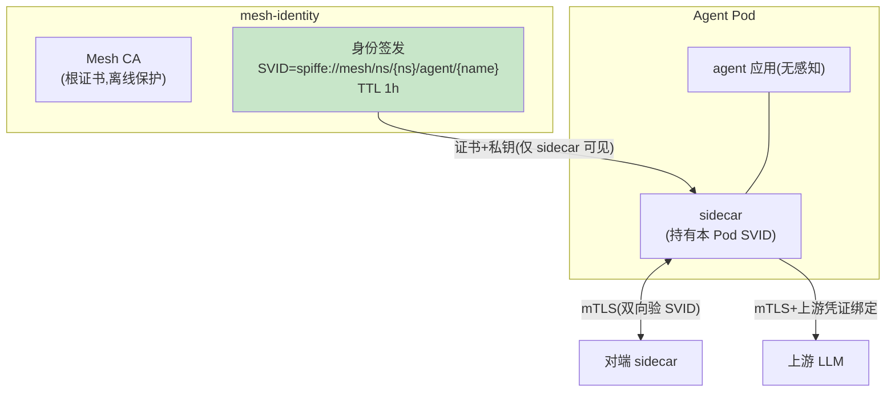

# 04-迭代三：身份零信任与 mTLS——每个 Agent 一个身份

> **定位**：建立**网格身份体系**（mesh-identity）：每个 Agent 实例一个**短时效加密身份**（SPIFFE 式 SVID），Sidecar 间与 Sidecar→上游全 mTLS；**授权即策略**（谁能调谁在 MeshPolicy 声明）；**逃生通道封死**（无身份直连上游被拒——02 逃逸检测的闭环）。读者画像：要"网格内零明文、越权即拒"的读者。前置阅读：[03-迭代二-控制面与xDS动态下发](03-迭代二-控制面与xDS动态下发.md)、[教程 31-安全与权限控制]。
>
> **铁律 0**：mTLS 由 Sidecar 终结（Agent 应用无感知——零改造纪律）；证书轮换自研（标注 SPIFFE/SPIRE 为第三方可选）。

---

## 一、四问

| 问 | 答 |
|----|----|
| **新增了什么需求** | ① Agent 身份签发（SVID：spiffe://mesh/ns/tenant/agent/name）② Sidecar 间 mTLS（全网格零明文）③ 声明式授权（allow/deny 策略随 xDS 下发）④ 上游验证（无身份直连拒）⑤ 证书短时效自动轮换（TTL 1h） |
| **影响了哪些模块** | 新增 `mesh-identity`；Sidecar 加 TLS 终结/发起；策略引擎加授权检查 |
| **架构如何演进** | 治理可信（策略）+ 传输可信（身份加密）双轮 |
| **上一版痛点** | Sidecar 间/到上游明文，Agent 可绕过（03 §七） |

**本迭代验收**：① 网格内流量抓包全 mTLS ② 无身份直连上游被 401/连接拒 ③ 越权调用（策略 deny）被拒且审计 ④ 证书轮换零中断（TTL 到期前自动换）。

---

## 二、身份模型



## 三、声明式授权（随 03 的 xDS 下发）

```yaml
# MeshPolicy 追加授权段——谁能调我 / 我能调谁
spec:
  authorization:
    inbound:
      - { from: "spiffe://mesh/ns/tenant-a/agent/supervisor/*", allow: true }
      - { from: "*", allow: false }          # 默认拒
    outboundTools:
      - { tool: "order.query",  requireIdentity: true }
      - { tool: "refund.execute", requireApproval: true }   # 与 HITL 联动
```

## 四、轮换与逃生闭环

```java
// 轮换：TTL 1h，到期前 10m Sidecar 静默换证（新旧重叠期双证可用）——零中断
// 上游绑定：上游 LLM 的 Key 由 Sidecar 持有注入（Agent 永远见不到 Key）
//   → 逃逸闭环：Agent 绕过 Sidecar = 无 Key 无身份 = 连不上
// 吊销：身份随 Pod 消亡自然失效（短 TTL）；紧急吊销走控制面撤销列表
```

## 五、验证包（手工测试与验证）
**前置条件**：SPIFFE 类 SVID 签发+网格强制 mTLS+授权策略（allow/deny+审计）实现。

**材料 A——抓包器**（tcpdump on 节点）；**材料 B——直连尝试**；**材料 C——证书到期注入**（把 TTL 调到 5min）。

**步骤与断言**：

| # | 操作 | 预期（PASS 判据） |
|---|------|------------------|
| 1 | 材料A 抓网格内流量 | 全 TLS，零明文业务负载 |
| 2 | 材料B：Agent 容器直接 curl 上游 | 无有效 Key 被拒（逃逸闭环） |
| 3 | supervisor 调 worker：SVID 匹配 allow 规则 | 通；陌生 SVID → deny+审计事件 |
| 4 | 材料C 证书到期 | 自动轮换期间请求零失败（重试无感） |

**失败排查**：①明文→某跳用了明文协议（健康检查端口除外应显式豁免）；④轮换失败→长连接未在旧证书失效前重建（连接 maxAge 设置）。


## 六、本迭代痛点

身份与策略齐了，但流量层治理仍是零散开关 → 05 声明式流量治理统一。

## 七、验收对照

| 验收项 | 标准 | 状态 |
|--------|------|------|
| 全 mTLS | 抓包零明文 | ✅ |
| 上游绑定 | 绕过即拒 | ✅ |
| 声明授权 | 默认拒+显式 allow | ✅ |
| 轮换 | 零中断 | ✅ |

**下一篇**：[05-迭代四-流量治理与故障注入](05-迭代四-流量治理与故障注入.md)。
