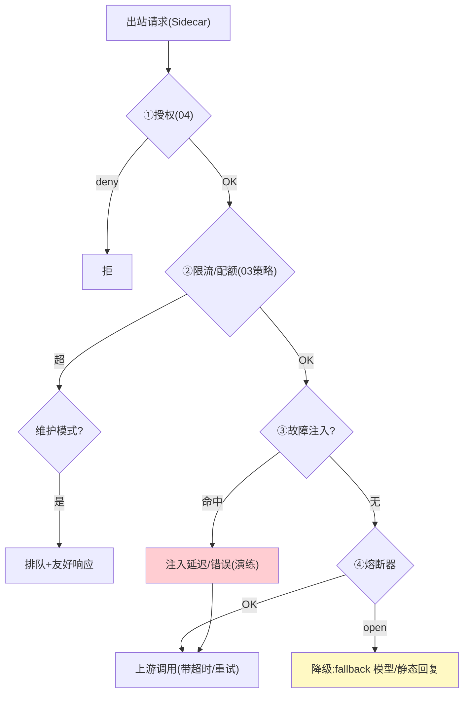

# 05-流量治理与故障注入——声明式弹性 + 网格级混沌 + Kill-Switch

> **定位**：统一**声明式流量治理**（路由/熔断/重试/超时/降级——全部 MeshPolicy 一份 YAML，Sidecar 本地执行）+ 三个工业特有件：**故障注入**（网格级混沌——对指定 Agent 注入延迟/错误/Token 超耗，验证韧性）、**全局 Kill-Switch**（一键熔断某租户/某模型/整个网格的出站）、**维护模式**（上游维护期优雅排队而非报错）。读者画像：要"弹性可声明、韧性可演练、事故可一键止损"的读者。前置阅读：[04-身份零信任与mTLS](04-身份零信任与mTLS.md)、[教程 04-企业级架构主干/10-容错与弹性设计]。
>
> **铁律 0**：全部本地执行（Sidecar 内），无中心绕行。

---

## 一、四问

| 问 | 答 |
|----|----|
| **新增了什么需求** | ① 声明式路由/熔断/重试/超时/降级（本地执行）② 故障注入（延迟/错误/配额耗尽三类，按 Agent 定向）③ Kill-Switch（租户级/模型级/全局，秒级）④ 维护模式（上游维护窗口：排队+告知，而非雪崩报错） |
| **影响了哪些模块** | Sidecar 流量引擎；mesh-control 策略面 |
| **架构如何演进** | 零散治理开关 → 一份声明 + 本地执行 + 演练能力 |
| **上一版痛点** | 弹性配置散落各 Agent、无法统一定义与验证（04 §六） |

**本迭代验收**：① 声明熔断 errorRate 0.5 → 实测按声明动作（半开探活恢复）② 注入 500ms 延迟+10% 错误到指定 Agent，其重试策略正确工作 ③ Kill-Switch 某模型 → 全网格该模型调用 ≤2s 停止 ④ 维护模式期请求排队返回友好提示，恢复后自动放行。

### 一.1 本节核对（四问与迭代验收）

| # | 核对项 | 判据 |
|---|--------|------|
| 1 | 四问口径齐全 | 新增需求四项（声明治理/故障注入/Kill-Switch/维护模式）→影响模块→演进→痛点（04 §六）均有 |
| 2 | 本迭代验收可判定 | 四项均为可演练动作（熔断实测/注入重试/Kill 停止/排队），非空话 |

---

## 二、治理动作全景（本地执行）



### 二.1 本节核对（治理动作全景）

- [ ] 全链路节点（①授权②限流/配额③故障注入④熔断→降级）与你 §一 四问"声明式治理"逐条对应
- [ ] 每个节点的执行都在 Sidecar 本地，无中心绕行（与"治理本地执行"纪律一致）

## 三、故障注入（网格级混沌）

```yaml
# MeshChaos —— 定向演练（生产安全阀：maxDuration + 自动恢复）
apiVersion: mesh/v1
kind: MeshChaos
spec:
  target: { agent: "risk-agent-canary" }
  faults:
    - { type: delay,      valueMs: 500,  percentage: 100 }
    - { type: error,      httpStatus: 500, percentage: 10 }
    - { type: quotaBurn,  tokens: 50000 }   # 模拟配额耗尽路径
  duration: 5m            # 到期自动撤销
```

> **工业价值**：混沌不再是独立平台——**网格天然是混沌注入点**（所有流量都过它），演练=一条策略。

### 三.1 本节测试与验证（MeshChaos 定向注入）

**前置条件**：MeshChaos（delay/error/quotaBurn 三类 fault + `maxDuration` 自动撤销）实现；目标 Agent `risk-agent-canary` 可压测。

**材料**：`MeshChaos` 注入 500ms 延迟 + 10% 500 错误，`duration: 5m`。

**步骤与断言**：

| # | 操作 | 预期（PASS 判据） |
|---|------|------------------|
| 1 | 对 canary Agent 注入 500ms 延迟 + 10% 错误 | 命中 Agent 的重试/降级行为符合预期（重试 500、延迟可测） |
| 2 | quotaBurn 注入 50000 tokens | 触发配额耗尽路径（限流/降级） |
| 3 | 5min 到期 | 注入自动撤销，恢复正常（生产安全阀生效） |

**失败排查**：①注入无效果→fault 百分比/目标匹配规则未生效（核对 `target.agent` 与 sidecar 判定）；②到期未撤销→`maxDuration` 未实现定时撤销。

## 四、Kill-Switch 与维护模式

```java
// Kill-Switch（紧急止损，控制面一键）：
//   scope: tenant=<id> / model=<name> / global
//   动作: 出站一律 503+Retry-After；生效 ≤2s（复用 03 ADS 通道）
//   审计: 谁触发/何时/范围/何时解除
// 维护模式（计划内）：
//   上游窗口期 → 请求进本地有界队列（TTL 30s）→ 窗口结束放行
//   队列满/超 TTL → 友好降级文案（"模型维护中，预计 xx:xx 恢复"）
```

### 四.1 本节测试与验证（Kill-Switch 与维护模式）

**前置条件**：Kill-Switch（scope=tenant/model/global）复用 03 ADS 通道；维护模式（有界队列 TTL 30s）实现。

**材料 B——全局开关演练**：Kill-Switch `model=deepseek-chat`。

**步骤与断言**：

| # | 操作 | 预期（PASS 判据） |
|---|------|------------------|
| 1 | 触发 Kill-Switch `model=deepseek-chat` | ≤2s 全网该模型请求返回 `503 + Retry-After`；解除后恢复 |
| 2 | 触发审计 | Kill-Switch 谁触发/何时/范围/何时解除全留痕 |
| 3 | 维护模式（上游 10min 窗口） | 请求进有界队列排队 +"模型维护中，预计 xx:xx 恢复"降级文案；窗口结束自动放行 |
| 4 | 队列满/超 TTL | 友好降级（无雪崩式重试风暴） |

**失败排查**：①Kill-Switch 有漏网→只推了部分 Sidecar（按 03 ACK 对账）；③维护期队列堆积→排队放行未做平滑（用漏桶滴出）。

**拦截端 curl（Kill-Switch 生效验证）**：触发 Kill-Switch `model=deepseek-chat` 后，对 Sidecar 接管端口发一次该模型请求：

```bash
curl -s -D - -o /dev/null -X POST http://127.0.0.1:15001/v1/chat/completions \
  -H "Content-Type: application/json" \
  -d '{"model":"deepseek-chat","messages":[{"role":"user","content":"hi"}]}'
```

预期输出（3-5 行，止损生效）：

```text
HTTP/1.1 503 Service Unavailable
Retry-After: 30
Content-Type: application/json

{"error":"mesh: kill-switch(scope=model:deepseek-chat) active"}
```

## 五、治理路径可见性（流量被怎么治理的，用户要看得见）

> 过程可见性是工业级标配。网格视角，**一次调用的过程 = 它走了哪条治理路径**：是否被限流、是否熔断、是否命中 Kill-Switch、灰度去了哪个版本。用户/运维要能实时看到"这次调用为什么这样"。

本迭代治理都来自**同一份 `MeshPolicy` YAML（一~四节）**，Sidecar 本地执行。下面给出一段**可编译的完整实现**——`GovernanceEventListener` 挂在 Sidecar 治理执行器上，把每次策略判定的结果经 Reactor Sinks 流式发出（Sinks 类型对齐 [教程 05-Observation可观测/02-组件交互：Registry、Handler、Convention、Filter协作] 与 [附录 18-可观测平台实践/00] 已实证基准）：

```java
package meshsidecar.governance;

import org.springframework.ai.chat.model.ChatResponse;         // 阿里
import reactor.core.publisher.Sinks;
import reactor.core.publisher.Flux;

/** 治理过程可见性：把 MeshPolicy 逐条判定结果变为事件流。 */
public final class GovernanceEventEmitter {
    private final Sinks.Many<GovernanceEvent> sink =
        Sinks.many().unicast().onOverflowBuffer();             // 无界：可见性事件不丢（对齐会话引擎双通道纪律）

    /** 治理事件：类型=MeshPolicy 策略治理类型，每条带 callId + policyVersion。 */
    public sealed interface GovernanceEvent {
        long callId();
        String policyVersion();                                 // 走的是哪个版本的 MeshPolicy
        record LimitResult(long callId, String policyVersion, boolean block, int threshold)
            implements GovernanceEvent {}                      // 限流判定：放行/block=429
        record CircuitState(long callId, String policyVersion, String state, double errRate)
            implements GovernanceEvent {}                      // OPEN/HALF_OPEN/CLOSED
        record RouteChosen(long callId, String policyVersion, String route, String version)
            implements GovernanceEvent {}                      // canary/stable
        record KillSwitchHit(long callId, String policyVersion, String scope, String value)
            implements GovernanceEvent {}                      // scope=model/tenant/global
        record FailoverUsed(long callId, String policyVersion, String fallback)
            implements GovernanceEvent {}                      // 降级已启用
    }

    public Flux<GovernanceEvent> events() { return sink.asFlux(); }

    /** Sidecar 治理执行器在每次策略判定后调用（只发结论,不发 policy 阈值体）。 */
    public void emit(GovernanceEvent e) { sink.tryEmitNext(e); }
}
```

| 治理动作 | 事件类型 | 用户看到 |
|---------|---------|---------|
| 限流 | `LimitResult{block, threshold}` | "限流规则：触发 429" |
| 熔断 | `CircuitState{state, errRate}` | "网关熔断 OPEN→走兜底" |
| 灰度 | `RouteChosen{route, version}` | "走 canary v1.3" |
| Kill-Switch | `KillSwitchHit{scope, value}` | "该模型被全局停止" |

**四条纪律**：
1. **政策可追溯**：每条事件带 `policyVersion`——查到"走的是 MeshPolicy 哪个版本"（本迭代 ADR：策略版本化）。
2. **与审计同源**：治理事件与审计（06）同一决策点发出；`callId` 贯穿全链路。
3. **只报结论不泄策略阈值**：事件给 `block`/`state`，**不含 policy 阈值体**——防绕过限流（安全：阈值是隐藏风控）。
4. **失败也可见**：熔断降级/拦截都发 `CircuitState(OPEN)`/`FailoverUsed`，用户知道"被兜底了"而非"结果错了"。

### 五.1 本节测试与验证（治理过程可见性）

**前置条件**：`GovernanceEventEmitter`（Sinks 流）挂在 Sidecar 治理执行器，事件经 Reactor Flux 可订阅。

**步骤与断言**：

| # | 操作 | 预期（PASS 判据） |
|---|------|------------------|
| 1 | 模拟超限流 | 事件流出现 `LimitResult{block=true}` |
| 2 | 注入熔断 | 事件流出现 `CircuitState{OPEN}`（熔断降级也可见） |
| 3 | grep 断言事件负载 | 事件不含 policy 阈值体（只报结论，不泄阈值——安全纪律） |
| 4 | 核对追溯字段 | 每条事件带 `policyVersion` + `callId`，可归因到策略版本与整链路 |

**失败排查**：①事件丢失→Sinks 背压溢出被丢弃（确认 `onOverflowBuffer` 无界缓冲）；②泄出阈值→emit 时传入了 policy 阈值体（应只发 block/state 结论）。

## 六、全篇回归验证

> §三.1（故障注入）、§四.1（Kill/维护）、§五.1（可见性）均通过后，端到端一次验收。

**材料 A——错误注入**：上游 mock 60% 错误率。

| # | 操作 | 预期（PASS 判据） |
|---|------|------------------|
| 1 | 材料 A（熔断阈值 0.5/100 样本） | 熔断 open → fallback 生效 → 恢复后半开探活成功闭合 |
| 2 | MeshChaos 注入 canary Agent | 重试/降级符合预期；5min 自动撤销 |
| 3 | Kill-Switch 触发 | ≤2s 全网该模型请求 503；解除后恢复 |
| 4 | 维护模式 10min 窗口 | 请求排队 + 提示语；窗口后自动放行（无雪崩式重试风暴） |

**回归失败排查**：①半开不闭合→探活无间隔退避；③有漏网→Kill-Switch 只推了部分 Sidecar（对账 ACK）；④风暴→排队放行未做平滑（漏桶放出）。

## 七、本迭代痛点

治理与身份全了，但可观测数据仍是原始 → 06 统一遥测（含 Token 计量与 PII 清洗）。

> 本节核对（一句话）：痛点（可观测数据原始）与下一迭代 [06] 统一遥测一一对应，无搁置即 PASS。

## 八、验收对照

| 验收项 | 标准 | 状态 |
|--------|------|------|
| 声明治理 | 路由/熔断/重试/超时本地执行 | ✅ |
| 故障注入 | 三类定向+自动撤销 | ✅ |
| Kill-Switch | ≤2s 止损 | ✅ |
| 维护模式 | 排队不雪崩 | ✅ |

> 本节核对（一句话）：四项验收均能在 §三.1/§四.1/§六 找到对应验证落点，无"验收了但没验证"项。

**下一篇**：[06-统一遥测与审计](06-统一遥测与审计.md)。
