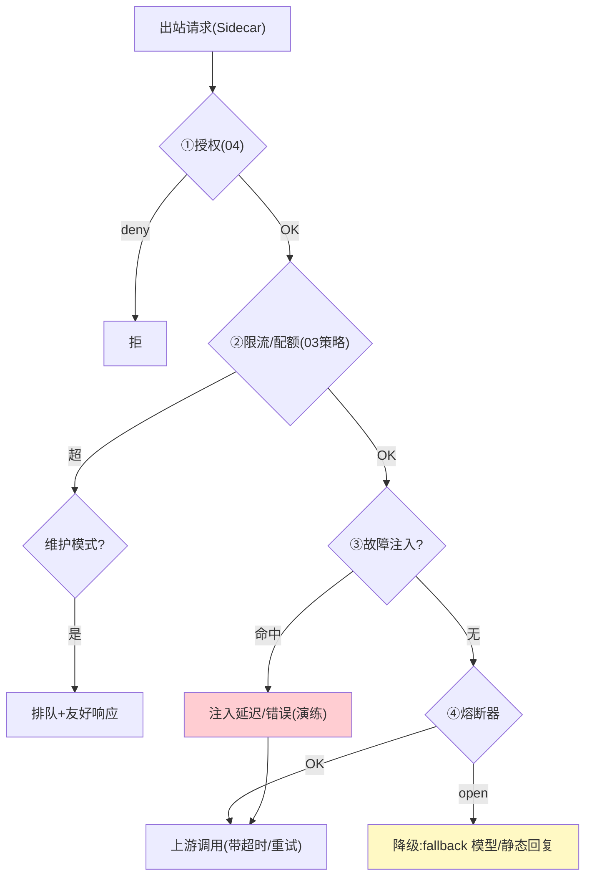

# 05-迭代四：流量治理与故障注入——声明式弹性 + 网格级混沌 + Kill-Switch

> **定位**：统一**声明式流量治理**（路由/熔断/重试/超时/降级——全部 MeshPolicy 一份 YAML，Sidecar 本地执行）+ 三个工业特有件：**故障注入**（网格级混沌——对指定 Agent 注入延迟/错误/Token 超耗，验证韧性）、**全局 Kill-Switch**（一键熔断某租户/某模型/整个网格的出站）、**维护模式**（上游维护期优雅排队而非报错）。读者画像：要"弹性可声明、韧性可演练、事故可一键止损"的读者。前置阅读：[04-迭代三-身份零信任与mTLS](04-迭代三-身份零信任与mTLS.md)、[教程 30-容错与弹性设计]。
>
> **铁律 0**：全部本地执行（Sidecar 内），无中心绕行。

---

## 一、四问

| 问 | 答 |
|----|----|
| **新增了什么需求** | ① 声明式路由/熔断/重试/超时/降级（本地执行）② 故障注入（延迟/错误/配额耗尽三类，按 Agent 定向）③ Kill-Switch（租户级/模型级/全局，秒级）④ 维护模式（上游维护窗口：排队+告知，而非雪崩报错） |
| **影响了哪些模块** | Sidecar 流量引擎；mesh-control 策略面 |
| **架构如何演进** | 零散治理开关 → 一份声明 + 本地执行 + 演练能力 |
| **上一版痛点** | 弹性配置散落各 Agent、无法统一定义与验证（04 §六） |

**本迭代验收**：① 声明熔断 errorRate 0.5 → 实测按声明动作（半开探活恢复）② 注入 500ms 延迟+10% 错误到指定 Agent，其重试策略正确工作 ③ Kill-Switch 某模型 → 全网格该模型调用 ≤2s 停止 ④ 维护模式期请求排队返回友好提示，恢复后自动放行。

---

## 二、治理动作全景（本地执行）



## 三、故障注入（网格级混沌）

```yaml
# MeshChaos —— 定向演练（生产安全阀：maxDuration + 自动恢复）
apiVersion: mesh/v1
kind: MeshChaos
spec:
  target: { agent: "risk-agent-canary" }
  faults:
    - { type: delay,      valueMs: 500,  percentage: 100 }
    - { type: error,      httpStatus: 500, percentage: 10 }
    - { type: quotaBurn,  tokens: 50000 }   # 模拟配额耗尽路径
  duration: 5m            # 到期自动撤销
```

> **工业价值**：混沌不再是独立平台——**网格天然是混沌注入点**（所有流量都过它），演练=一条策略。

## 四、Kill-Switch 与维护模式

```java
// Kill-Switch（紧急止损，控制面一键）：
//   scope: tenant=<id> / model=<name> / global
//   动作: 出站一律 503+Retry-After；生效 ≤2s（复用 03 ADS 通道）
//   审计: 谁触发/何时/范围/何时解除
// 维护模式（计划内）：
//   上游窗口期 → 请求进本地有界队列（TTL 30s）→ 窗口结束放行
//   队列满/超 TTL → 友好降级文案（"模型维护中，预计 xx:xx 恢复"）
```

## 五、治理路径可见性（流量被怎么治理的，用户要看得见）

> 过程可见性是工业级标配（[附录 14/01-中间过程可见性设计]）。网格视角，**一次调用的过程 = 它走了哪条治理路径**：是否被限流、是否熔断、是否命中 Kill-Switch、灰度去了哪个版本。用户/运维要能实时看到"这次调用为什么这样"。

一~四节的治理论断在 Sidecar 本地执行，**顺手发出过程事件**——每跳一个治理论断（限流/熔断/灰度/拦截）emit 一条治理事件：`{callId, 治理动作, 决策值, 规则版本, 结果}`。

| 治理动作 | 可见性事件 | 用户看到 |
|---------|-----------|---------|
| 限流 | `RateLimitHit{callId, threshold, reject}` | "触发限流 429" |
| 熔断 | `CircuitOpen{callId, errRate, fallback}` | "上游故障→已熔断→走兜底" |
| Kill-Switch | `KillSwitchHit{model, scope}` | "该模型被全局停止" |
| 灰度 | `Route{callId, version=canary}` | "当前走 canary 版本" |

**四条纪律**：
1. **与审计同源**：治理事件与审计（06）同一决策点发出，不重复埋点；有 `callId` 可贯穿全链路。
2. **只报结论不泄策略细节**：事件给"决策值+结果"，不给规则全文——避免暴露内部风控阈值（防绕过限流）。
3. **失败也可见**：熔断降级/拦截都发事件，用户知道"这步被兜底了"而非"结果错了"。
4. **可下钻**：治理论断带 `规则版本`，用户能追溯到"这条治理规则是这个版本下的"（呼应 03 ADS 版本化）。

**验证**（叠加本迭代验证包）：模拟一次超限流 → 事件流出现 `RateLimitHit` 且含 callId/阈值；熔断降级 → `CircuitOpen` 事件出现；grep 断言事件不含规则全文。

## 六、验证包（手工测试与验证）
**前置条件**：熔断/fallback/重试预算+MeshChaos+Kill-Switch+维护模式实现。

**材料 A——错误注入**：上游 mock 60% 错误率；**材料 B——全局开关演练**：Kill-Switch model=deepseek-chat。

**步骤与断言**：

| # | 操作 | 预期（PASS 判据） |
|---|------|------------------|
| 1 | 材料A（熔断阈值 0.5/100 样本） | 熔断 open → fallback 生效 → 恢复后半开探活成功闭合 |
| 2 | MeshChaos 注入 canary Agent | 其重试/降级行为符合预期；5min 自动撤销 |
| 3 | 材料B 触发 | ≤2s 全网该模型请求 503；解除后恢复 |
| 4 | 维护模式 10min 窗口 | 请求排队+提示语；窗口后自动放行（无雪崩式重试风暴） |

**失败排查**：①半开不闭合→探活无间隔退避；③有漏网→Kill-Switch 只推了部分 Sidecar（对账 ACK）；④风暴→排队放行未做平滑（漏桶放出）。


## 七、本迭代痛点

治理与身份全了，但可观测数据仍是原始 → 06 统一遥测（含 Token 计量与 PII 清洗）。

## 八、验收对照

| 验收项 | 标准 | 状态 |
|--------|------|------|
| 声明治理 | 路由/熔断/重试/超时本地执行 | ✅ |
| 故障注入 | 三类定向+自动撤销 | ✅ |
| Kill-Switch | ≤2s 止损 | ✅ |
| 维护模式 | 排队不雪崩 | ✅ |

**下一篇**：[06-迭代五-统一遥测与审计](06-迭代五-统一遥测与审计.md)。
