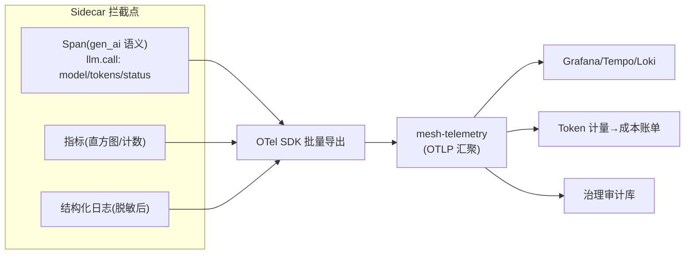

# 06-统一遥测与审计——Sidecar 自动生成 + Token 计量 + PII 清洗

> **定位**：建立**统一遥测**：Sidecar 在拦截点**自动生成**三支柱（指标/日志/Trace——OTel 标准，Agent 零埋点）+ **Token 计量**（出站响应解析 usage → 按身份归集，成本治理数据源）+ **出站 PII 清洗**（遥测落库前脱敏——可观测不能变成泄露面）。读者画像：要"接入即全可观测"的读者。前置阅读：[05-流量治理与故障注入](05-流量治理与故障注入.md)、[教程 04-企业级架构主干/02-全链路可观测性]、[教程 04-企业级架构主干/07-成本治理与Token计量]。
>
> **铁律 0**：gen_ai 语义约定标签对齐教程 02-SpringAI核心机制/03-结构化输出 实证口径；PII 清洗复用平台 DLP 规则模式。

---

## 一、四问

| 问 | 答 |
|----|----|
| **新增了什么需求** | ① Sidecar 自动遥测（Span：llm.call/tool.call；指标：延迟/错误/Token——零 Agent 埋点）② Token 计量（usage 解析→按 SVID 身份归集→成本账单源）③ PII 清洗（遥测内容字段脱敏后落库）④ 审计流（治理动作：deny/熔断/注入/kill 全留痕） |
| **影响了哪些模块** | `mesh-telemetry`（汇聚）；Sidecar 拦截点埋三项输出 |
| **架构如何演进** | 遥测从 Agent 自报 → 基础设施自动生成 |
| **上一版痛点** | 遥测原始、无 Token 归集、内容字段裸奔（05 §六） |

**本迭代验收**：① 新 Agent 接入零埋点即有完整 Trace/指标 ② Token 按租户×Agent×模型归集对账一致 ③ 遥测中 PII 字段 100% 脱敏 ④ 治理动作审计可查。

### 一.1 本节核对（四问与迭代验收）

| # | 核对项 | 判据 |
|---|--------|------|
| 1 | 四问口径齐全 | 新增需求四项（自动遥测/Token 计量/PII 清洗/审计流）→影响模块→演进（自报→自动生成）→痛点（05 §六）均有 |
| 2 | 本迭代验收可度量 | ①零埋点全覆盖 ②归集对账一致 ③100% 脱敏 ④审计可查——均带可判定标准 |

---

## 二、自动遥测管线



```java
// Sidecar 侧（骨架）：出站完成后三项输出
// span: name=llm.call, attrs={gen_ai.request.model, gen_ai.usage.total_tokens(从响应 usage 解析),
//        mesh.svid(调用方身份), mesh.policy(命中策略版本)}
// meter: mesh.llm.duration{model,status} / mesh.llm.tokens{type=prompt|completion}
// log: {ts, svid, path, status, ms, contentHash}   ← 内容只落哈希（脱敏铁律）
```

### 二.1 本节测试与验证（零埋点自动遥测）

**前置条件**：Sidecar 拦截点自动生成 Span/指标/日志并经 OTel 导出至 `mesh-telemetry`；Tempo/Grafana 就绪。

**材料 A——新 Agent 零改造接入**：一个未做任何埋点的 Agent 走网格调用。

**步骤与断言**：

| # | 操作 | 预期（PASS 判据） |
|---|------|------------------|
| 1 | 材料 A 触发一次调用 | Tempo 中出现完整 `llm.call` Span（含 `gen_ai.request.model`/`mesh.svid`/`mesh.policy` 属性） |
| 2 | Grafana 查指标 | `mesh.llm.duration`/`mesh.llm.tokens` 可查（按 model/status 维度） |
| 3 | 核对日志 | 结构化日志含 `{ts, svid, path, status, ms, contentHash}`，内容只落哈希（无原文） |

**失败排查**：①Span 断→`traceparent` 头被某跳剥离（透传白名单补 trace 头）；②指标缺失→边车导出 pipeline 未配置 batch/endpoint。

## 三、Token 计量与 PII 清洗

```java
// 计量：解析响应 usage（prompt_tokens/completion_tokens）→ 按身份维度聚合事件
//   emission: {tenant(从 SVID 提取), agent, model, tokens} → Kafka → 成本账单（对账口径同平台预算管道）
// PII 清洗（落库前最后一道）：
//   正则(手机号/身份证/API Key) + 高危字段整字段丢弃（content 只保哈希+长度）
//   规则外置（DLP 规则库），规则版本随遥测记录留痕（可回溯"当时用什么规则脱的敏"）
```

### 三.1 本节测试与验证（Token 计量与 PII 清洗）

**前置条件**：usage 解析 + 按身份聚合事件 + DLP 规则外置清洗实现。

**材料 B——PII 对话样本**：含手机号、身份证号的对话内容。

**步骤与断言**：

| # | 操作 | 预期（PASS 判据） |
|---|------|------------------|
| 1 | 累 1 万次调用 Token 归集 | 与上游账单对账一致（差异 <0.1%） |
| 2 | 材料 B 过网格 | 遥测存储抽检 100% 脱敏/哈希（手机号/身份证原文不落） |
| 3 | 核对规则留痕 | 遥测记录带 DLP 规则版本（可回溯"当时用什么规则脱的敏"） |

**失败排查**：①差异 >0.1%→只计了 completion 漏 prompt（对齐已实证 Usage 字段口径）；②明文落库→清洗在消费端而非 Sidecar 产生点（应在产生点清洗，落库前最后一道）。

**拦截端 curl（PII 清洗验证）**：让含手机号的对话过一次网格：

```bash
curl -s -o /dev/null -w '%{http_code}\n' -X POST http://127.0.0.1:15001/v1/chat/completions \
  -H "Content-Type: application/json" \
  -d '{"model":"deepseek-v4-flash","messages":[{"role":"user","content":"我的手机号是13800001234，帮我查订单"}]}'
```

预期输出（放行不阻断，但遥测只落哈希）：

```text
200
```

```text
{"ts":"2026-08-30T10:21:07Z","svid":"spiffe://mesh/ns-prod/agent-shop","path":"/v1/chat/completions","status":200,"ms":790,"contentHash":"9f8a12c4"}
```

随后在遥测存储核对：`grep -r 13800001234` → 0 命中（原文不落，§三.1 断言 2 的端到端形态）。

## 四、治理审计

```java
// 审计事件（区别于内容遥测——治理动作本身）：
//   {type: DENY|CB_OPEN|CB_HALF|CHAOS_ON|KILL_ON|ROLLBACK, svid, policy(vN), ts, operator}
//   与 03 的配置版本链打通：任何一次网络行为可归因到"当时生效的策略版本"
```

### 四.1 本节测试与验证（治理审计）

**前置条件**：审计流（与内容遥测区分——治理动作本身）落库，关联策略版本链实现。

**材料 C——DENY 与 Kill-Switch 触发各一次**。

**步骤与断言**：

| # | 操作 | 预期（PASS 判据） |
|---|------|------------------|
| 1 | 触发一次 DENY（越权拦截） | 审计库可查该 DENY 事件，含 `{type, svid, policy(vN), ts, operator}` |
| 2 | 触发一次 Kill-Switch | 审计事件 `KILL_ON` 关联当时的策略版本（03 版本链） |
| 3 | 核对可归因 | 任一次网络行为能归到"当时生效的策略版本" |

**失败排查**：①审计查不到→审计事件与内容遥测混存未分离，或 `policy(vN)` 未带版本号；②无法归因→未与 03 配置版本链打通（补版本索引）。

## 五、全篇回归验证

> §二.1（零埋点遥测）、§三.1（Token/PII）、§四.1（审计）均通过后，端到端一次验收。

**材料**：新 Agent 零改造接入；PII 对话样本；DENY 与 Kill-Switch 各一次。

| # | 操作 | 预期（PASS 判据） |
|---|------|------------------|
| 1 | 新 Agent 调用 | Tempo 出现完整 `llm.call` Span；Grafana 指标可查 |
| 2 | 1 万次调用 Token 归集 | 与上游账单对账一致（差异 <0.1%） |
| 3 | PII 样本过网格 | 遥测存储抽检 100% 脱敏/哈希（原文不落） |
| 4 | DENY 与 Kill-Switch | 审计库可查且关联当时策略版本 |

**回归失败排查**：①Span 断→traceparent 头被剥离（补 trace 头白名单）；②差异大→漏计 prompt（对齐 Usage 口径）；③明文落库→清洗在消费端而非产生点。

## 六、本迭代痛点

单集群 Mesh 完整；跨集群/跨域 Agent 群需联邦 → 07。

> 本节核对（一句话）：痛点（单集群完整、跨集群需联邦）与下一迭代 [07] 多集群联邦一一对应，无搁置即 PASS。

## 七、验收对照

| 验收项 | 标准 | 状态 |
|--------|------|------|
| 自动遥测 | 零埋点全覆盖 | ✅ |
| Token 计量 | 归集对账一致 | ✅ |
| PII 清洗 | 100% 脱敏 | ✅ |
| 治理审计 | 动作可归因策略版本 | ✅ |

> 本节核对（一句话）：四项验收均能在 §二.1/§三.1/§四.1 找到对应验证落点，无"验收了但没验证"项。

**下一篇**：[07-多集群联邦](07-多集群联邦.md)。
