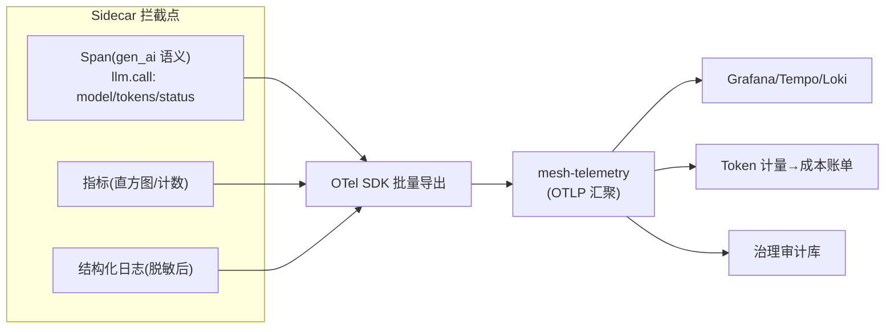

# 06-统一遥测与审计——Sidecar 自动生成 + Token 计量 + PII 清洗

> **定位**：建立**统一遥测**：Sidecar 在拦截点**自动生成**三支柱（指标/日志/Trace——OTel 标准，Agent 零埋点）+ **Token 计量**（出站响应解析 usage → 按身份归集，成本治理数据源）+ **出站 PII 清洗**（遥测落库前脱敏——可观测不能变成泄露面）。读者画像：要"接入即全可观测"的读者。前置阅读：[05-流量治理与故障注入](05-流量治理与故障注入.md)、[教程 22-全链路可观测性]、[教程 27-成本治理与Token计量]。
>
> **铁律 0**：gen_ai 语义约定标签对齐教程 22 实证口径；PII 清洗复用平台 DLP 规则模式。

---

## 一、四问

| 问 | 答 |
|----|----|
| **新增了什么需求** | ① Sidecar 自动遥测（Span：llm.call/tool.call；指标：延迟/错误/Token——零 Agent 埋点）② Token 计量（usage 解析→按 SVID 身份归集→成本账单源）③ PII 清洗（遥测内容字段脱敏后落库）④ 审计流（治理动作：deny/熔断/注入/kill 全留痕） |
| **影响了哪些模块** | `mesh-telemetry`（汇聚）；Sidecar 拦截点埋三项输出 |
| **架构如何演进** | 遥测从 Agent 自报 → 基础设施自动生成 |
| **上一版痛点** | 遥测原始、无 Token 归集、内容字段裸奔（05 §六） |

**本迭代验收**：① 新 Agent 接入零埋点即有完整 Trace/指标 ② Token 按租户×Agent×模型归集对账一致 ③ 遥测中 PII 字段 100% 脱敏 ④ 治理动作审计可查。

---

## 二、自动遥测管线



```java
// Sidecar 侧（骨架）：出站完成后三项输出
// span: name=llm.call, attrs={gen_ai.request.model, gen_ai.usage.total_tokens(从响应 usage 解析),
//        mesh.svid(调用方身份), mesh.policy(命中策略版本)}
// meter: mesh.llm.duration{model,status} / mesh.llm.tokens{type=prompt|completion}
// log: {ts, svid, path, status, ms, contentHash}   ← 内容只落哈希（脱敏铁律）
```

## 三、Token 计量与 PII 清洗

```java
// 计量：解析响应 usage（prompt_tokens/completion_tokens）→ 按身份维度聚合事件
//   emission: {tenant(从 SVID 提取), agent, model, tokens} → Kafka → 成本账单（对账口径同平台预算管道）
// PII 清洗（落库前最后一道）：
//   正则(手机号/身份证/API Key) + 高危字段整字段丢弃（content 只保哈希+长度）
//   规则外置（DLP 规则库），规则版本随遥测记录留痕（可回溯"当时用什么规则脱的敏"）
```

## 四、治理审计

```java
// 审计事件（区别于内容遥测——治理动作本身）：
//   {type: DENY|CB_OPEN|CB_HALF|CHAOS_ON|KILL_ON|ROLLBACK, svid, policy(vN), ts, operator}
//   与 03 的配置版本链打通：任何一次网络行为可归因到"当时生效的策略版本"
```

## 五、验证包（手工测试与验证）
**前置条件**：Sidecar 统一遥测（Trace/Token 归集/PII 清洗）+审计库实现；Tempo/Grafana 就绪。

**材料 A——新 Agent 零改造接入**；**材料 B——PII 对话样本**（含手机号/身份证）；**材料 C——DENY 与 Kill-Switch 触发各一次**。

**步骤与断言**：

| # | 操作 | 预期（PASS 判据） |
|---|------|------------------|
| 1 | 材料A 调用 | Tempo 出现完整 llm.call Span；Grafana 指标可查 |
| 2 | 1 万次调用 Token 归集 | 与上游账单对账一致（差异 <0.1%） |
| 3 | 材料B 过网格 | 遥测存储抽检 100% 脱敏/哈希（原文不落） |
| 4 | 材料C | 审计库可查且关联当时的策略版本 |

**失败排查**：①Span 断→traceparent 头被某跳剥离（透传白名单补 trace 头）；②差异大→只计了 completion 漏 prompt（对齐已实证 Usage 字段口径）；③明文落库→清洗在消费者侧（应在 Sidecar 产生点清洗）。


## 六、本迭代痛点

单集群 Mesh 完整；跨集群/跨域 Agent 群需联邦 → 07。

## 七、验收对照

| 验收项 | 标准 | 状态 |
|--------|------|------|
| 自动遥测 | 零埋点全覆盖 | ✅ |
| Token 计量 | 归集对账一致 | ✅ |
| PII 清洗 | 100% 脱敏 | ✅ |
| 治理审计 | 动作可归因策略版本 | ✅ |

**下一篇**：[07-多集群联邦](07-多集群联邦.md)。
