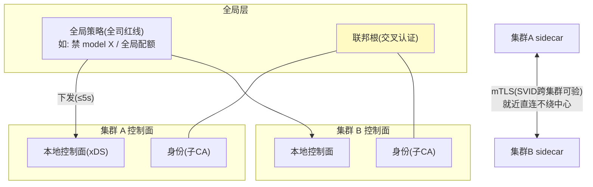
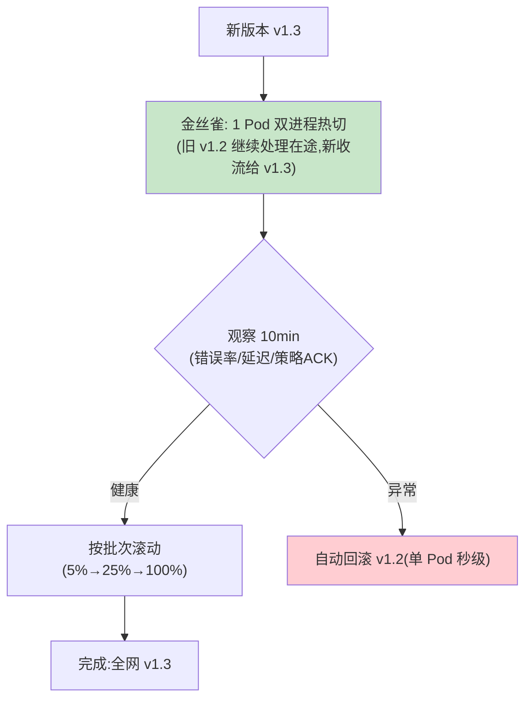

# 07-多集群联邦与 Sidecar 自升级——跨域互信 + 数据面滚动

> **定位**：完成 Mesh 最后两块工业拼图：**多集群联邦**（跨集群互信根、策略分域下发、跨网格调用就近与身份透传）与 **Sidecar 自身升级**（数据面滚动——治理组件自己也要能安全升级：版本金丝雀、双进程热切、失败自回滚）。读者画像：多区域/要长期运营 Mesh 的读者。前置阅读：[06-统一遥测与审计](06-统一遥测与审计.md)。
>
> **铁律 0**：机制自研；升级策略复用 03 的灰度管道。

---

## 一、四问

| 问 | 答 |
|----|----|
| **新增了什么需求** | ① 联邦互信（根 CA 交叉认证/身份跨集群可验）② 策略分域（每集群本地控制面+全局策略层）③ 跨网格调用（身份透传、就近路由）④ **Sidecar 升级**（金丝雀滚动、热切、自动回滚、逃生门不变） |
| **影响了哪些模块** | `mesh-federation`；Sidecar 加升级代理模式 |
| **架构如何演进** | 单集群 Mesh → 多域联邦 + 自我可演进 |
| **上一版痛点** | 跨集群无互信、Sidecar 升级=全网重启（06 §六） |

**本迭代验收**：① 集群 A 身份在集群 B 可验并按同一授权语义放行/拒绝 ② 全局策略（如全司禁某模型）≤5s 到全部集群 ③ Sidecar 新版本金丝雀 1 Pod → 全量，异常自动回滚 ④ 升级全程业务零中断。

### 一.1 本节核对（四问与迭代验收）

| # | 核对项 | 判据 |
|---|--------|------|
| 1 | 四问口径齐全 | 新增需求四项（联邦互信/策略分域/跨网格调用/Sidecar 升级）→影响模块→演进→痛点（06 §六）均有 |
| 2 | 本迭代验收可度量 | ①跨集群可验 ②全局≤5s ③金丝雀+自动回滚 ④零中断——均带时限或可判定事件 |

---

## 二、联邦架构



**分域纪律**：本地策略管本地细节（路由/限流），全局策略只放**红线**（禁令/全司配额）——全局层越薄越稳。

### 二.1 本节测试与验证（联邦互信与跨集群调用）

**前置条件**：两集群联邦（信任锚互认 + SVID 跨集群可验 + 全局策略广播）实现。

**材料 A——跨集群调用**；**材料 B——伪造 SVID**；**材料 C——全局禁令** `model X`。

**步骤与断言**：

| # | 操作 | 预期（PASS 判据） |
|---|------|------------------|
| 1 | 材料 A：集群 A 的 SVID 调用集群 B 能力 | 授权内放行（就近直连，不绕中心）；材料 B 伪造身份 → 拒绝 + 审计 |
| 2 | 材料 C：全局禁令 model X 下发 | 两集群 ≤5s 全部 503（事件广播，非轮询） |
| 3 | 核对分域 | 本地路由/限流本地控制面管，红线全局层广播，语义一致 |

**失败排查**：①跨集群调用失败→信任锚未互认（联邦根/交叉认证缺失）；④禁令延迟大→走轮询而非事件广播（改 xDS 推送）。

## 三、Sidecar 升级（数据面滚动）



```java
// 热切要点：同一 Pod 内新旧 Sidecar 进程并存
//   - 在途流(长 SSE)由旧进程服务完；新连接交新进程
//   - 策略引擎状态(熔断器窗口/限流桶)序列化交接——治理状态不因升级清零
//   - 升级期间逃生门始终可用（02 的 bypass 纪律永久有效）
```

### 三.1 本节测试与验证（Sidecar 双进程热切升级）

**前置条件**：金丝雀 1 Pod + 双进程热切（新旧并存、在途由旧服务、新连接交新）+ 自动回滚实现。

**材料 D——升级期压测**（含长 SSE 连接）。

**步骤与断言**：

| # | 操作 | 预期（PASS 判据） |
|---|------|------------------|
| 1 | v1.2→v1.3 金丝雀 1 Pod | 观察 10min 健康则进入批次滚动（5%→25%→100%） |
| 2 | 注入新版本 bug | 金丝雀阶段判定异常 → 自动回滚 v1.2（未伤全量） |
| 3 | 材料 D：升级期间压测 | 长 SSE 不断；错误率无毛刺（热切零中断） |
| 4 | 策略状态交接 | 熔断窗口/限流桶序列化交接，治理状态不因升级清零 |

**失败排查**：①长连接断→升级驱逐了承载长连接的 Pod（应优雅摘流：在途由旧进程服务完）；②回滚慢→金丝雀判定指标延迟（缩短观察窗口）；③状态清零→策略引擎状态未序列化交接。

## 四、全篇回归验证

> §二.1（联邦）与 §三.1（升级）均通过后，端到端一次验收。

**材料**：跨集群调用；伪造 SVID；全局禁令 model X；升级期压测（含长 SSE）。

| # | 操作 | 预期（PASS 判据） |
|---|------|------------------|
| 1 | 集群 A SVID 调集群 B | 授权内放行；伪造身份拒绝 + 审计 |
| 2 | 全局禁令 model X | 两集群 ≤5s 全部 503 |
| 3 | v1.3 金丝雀 → 滚动 | 注入新版本 bug → 金丝雀阶段自动回滚（未伤全量） |
| 4 | 升级期压测 | 长 SSE 不断；错误率无毛刺 |

**回归失败排查**：①延迟大→禁令走轮询（改事件广播）；②回滚慢→金丝雀判定指标延迟（缩短窗口）；③断连→升级驱逐了承载长连接的 Pod（优雅摘流）。

## 五、本迭代痛点

六层机制齐备但散在各篇 → 08 核心代码讲解统一复盘。

> 本节核对（一句话）：痛点（机制散在各篇）与收敛方向（核心代码讲解统一复盘）一致，机制已通过 §二.1/§三.1 逐项验证即 PASS。

## 六、验收对照

| 验收项 | 标准 | 状态 |
|--------|------|------|
| 联邦互信 | SVID 跨集群可验 | ✅ |
| 全局红线 | ≤5s 全集群 | ✅ |
| Sidecar 升级 | 金丝雀+热切+自动回滚 | ✅ |
| 零中断 | 长连接不断 | ✅ |

> 本节核对（一句话）：四项验收均能在 §二.1/§三.1 找到对应验证落点（联邦互信→跨集群可验、全局红线→≤5s、升级→金丝雀+回滚、零中断→压测），无"验收了但没验证"项。

**下一篇**：[11-核心代码讲解](11-核心代码讲解.md)。
