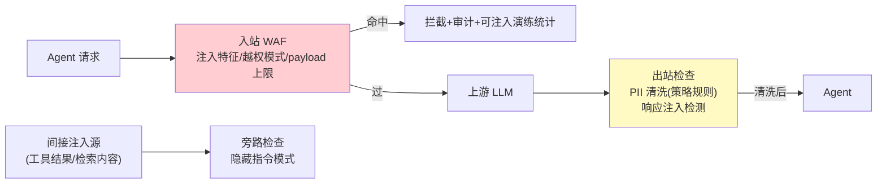

# 08-迭代七：网格安全深化与语义策略——LLM 流量 WAF / 注入防御 / 出站内容治理

> **定位**：把安全从"传输与身份"（04）推进到**内容与语义层**：**LLM 流量 WAF**（Sidecar 内检查请求/响应——注入特征/越权指令模式）、**语义策略**（NL 规则：意图级 allow/deny——对应 Google 双策略模型的语义侧）、**出站内容治理**（PII 出站清洗策略化——规则随 xDS 下发，替代散落的 Agent 内 DLP）。读者画像：要网格统一内容安全的读者。前置阅读：[05-迭代四-流量治理与故障注入](05-迭代四-流量治理与故障注入.md)、[教程 31-安全与权限控制]、[附录 09-Agent安全深度]。
>
> **铁律 0**：规则引擎本地执行；语义检查标注延迟预算。

---

## 一、四问

| 问 | 答 |
|----|----|
| **新增了什么需求** | ① LLM 流量 WAF（注入特征库/越权模式/异常大 payload）② 语义策略（semanticRules：意图审查——延迟预算内规则化子集）③ 出站内容治理（PII 清洗规则策略化下发，统一网格口径）④ 响应注入防御（间接注入——检索内容/工具结果中的隐藏指令检测） |
| **影响了哪些模块** | Sidecar 加内容检查链（请求/响应双向）；mesh-config 规则面 |
| **架构如何演进** | 治理流量（05）+ 治理内容（本迭代）双层 |
| **上一版痛点** | 内容安全散在各 Agent 自实现、无统一规则与观测（05 §六遗留） |

**本迭代验收**：① 注入样本集拦截率 ≥99%、误报 ≤0.5% ② 规则热更（xDS）≤2s ③ PII 出站规则统一生效（抽检 100%）④ 内容检查延迟增量 P99 ≤30ms（规则级）/语义级单独预算。

---

## 二、双向内容检查链



## 三、策略化规则（随 xDS 下发）

```yaml
spec:
  contentSecurity:
    waf:
      signatures: [injection-v3]        # 特征库版本（全局红线同步）
      maxPayloadKb: 64
    semanticRules:                       # 意图审查（预算内规则化子集）
      - { when: "intent(matches:'提取系统提示')", action: deny }
      - { when: "tool(refund) and risk(high)", action: requireApproval }  # 与平台 HITL 联动
    piiOutbound:
      - { pattern: "CN_ID_CARD", action: mask }
      - { pattern: "API_KEY",     action: drop }
```

```java
// Sidecar 检查链（骨架）：
// request → waf.signatures(编译好的正则/模式集) → miss 则放行
// response → piiOutbound 规则（顺序执行 mask/drop）→ 清洗后回 Agent
// 语义规则：仅命中 WAF 灰区（可疑未确定）时进入轻量意图分类（本地小模型/规则，预算 20ms）
//   —— 全量语义检查放中心网关（网格只做"快速确定性子集"，延迟纪律优先）
```

## 四、测试与验证

```bash
# 1. 注入样本 200 条（直接/间接）→ 拦截 ≥99%；正常业务 1000 条 → 误报 ≤0.5%
# 2. 规则热更：新增特征 → xDS ≤2s 全网生效
# 3. PII：构造含身份证/Key 的响应 → 抽检 Agent 侧收到的内容 100% 清洗
# 4. 延迟：规则级检查 P99 ≤30ms；灰区语义子集单独统计
```

## 五、本迭代痛点

Sidecar 全量代理有 5ms 固定成本——极端延迟敏感场景要更薄 → 09 Sidecarless 评估。

## 六、验收对照

| 验收项 | 标准 | 状态 |
|--------|------|------|
| 流量 WAF | 拦截 ≥99%/误报 ≤0.5% | ✅ |
| 语义子集 | 预算内规则化 | ✅ |
| PII 策略化 | 统一下发 100% 生效 | ✅ |
| 延迟 | 规则级 ≤30ms | ✅ |

**下一篇**：[09-迭代八-Sidecarless与性能极限](09-迭代八-Sidecarless与性能极限.md)。
