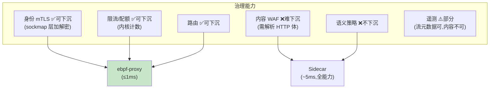

# 09-迭代八：Sidecarless 与性能极限——eBPF 旁路 / 混合模式 / 延迟治理

> **定位**：把网格推到**性能极限**：**Sidecarless 评估与落地**（eBPF/内核层旁路——延迟 <1ms 的极端场景；能力对比与降级取舍）、**混合模式**（同网格 Sidecar 与 Sidecarless 共存——按 Agent 分级选用）、**延迟治理**（全链路延迟预算表：劫持/检查/策略/mTLS 各环节预算与测量）。读者画像：有毫秒级敏感 Agent（实时风控/语音）的读者。前置阅读：[08-迭代七-网格安全深化与语义策略](08-迭代七-网格安全深化与语义策略.md)、[教程 38-Agent性能优化]。
>
> **铁律 0**：eBPF 为 Linux 内核技术（第三方，概念+真实坐标 cilium 标注）；Java 层测量自研。

---

## 一、四问

| 问 | 答 |
|----|----|
| **新增了什么需求** | ① Sidecarless 路线评估（eBPF sockmap/出口层——能力矩阵：哪些治理可下沉）② 混合模式（Pod 标签选 Sidecar/Sidecarless；策略语义一致）③ 延迟预算表（各环节预算+持续测量看板）④ 性能压测基线（三模式：直连/Sidecar/Sidecarless） |
| **影响了哪些模块** | 新增 `ebpf-proxy`（可选数据面）；mesh-control 面向两种数据面统一下发 |
| **架构如何演进** | 单一数据面 → 双数据面共存（按需选择） |
| **上一版痛点** | Sidecar 固定 ~5ms 对毫秒级场景过重（08 §五） |

**本迭代验收**：① Sidecarless 路径延迟增量 ≤1ms（可下沉治理：身份/限流/路由）② 混合模式策略语义一致（同一策略两数据面行为等价）③ 延迟预算看板各环节可测量 ④ 三模式基线报告产出。

---

## 二、能力下沉矩阵



## 三、混合模式

```yaml
# Pod 标签选数据面（策略语义一致，能力面不同）
mesh-agent.io/dataplane: sidecar      # 默认全能力
mesh-agent.io/dataplane: ebpf         # 低延迟子集(身份/限流/路由)
# ebpf 模式的 Agent 需内容 WAF 时 → 策略校验器提示"该 Agent 需 sidecar"（防静默失防）
```

## 四、延迟预算表与基线

| 环节 | 预算 | 实测方式 |
|------|------|---------|
| iptables 劫持 | ≤0.1ms | Sidecar 内打点 |
| WAF 规则 | ≤0.5ms（规则级） | 检查链打点 |
| 策略求值 | ≤0.1ms | 本地缓存命中 |
| mTLS 握手（复用后） | ≤0.3ms | 会话复用 |
| **Sidecar 总增量** | **≤5ms** | 端到端对比 |
| **eBPF 路径总增量** | **≤1ms** | 同上 |

```bash
# 基线：同 Agent 三模式各压 10 万请求 → P50/P99 报告进 meshctl perf 基线库
```

## 五、验证包（手工测试与验证）
**前置条件**：eBPF 数据面（内核层身份/限流/路由）+能力失防校验器+延迟预算看板实现；两种数据面并存。

**材料 A——策略等价对比集**；**材料 B——含 WAF 规则的策略**（eBPF 不支持的能力）。

**步骤与断言**：

| # | 操作 | 预期（PASS 判据） |
|---|------|------------------|
| 1 | eBPF 模式压测 | 增量延迟 ≤1ms；身份/限流/路由治理全生效 |
| 2 | 材料A：同一限流策略两种数据面 | 行为等价（限流曲线一致） |
| 3 | 材料B 下发到 eBPF Agent | 校验器拒绝+提示缺失能力（失防保护） |
| 4 | 看板 | 延迟预算各环节实测值可见；超标告警 |

**失败排查**：①治理失效→eBPF 程序 attach 点缺该协议；③拒不下发→校验器没跑（策略直通数据面——严重，立即堵）。


## 六、本迭代痛点

网格内部完备；对外生态（跨组织 Agent 协作）待打通 → 10 A2A 互操作。

## 七、验收对照

| 验收项 | 标准 | 状态 |
|--------|------|------|
| eBPF 路径 | ≤1ms 增量 | ✅ |
| 混合共存 | 策略语义一致 | ✅ |
| 失防保护 | 能力不匹配拒下发 | ✅ |
| 延迟基线 | 三模式报告 | ✅ |

**下一篇**：[10-迭代九-A2A互操作与策略市场](10-迭代九-A2A互操作与策略市场.md)。
