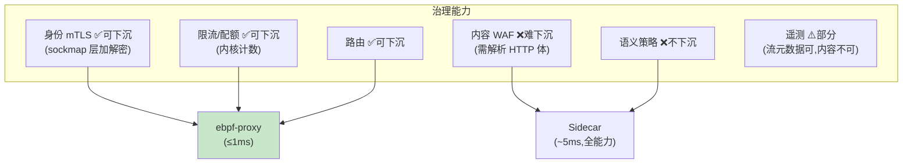

# 09-Sidecarless 与性能极限——eBPF 旁路 / 混合模式 / 延迟治理

> **定位**：把网格推到**性能极限**：**Sidecarless 评估与落地**（eBPF/内核层旁路——延迟 <1ms 的极端场景；能力对比与降级取舍）、**混合模式**（同网格 Sidecar 与 Sidecarless 共存——按 Agent 分级选用）、**延迟治理**（全链路延迟预算表：劫持/检查/策略/mTLS 各环节预算与测量）。读者画像：有毫秒级敏感 Agent（实时风控/语音）的读者。前置阅读：[08-网格安全深化与语义策略](08-网格安全深化与语义策略.md)、[教程 08-架构师进阶/04-Agent性能优化]。
>
> **铁律 0**：eBPF 为 Linux 内核技术（第三方，概念+真实坐标 cilium 标注）；Java 层测量自研。

---

## 一、四问

| 问 | 答 |
|----|----|
| **新增了什么需求** | ① Sidecarless 路线评估（eBPF sockmap/出口层——能力矩阵：哪些治理可下沉）② 混合模式（Pod 标签选 Sidecar/Sidecarless；策略语义一致）③ 延迟预算表（各环节预算+持续测量看板）④ 性能压测基线（三模式：直连/Sidecar/Sidecarless） |
| **影响了哪些模块** | 新增 `ebpf-proxy`（可选数据面）；mesh-control 面向两种数据面统一下发 |
| **架构如何演进** | 单一数据面 → 双数据面共存（按需选择） |
| **上一版痛点** | Sidecar 固定 ~5ms 对毫秒级场景过重（08 §五） |

**本迭代验收**：① Sidecarless 路径延迟增量 ≤1ms（可下沉治理：身份/限流/路由）② 混合模式策略语义一致（同一策略两数据面行为等价）③ 延迟预算看板各环节可测量 ④ 三模式基线报告产出。

### 一.1 本节核对（四问与迭代验收）

| # | 核对项 | 判据 |
|---|--------|------|
| 1 | 四问口径齐全 | 新增需求四项（Sidecarless/混合模式/延迟预算表/三模式基线）→影响模块→演进→痛点（08 §五）均有 |
| 2 | 本迭代验收带阈值 | ①≤1ms ②语义一致 ③各环节可测 ④基线报告——均带明确判据 |

---

## 二、能力下沉矩阵



### 二.1 本节核对（能力下沉矩阵）

- [ ] 可下沉（身份/限流/路由）→ eBPF；难/不下沉（WAF/语义）→ Sidecar——与实际能力面一致，无"下沉到做不到的治理"矛盾
- [ ] 遥测"部分可下沉（流元数据可、内容不可）"与 06 依赖 HTTP 体解析的语义一致

## 三、混合模式

```yaml
# Pod 标签选数据面（策略语义一致，能力面不同）
mesh-agent.io/dataplane: sidecar      # 默认全能力
mesh-agent.io/dataplane: ebpf         # 低延迟子集(身份/限流/路由)
# ebpf 模式的 Agent 需内容 WAF 时 → 策略校验器提示"该 Agent 需 sidecar"（防静默失防）
```

### 三.1 本节测试与验证（混合模式与失防保护）

**前置条件**：两种数据面并存（Pod 标签选型），策略语义一致，能力失防校验器实现。

**材料 A——策略等价对比集**：同一限流策略分别在 sidecar/ebpf 两种数据面下发；**材料 B——含 WAF 规则的策略**（ebpf 不支持的能力）。

**步骤与断言**：

| # | 操作 | 预期（PASS 判据） |
|---|------|------------------|
| 1 | 材料 A：同一限流策略两数据面 | 行为等价（限流曲线一致，策略语义一致） |
| 2 | 材料 B 下发到 ebpf Agent | 校验器拒绝 + 提示缺失能力（防静默失防） |
| 3 | 混合集群运转 | sidecar（全能力）与 ebpf（低延迟子集）Agent 在网格内共存，各自能力面生效 |

**失败排查**：①两数据面行为不一致→策略语义或执行序不统一；②ebpf 被静默失防→校验器没跑（策略直通数据面——严重，立即堵）。

## 四、延迟预算表与基线

| 环节 | 预算 | 实测方式 |
|------|------|---------|
| iptables 劫持 | ≤0.1ms | Sidecar 内打点 |
| WAF 规则 | ≤0.5ms（规则级） | 检查链打点 |
| 策略求值 | ≤0.1ms | 本地缓存命中 |
| mTLS 握手（复用后） | ≤0.3ms | 会话复用 |
| **Sidecar 总增量** | **≤5ms** | 端到端对比 |
| **eBPF 路径总增量** | **≤1ms** | 同上 |

```bash
# 基线：同 Agent 三模式各压 10 万请求 → P50/P99 报告进 meshctl perf 基线库
```

### 四.1 本节测试与验证（延迟预算表与三模式基线）

**前置条件**：延迟预算看板（各环节打点测量 + 超标告警）实现；直连/Sidecar/Sidecarless 三模式可切。

**材料**：同 Agent 三模式各压 10 万请求 → P50/P99 报告进 `meshctl perf` 基线库。

**步骤与断言**：

| # | 操作 | 预期（PASS 判据） |
|---|------|------------------|
| 1 | eBPF 模式压测 | 增量延迟 ≤1ms；身份/限流/路由治理全生效 |
| 2 | 直连 / Sidecar / Sidecarless 对比 | 输出三模式基线报告（Sidecar 总增量 ≤5ms、eBPF ≤1ms） |
| 3 | 看板各环节实测 | 劫持/规则/求值/mTLS 各环节预算可测量；超标告警 |

**失败排查**：①治理失效→eBPF 程序 attach 点缺该协议；③预算无实测→打点未埋（延迟预算需每环节埋点）。

## 五、全篇回归验证

> §三.1（混合/失防）与 §四.1（延迟基线）均通过后，一次端到端验收。

**材料**：策略等价对比集；含 WAF 规则的策略；三模式压测。

| # | 操作 | 预期（PASS 判据） |
|---|------|------------------|
| 1 | eBPF 模式压测 | 增量延迟 ≤1ms；身份/限流/路由治理全生效 |
| 2 | 同一限流策略两种数据面 | 行为等价（限流曲线一致） |
| 3 | 含 WAF 策略下发到 eBPF Agent | 校验器拒绝 + 提示缺失能力（失防保护） |
| 4 | 延迟预算看板 | 各环节实测值可见；超标告警 |

**回归失败排查**：任一步 FAIL 按 §三.1/§四.1 对应排查项回溯（attach 点缺协议 / 校验器直通 / 打点缺失）。

## 六、本迭代痛点

网格内部完备；对外生态（跨组织 Agent 协作）待打通 → 10 A2A 互操作。

> 本节核对（一句话）：痛点（对外生态待打通）与下一迭代 [10] A2A 互操作一一对应，无搁置即 PASS。

## 七、验收对照

| 验收项 | 标准 | 状态 |
|--------|------|------|
| eBPF 路径 | ≤1ms 增量 | ✅ |
| 混合共存 | 策略语义一致 | ✅ |
| 失防保护 | 能力不匹配拒下发 | ✅ |
| 延迟基线 | 三模式报告 | ✅ |

> 本节核对（一句话）：四项验收均能在 §三.1/§四.1/§五 找到对应验证落点，无"验收了但没验证"项。

**下一篇**：[10-A2A互操作与策略市场](10-A2A互操作与策略市场.md)。
