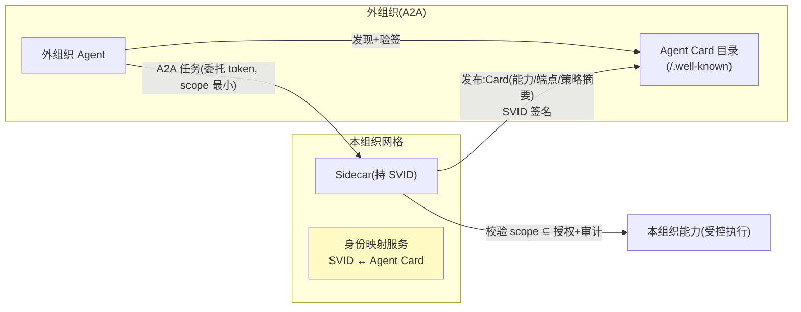

# 10-迭代九：A2A 互操作与策略市场——跨组织协作 / 策略资产共享

> **定位**：打通网格**对外生态**：**A2A 互操作**（SVID↔Agent Card 映射、跨组织 Agent 委托——网格身份体系对接 A2A 协议）、**策略市场**（治理策略资产化——特征库/限流模板/语义规则包在组织内共享与订阅）。读者画像：要跨团队/跨组织 Agent 协作与规模化治理复用的读者。前置阅读：[09-Sidecarless与性能极限](09-Sidecarless与性能极限.md)、[前沿 00-A2A协议]。
>
> **铁律 0**：A2A 为开放协议（无官方 Java SDK——适配层标概念代码）；市场机制自研。

---

## 一、四问

| 问 | 答 |
|----|----|
| **新增了什么需求** | ① SVID↔Agent Card 映射（网格身份对外可发现/可验证）② 跨组织委托（A2A 任务：外组织 Agent 经网格受控调用本组织能力）③ 策略市场（特征库/规则包/模板的发布-订阅-版本化）④ 委托不放大（跨组织权限 ⊆ 原始授权+显式 scope） |
| **影响了哪些模块** | `mesh-federation`（扩 A2A 适配）；新增 `mesh-market`（策略资产） |
| **架构如何演进** | 组织内网格 → 跨组织协作 + 治理资产复用 |
| **上一版痛点** | 网格内闭环、对外无标准互操作；治理经验无法规模化复制（09 §六） |

**本迭代验收**：① Agent Card 发布/发现/验证（SVID 签名）闭环 ② 跨组织 A2A 委托按最小授权执行且全程审计 ③ 策略包订阅后自动同步新版本 ④ 委托越权尝试被拒。

---

## 二、SVID ↔ Agent Card



## 三、委托不放大（跨组织铁律）

```java
// 委托 token：外组织签发 → 本组织网格验证
// 规则：scope 显式列出可调能力（单能力单次/短 TTL 5min）
//      网关侧再取交集：委托 scope ∩ 本组织对外授权 → 执行
//      尝试越权（token 外能力）→ EPERM+双向审计（本组织+回调外组织告警）
```

## 四、策略市场

```yaml
# 策略包（资产化：版本化/签名/订阅）
apiVersion: mesh-market/v1
kind: PolicyBundle
metadata: { name: llm-security-baseline, version: 2.3.0 }
spec:
  waf:        { signatures: [injection-v3, exfil-v1] }
  piiOutbound: [id-card-v2, phone-v1, email-v1, credit-card-v3]
  rateLimitTemplate: { interactive: {qps: 20} }
# 订阅：组织订阅后 xDS 自动同步新版本（签名校验→灰度→生效，复用 03 管道）
# 治理：下架/漏洞响应（特征库爆雷→市场推送撤销+全网回退）
```

## 五、验证包（手工测试与验证）
**前置条件**：Agent Card 发布/发现+SVID 跨验+委托 scope+策略市场订阅实现。

**材料 A——Card 闭环剧本**；**材料 B——越权调用**（scope 外能力）；**材料 C——市场策略** llm-security-baseline v2.4。

**步骤与断言**：

| # | 操作 | 预期（PASS 判据） |
|---|------|------------------|
| 1 | 材料A：发布→外组织发现→调用 | SVID 验签通过；全程双向审计可查 |
| 2 | scope 内能力调用 | 通；材料B 越权 → EPERM+审计 |
| 3 | 材料C 订阅→v2.4 发布 | 自动同步生效（≤5s）；撤销订阅 → 策略回退 |

**失败排查**：①验签失败→信任锚未互认（联邦前置条件缺失）；③不生效→市场推送无 ACK 机制；回退失效→策略版本被覆盖非停用。


## 六、本迭代痛点

六层+三进阶齐备但代码散在各篇 → 11 核心代码讲解统一复盘。

## 七、验收对照

| 验收项 | 标准 | 状态 |
|--------|------|------|
| Card 闭环 | 发布/发现/验签 | ✅ |
| 委托不放大 | scope 交集+双向审计 | ✅ |
| 策略市场 | 订阅同步+撤销回退 | ✅ |
| 越权防护 | EPERM | ✅ |

**下一篇**：[11-核心代码讲解](11-核心代码讲解.md)。
