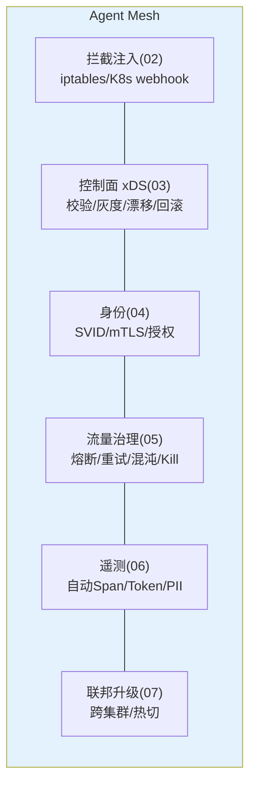

# 11-核心代码讲解：一次 LLM 调用的 Mesh 旅程

> **定位**：复盘 Mesh 六层关键实现，并以**一次跨集群 LLM 调用的完整旅程**串起全部机制（拦截→授权→策略→mTLS→治理→遥测→联邦）。读者画像：读完迭代想统一消化的读者。前置阅读：[02-透明拦截与注入](02-透明拦截与注入.md) 至 [07-多集群联邦](07-多集群联邦.md)。
>
> **铁律 0**：与各迭代实证一致。

---

## 一、六层机制速查



### 一.1 本节核对（六层机制速查）

- [ ] 六层（拦截注入/控制面xDS/身份/流量治理/遥测/联邦升级）名称与对应迭代篇（02/03/04/05/06/07）一一对上，无漏层或错位
- [ ] 每层括注（iptables webhook / 校验灰度漂移回滚 / SVID mTLS / 熔断重试混沌Kill / 自动Span Token PII / 跨集群热切）能凭记忆复述该层核心

## 二、完整旅程（六层串联）

```mermaid
sequenceDiagram
    participant A as Agent(tenantA/risk,零改造)
    participant S as Sidecar(集群A)
    participant C as 控制面(03)
    participant B as Sidecar(集群B LLM出口)
    participant T as mesh-telemetry

    Note over S: ②启动:iptables已劫持,SVID已签发(04),策略vN已ACK(03)
    A->>S: POST /v1/chat/completions(透明劫持)
    S->>S: ④授权:inbound allow?(vN策略本地)
    S->>S: ⑤治理链:限流→熔断检查→重试预算
    S->>B: mTLS(SVID: spiffe://.../tenantA/risk)
    B->>B: 出口策略(联邦红线: model X 禁?)→放行
    B-->>S: 响应(usage: 812 tokens)
    S->>T: Span+指标+计量事件(PII脱敏,策略vN留痕)
    S-->>A: 透传响应(Agent 无感知)
    Note over C: 全程:若Kill-Switch→此处503;若混沌注入→按MeshChaos
```

**一句话**：Agent 只发了一次普通 HTTP；网格完成了 授权-治理-加密-跨域-计量-审计 六件事。

### 二.1 本节测试与验证（完整旅程逐跳断言）

> 与各迭代篇的测试用例一一对应（每跳标注其迭代来源）。

**前置条件**：跨集群（集群 A Agent / 集群 B LLM 出口）双 Sidecar 已接入，控制面策略 vN 已 ACK（03），SVID 已签发（04）。

**材料**：一次发向 `/v1/chat/completions` 的测试请求；一个禁用模型名（触发出口红线）。

**步骤与断言**：

| # | 操作 | 预期（PASS 判据） |
|---|------|------------------|
| 1 | Agent 发 `POST /v1/chat/completions`（透明劫持） | Sidecar 拦截到流量；Agent 侧零改造（源头 02 用例通过） |
| 2 | 检查④授权：本地 vN 策略 allow？ | 授权判定本地执行（来源 03/04），非法请求按策略拒绝 |
| 3 | 检查⑤治理链：限流→熔断→重试预算 | 各环节在本地策略命中；超限 429 / 熔断 503 触发符合预期（05） |
| 4 | Sidecar(集群A)→Sidecar(集群B)：mTLS `spiffe://.../tenantA/risk` | 传输含 SVID 身份，mTLS 握手通过（04），非本网格身份被拒 |
| 5 | 出口策略：提交禁用模型到 LLM | 命中国际红线被拦（07），放行合法模型 |
| 6 | 检查遥测：Span+指标+计量事件（PII 脱敏，策略 vN 留痕） | Sidecar 上报遥测一条，Token/耗时/状态齐备，PII 已脱敏（06） |

**失败排查**：①②跳不通过→授权策略 vN 未本地生效（回查 03/04 下发与 ACK）；④mTLS 失败→SVID 过期或集群间根未互信（04/07）；⑤出口红线失效→联邦根只放红线未下放或语义规则未匹配；⑥遥测缺脱敏→PII 字段未在 Sidecar 侧处理。

---

## 三、关键设计复盘（五条）

| # | 设计 | 为什么 |
|---|------|--------|
| 1 | 治理全本地执行（策略随 xDS 下发） | 零中心绕行——延迟与可用性 |
| 2 | 配置三道门+灰度下发+漂移对账 | 一条坏配置不打挂全网 |
| 3 | 上游凭证只在 Sidecar | 逃逸=无 Key 无身份，闭环 |
| 4 | 逃生门（bypass）永久有效 | 治理可失联，业务不可中断 |
| 5 | 混沌/Kill/维护=普通策略 | 网格天然演练与止损点，不建第二系统 |

### 三.1 本节核对（关键设计复盘）

- [ ] 五条设计（本地执行/三道门+灰度+漂移/凭证只在 Sidecar/逃生门/混沌即策略）各自能指出对立面（中央绕行/单点坏配置/逃逸/治理中断/第二套工具），理解"为什么"
- [ ] 第 1 条"治理全本地执行"与 §二 旅程 ②④⑤ 步的本地判定一致；第 4 条逃生门与 [ADR 16-03] 永久可用一致

---

## 四、运维面（meshctl）

```bash
meshctl status                 # 全网格 Sidecar/策略版本收敛度
meshctl policy apply|rollback  # 策略下发/回滚（走灰度管道）
meshctl kill model=<name>      # Kill-Switch
meshctl chaos inject|revoke    # 故障注入
meshctl sidecar upgrade --canary
```

### 四.1 本节测试与验证（meshctl 运维命令演练）

**前置条件**：meshctl CLI 已接入控制面与 Sidecar 状态接口；可对单个模型/Kill 目标操作。

**材料**：5 条 meshctl 命令各执行一遍。

**步骤与断言**：

| # | 操作 | 预期（PASS 判据） |
|---|------|------------------|
| 1 | `meshctl status` | 输出全网格 Sidecar 与策略版本收敛度，无超时 |
| 2 | `meshctl policy apply|rollback` | 下发/回滚走灰度管道成功（回滚对齐 ADR 16-04/16-09） |
| 3 | `meshctl kill model=<name>` | Kill-Switch 生效（该模型调用被止损，来源 05） |
| 4 | `meshctl chaos inject|revoke` | 故障注入后撤销，流量恢复正常 |
| 5 | `meshctl sidecar upgrade --canary` | 金丝雀升级只刷部分 Sidecar，可自动回滚（ADR 16-09） |

**失败排查**：①status 收敛读不到→ACK 聚合未接通（03 §四.1）；②rollback 不生效→版本历史未保留（回看 03 §五.1）；③chaos 撤销后流量仍异常→注入未绑定生命周期失效。

## 五、全篇回归验证

> §二.1（旅程逐跳）与 §四.1（meshctl 运维）均通过后，把整套旅程串起来端到端收口。

| # | 操作 | 预期（PASS 判据） |
|---|------|------------------|
| 1 | 走完整旅程（Agent 发一次普通 HTTP） | 授权→治理→mTLS→跨域→计量→审计六步全通过，Agent 无感知（§二.1 全断言） |
| 2 | 用 meshctl 全命令演练一轮 | status/policy/kill/chaos/upgrade 五命令各自断言通过（§四.1 全断言） |

**回归失败排查**：任一步 FAIL 按 §二.1/§四.1 对应排查项回溯（策略本地生效 / mTLS 互信 / 版本历史 / 注入生命周期）。

**下一篇**：[12-ADR架构决策记录](12-ADR架构决策记录.md)。
