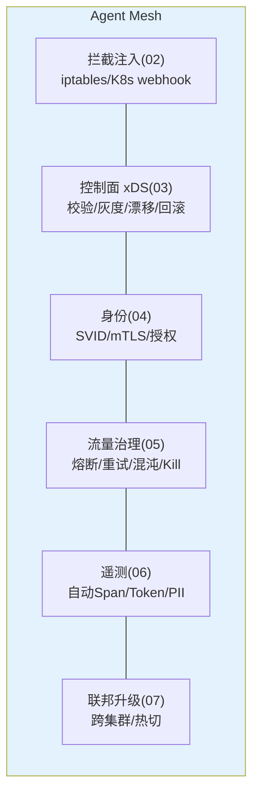

# 11-核心代码讲解：一次 LLM 调用的 Mesh 旅程

> **定位**：复盘 Mesh 六层关键实现，并以**一次跨集群 LLM 调用的完整旅程**串起全部机制（拦截→授权→策略→mTLS→治理→遥测→联邦）。读者画像：读完迭代想统一消化的读者。前置阅读：[02-透明拦截与注入](02-透明拦截与注入.md) 至 [07-多集群联邦](07-多集群联邦.md)。
>
> **铁律 0**：与各迭代实证一致。

---

## 一、六层机制速查



## 二、完整旅程（六层串联）

```mermaid
sequenceDiagram
    participant A as Agent(tenantA/risk,零改造)
    participant S as Sidecar(集群A)
    participant C as 控制面(03)
    participant B as Sidecar(集群B LLM出口)
    participant T as mesh-telemetry

    Note over S: ②启动:iptables已劫持,SVID已签发(04),策略vN已ACK(03)
    A->>S: POST /v1/chat/completions(透明劫持)
    S->>S: ④授权:inbound allow?(vN策略本地)
    S->>S: ⑤治理链:限流→熔断检查→重试预算
    S->>B: mTLS(SVID: spiffe://.../tenantA/risk)
    B->>B: 出口策略(联邦红线: model X 禁?)→放行
    B-->>S: 响应(usage: 812 tokens)
    S->>T: Span+指标+计量事件(PII脱敏,策略vN留痕)
    S-->>A: 透传响应(Agent 无感知)
    Note over C: 全程:若Kill-Switch→此处503;若混沌注入→按MeshChaos
```

**一句话**：Agent 只发了一次普通 HTTP；网格完成了 授权-治理-加密-跨域-计量-审计 六件事。

---

## 三、关键设计复盘（五条）

| # | 设计 | 为什么 |
|---|------|--------|
| 1 | 治理全本地执行（策略随 xDS 下发） | 零中心绕行——延迟与可用性 |
| 2 | 配置三道门+灰度下发+漂移对账 | 一条坏配置不打挂全网 |
| 3 | 上游凭证只在 Sidecar | 逃逸=无 Key 无身份，闭环 |
| 4 | 逃生门（bypass）永久有效 | 治理可失联，业务不可中断 |
| 5 | 混沌/Kill/维护=普通策略 | 网格天然演练与止损点，不建第二系统 |

---

## 四、运维面（meshctl）

```bash
meshctl status                 # 全网格 Sidecar/策略版本收敛度
meshctl policy apply|rollback  # 策略下发/回滚（走灰度管道）
meshctl kill model=<name>      # Kill-Switch
meshctl chaos inject|revoke    # 故障注入
meshctl sidecar upgrade --canary
```

## 五、测试与验证

```bash
# 按 §二旅程逐跳断言（每跳有对应迭代的测试用例）；meshctl 全命令演练
```

**下一篇**：[12-ADR架构决策记录](12-ADR架构决策记录.md)。
