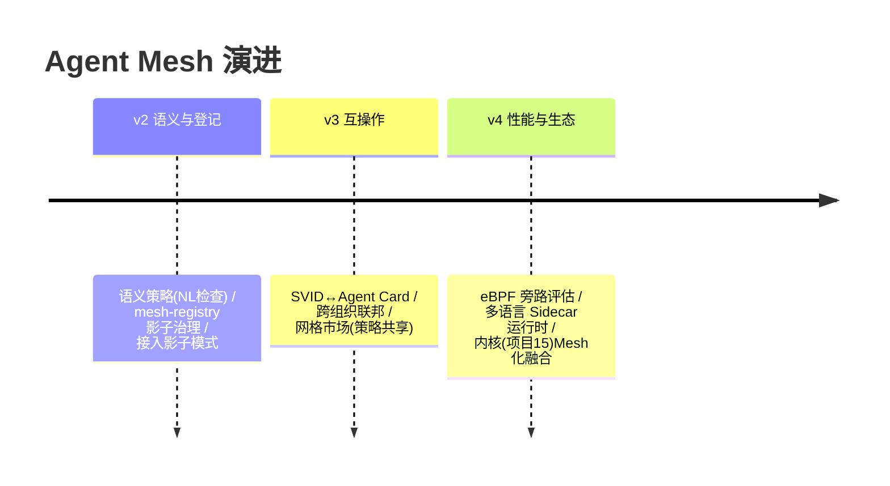

# 13-工业前沿与演进方向：Agent Mesh 的 2026 校准与收官

> **定位**：用 2026 真实工业实践校准 Mesh 方向，给缺口与 v2-v4 演进，项目收官。读者画像：读完 00-09 想知道"Mesh 接下来往哪长"的读者。前置阅读：[12-ADR架构决策记录](12-ADR架构决策记录.md)、[前沿 06-Spring-AI生态全景]。
>
> **来源**：真实外部资料（链接文内）。

---

## 一、行业信号：治理正在走向"网关+网格"双范式

- **Google**（[五指南](https://cloud.google.com/blog/topics/developers-practitioners/five-guides-to-building-and-scaling-production-ready-ai-agents) + [20 问框架](https://itbrief.com.au/story/google-sets-out-20-question-framework-for-ai-agents)）：提出**Agent Gateway**（所有交互过网关，拦截策略违规/注入）+ **Agent Registry**（中央注册表）+ **双策略模型**（IAM+语义检查）——本项目对应：Sidecar=分布式网关、mesh-control 策略=注册表下发、04 授权+可扩展语义层。其"沙箱隔离"主张与 05 故障注入/02 Pod 边界同构。
- **Nebius**（[Agents Blueprint](https://nebius.com/blog/posts/introducing-the-nebius-agents-blueprint)）：六组件中的 Observability 即"全记录"——本项目 06 零埋点自动遥测是其Sidecar 化实现；其"系统改进跑赢模型升级"印证治理基础设施的投资回报。
- **AWS**（[企业生产级指南](https://cloud.it168.com/a2026/0708/6939/000006939041.shtml)）：评估驱动闭环的**计量底座**正是 06 的 Token/轨迹自动归集（按 SVID 身份天然分租户）。
- **传统 Mesh 生态**（Istio/Linkerd）：xDS/身份/联邦被验证了十年——Agent Mesh 复用其成熟协议形态，替换"服务"为"Agent 能力"语义。

---

## 二、Mesh 现状对照（N1-N6）

| # | 前沿能力 | Mesh 现状 | 缺口/演进 |
|---|---------|----------|----------|
| N1 | Agent Gateway（全交互过闸） | ✅ Sidecar 出站全接管 | 🔶 工具/检索流量的**语义级**检查（NL 策略） |
| N2 | 中央注册表（owner/数据/工具） | 🔶 策略含目标但无登记面 | 🔷 v2：mesh-registry（Agent 卡片登记，影子治理） |
| N3 | 语义安全双策略（IAM+NL） | ✅ IAM（04）；🔶 NL 缺 | 🔷 v2：策略段加 semanticRules（意图审查） |
| N4 | A2A 互操作 | ❌ 仅网格内身份 | 🔷 v3：SVID↔Agent Card 映射，跨组织联邦 |
| N5 | 模拟先行 | 🔶 MeshChaos 可注入 | 🔷 v2：新 Agent 接入前"影子模式"（镜像流量不触上游，先观测策略命中） |
| N6 | 无代理化（eBPF/sidecarless） | ❌ Sidecar 模式 | 🔷 v4：热点路径评估 eBPF/内核旁路（延迟 <1ms） |

---

## 三、演进路线



**优先级依据**：语义安全与登记（Google 双信号）> 互操作 > 性能。

---

## 四、三旗舰对照收官（14/15/16）

| 视角 | 项目 14 平台 | 项目 15 内核 | 项目 16 网格 |
|------|-------------|-------------|-------------|
| 一句话 | 中心化能力平台 | 运行时 OS | 零改造治理层 |
| 最适合 | 绿地统一栈 | 长进程托管 | 存量异构群 |
| 篇数 | 36 | 11 | 11 |

> 三个项目共同回答一件事：**企业级 Agent 的"管控分离"可以落在三种基础设施形态上**——读者按场景选型，亦可组合（内核进程跑在网格上、接入平台能力市场）。

## 五、检验方式

```bash
# 把 04 授权与 Google "双策略模型"逐句比对（同构性自查）
# v2 PoC：一条 semanticRules 策略在 Sidecar 命中（延迟预算内）
```

---

## 六、项目收官

| 阶段 | 篇目 | 交付 |
|------|------|------|
| 基础（00-01） | 需求架构/最小拦截 | Mesh 范式 + 三视角对照 + 拦截闭环 |
| 六层（02-07） | 注入/xDS/身份/治理/遥测/联邦升级 | 完整 Mesh（含混沌/Kill/漂移回滚/热切） |
| 资产（08-10） | 讲解/ADR/前沿 | 旅程复盘 + 10 条决策 DNA + v2-v4 |

项目 16 到此收官：一套**零改造接入、策略秒级生效、身份全覆盖、遥测全自动、自身可安全演进**的工业级 Agent 服务网格蓝图。独立项目，无后续依赖。
