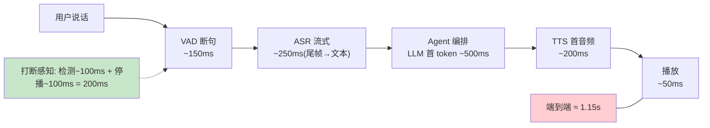
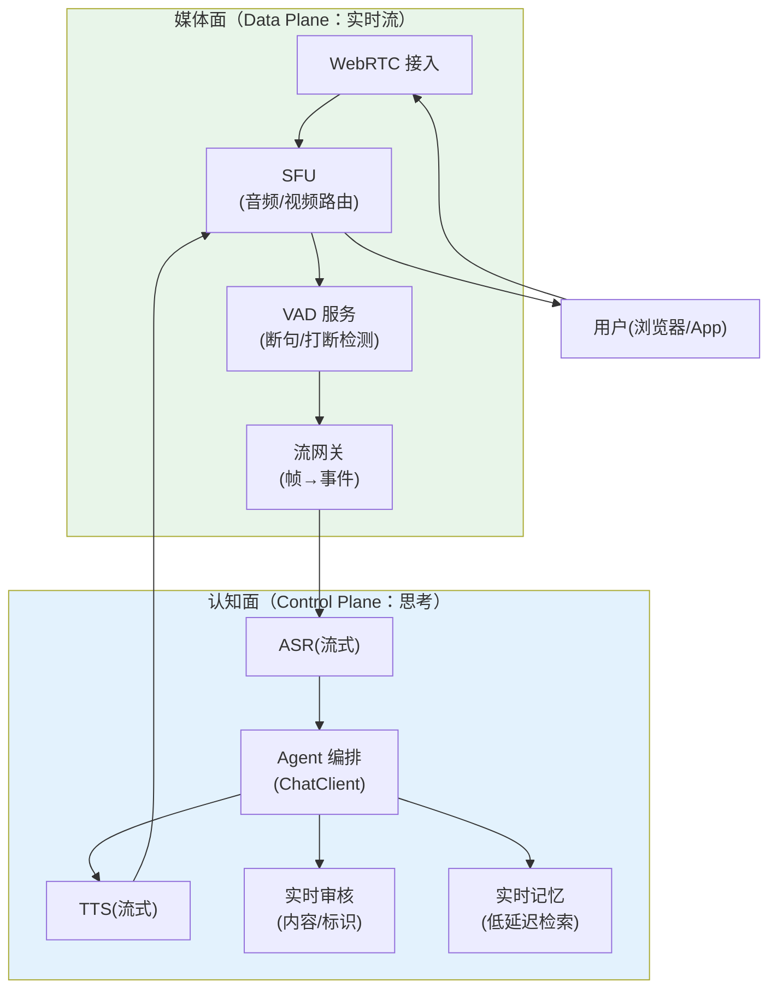
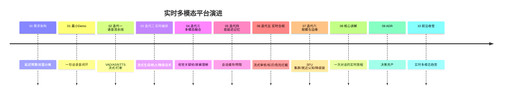

# 00-需求分析与架构设计：企业级实时多模态交互 Agent 平台

> **定位**：构建**毫秒级实时**的语音/视频多模态 Agent 平台（智能语音客服、数字人坐席、实时会议助理）：全双工语音流水线（VAD→ASR→编排→TTS 回流）、视觉通道（屏幕共享/摄像头帧理解）、**延迟预算驱动的架构**（端到端语音往返 ≤1.2s、可感知打断 ≤200ms）。管控分离：**媒体面**（WebRTC/SFU，数据面）与**认知面**（编排/审核/记忆，管控面）分层。读者画像：要做实时语音/数字人 Agent 的架构师。前置阅读：[教程 10-SSE流式通信]、[教程 48-多模态Agent开发]、[教程 38-Agent性能优化]。
>
> **铁律 0**：Spring AI 2.0 API 与基准一致；ASR/TTS/SFU 为第三方（真实坐标/概念标注）。独立项目（与 14/15/16 三视角互补，互不引用）。

---

## ★ 阅读顺序总览（序号 = 阅读顺序）

> 本子文件夹 11 个文件（00-10）：

| 阶段 | 文件 | 读者定位 |
|------|------|---------|
| ① 全貌 | 00-需求分析与架构设计 | **先读**：延迟预算、媒体面/认知面分离 |
| ② 起步 | 01-最小Demo | **动手**：一句话语音闭环 |
| ③ 主体迭代 | 02~07（语音流水线/实时编排/多模态融合/低延迟记忆/实时合规/规模与边缘） | **严格顺序** |
| ④ 讲解 | 08-核心代码讲解 | **回顾** |
| ⑤ 资产 | 09-ADR / 10-前沿 | **按需/收官** |

---

## 一、为什么实时多模态是独立问题域

| 维度 | 文本 Agent | 实时多模态 Agent |
|------|-----------|-----------------|
| 延迟单位 | 秒级（首 token 1s 可接受） | **毫秒级**（打断感知 200ms） |
| 数据形态 | 离散消息 | **连续流**（音频帧 20ms/视频帧 33ms） |
| 轮次控制 | 用户发消息开始 | **全双工**（随时说、随时打断） |
| 失败恢复 | 重发 | **实时降级**（ASR 降级词法/编排降级话术） |

**结论**：架构由**延迟预算倒推**，而不是功能堆叠。

## 二、延迟预算表（架构的第一公民）

**预算纪律**：每个环节有硬预算，超预算触发该环节的**降级路径**（不是失败，是降级）。

## 三、总体架构：媒体面/认知面分离

**分离纪律**：媒体面只搬运与切帧（不思考）；认知面只思考（不碰 RTP）——认知面慢不卡音频流，媒体面崩认知面可降级文本。

## 四、微服务清单与迭代路线

| 服务 | 平面 | 职责 | 迭代 |
|------|------|------|------|
| `rtc-gateway`(WebRTC/SFU) | 媒体 | 接入/路由/混流 | 01/07 |
| `vad-service` | 媒体 | 断句/打断检测/能量门 | 02 |
| `asr-tts-bridge` | 认知 | 流式 ASR/TTS 适配 | 02 |
| `realtime-orchestrator` | 认知 | 低延迟编排（流式思维/抢占生成） | 03 |
| `vision-service` | 认知 | 视频帧理解（关键帧抽取→多模态） | 04 |
| `realtime-memory` | 认知 | 会话缓存/低延迟检索 | 05 |
| `realtime-compliance` | 认知 | 实时审核/打断拦截/内容标识 | 06 |

## 五、量化验收（项目级）

| 指标 | 目标 |
|------|------|
| 端到端语音往返（安静环境） | ≤1.2s P50 / ≤2s P99 |
| 用户打断→Agent 停播 | ≤200ms |
| ASR 流式尾延迟 | ≤250ms |
| 30min 会话认知面零 Full GC | 达成 |
| 并发全双工会话/节点 | ≥200 |
| 内容审核覆盖 | 100%（含音频转写与视觉帧） |

## 六、与教程体系的锚点

[教程 10-SSE]（流式基座）、[教程 19-流式工具调用与事件协议]（事件协议）、[教程 48-多模态Agent开发]（Media/多模态）、[教程 38-Agent性能优化]（延迟治理）、[教程 31-安全与权限控制]+[教程 25-历史记录持久化与合规]（合规层）。

## 七、总结

实时多模态 Agent 的架构由**延迟预算倒推**：媒体面/认知面分离、每环节硬预算+降级路径、打断是一等公民。下一篇跑通第一句语音闭环。

**下一篇**：[01-最小Demo](01-最小Demo.md)。
