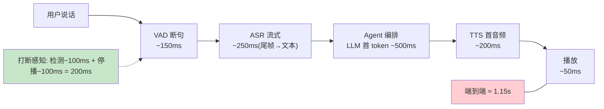
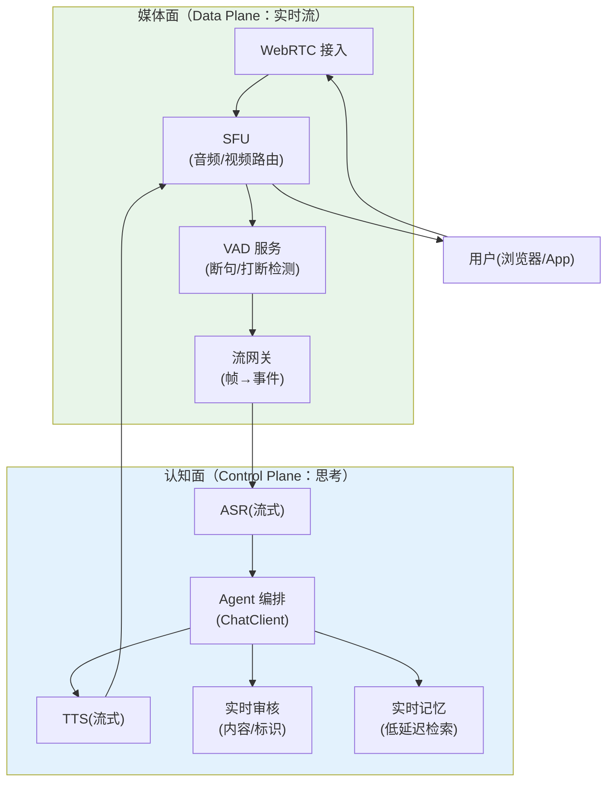
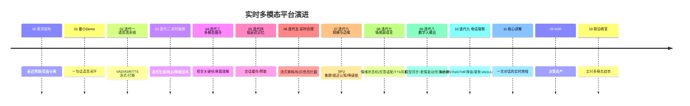

# 00-需求分析与架构设计：企业级实时多模态交互 Agent 平台

> **定位**：构建**毫秒级实时**的语音/视频多模态 Agent 平台（智能语音客服、数字人坐席、实时会议助理）：全双工语音流水线（VAD→ASR→编排→TTS 回流）、视觉通道（屏幕共享/摄像头帧理解）、**延迟预算驱动的架构**（端到端语音往返 ≤1.2s、可感知打断 ≤200ms）。管控分离：**媒体面**（WebRTC/SFU，数据面）与**认知面**（编排/审核/记忆，管控面）分层。读者画像：要做实时语音/数字人 Agent 的架构师。前置阅读：[教程 02-SpringAI核心机制/06-SSE流式通信]、[教程 09-前沿专题/02-多模态Agent开发]、[教程 08-架构师进阶/04-Agent性能优化]。
>
> **铁律 0**：Spring AI 2.0 API 与基准一致；ASR/TTS/SFU 为第三方（真实坐标/概念标注）。独立项目（与 14/15/16 三视角互补，互不引用）。

---

## ★ 阅读顺序总览（序号 = 阅读顺序）

> 本子文件夹 14 个文件（00-13，08-10 为进阶迭代，11-13 为讲解/ADR/前沿）：

| 阶段 | 文件 | 读者定位 |
|------|------|---------|
| ① 全貌 | 00-需求分析与架构设计 | **先读**：延迟预算、媒体面/认知面分离 |
| ② 起步 | 01-最小Demo | **动手**：一句话语音闭环 |
| ③ 主体迭代 | 02~07（语音流水线/实时编排/多模态融合/低延迟记忆/实时合规/规模与边缘） | **严格顺序** |
| ③+ 进阶迭代 | 08~10（情感副语言/数字人输出/电话与端侧） | **进阶**：情绪适配、口型同步≤80ms、SIP/PSTN、端侧打断≤120ms |
| ④ 讲解 | 11-核心代码讲解 | **回顾** |
| ⑤ 资产 | 12-ADR / 13-前沿 | **按需/收官** |

---

## 一、为什么实时多模态是独立问题域

| 维度 | 文本 Agent | 实时多模态 Agent |
|------|-----------|-----------------|
| 延迟单位 | 秒级（首 token 1s 可接受） | **毫秒级**（打断感知 200ms） |
| 数据形态 | 离散消息 | **连续流**（音频帧 20ms/视频帧 33ms） |
| 轮次控制 | 用户发消息开始 | **全双工**（随时说、随时打断） |
| 失败恢复 | 重发 | **实时降级**（ASR 降级词法/编排降级话术） |

**结论**：架构由**延迟预算倒推**，而不是功能堆叠。

### 一.1 本节核对（实时问题域）

| # | 核对项 | 判据 |
|---|--------|------|
| 1 | 问题域成立 | 能从「延迟单位/数据形态/轮次控制/失败恢复」四维说清实时多模态与文本 Agent 的本质差异 |
| 2 | 结论一句话 | "架构由延迟预算倒推而非功能堆叠"是后续全部章节的第一性，能与 §二 预算表直接衔接 |

## 二、延迟预算表（架构的第一公民）

**预算纪律**：每个环节有硬预算，超预算触发该环节的**降级路径**（不是失败，是降级）。

### 二.1 本节核对（延迟预算表）

| # | 核对项 | 判据 |
|---|--------|------|
| 1 | 端到端核算 | VAD 150ms + ASR 250ms + 编排 500ms + TTS 200ms + 播放 50ms = 1.15s，与图中 TOTAL 一致 |
| 2 | 打断单独成线 | 打断感知 200ms 独立于端到端 1.15s 核算（不重叠） |
| 3 | 降级语义 | 超预算=降级路径而非失败，与后续 03/07 的降级话术/降级矩阵衔接一致 |

## 三、总体架构：媒体面/认知面分离

**分离纪律**：媒体面只搬运与切帧（不思考）；认知面只思考（不碰 RTP）——认知面慢不卡音频流，媒体面崩认知面可降级文本。

### 三.1 本节核对（媒体面/认知面分离）

| # | 核对项 | 判据 |
|---|--------|------|
| 1 | 平面归属 | 能指出图中每个系统框属于媒体面（VAD/流网关/WebRTC/SFU）还是认知面（ASR/编排/TTS/审核/记忆），无错位 |
| 2 | 降级闭环 | "媒体面崩认知面可降级文本"与 ADR 17-01、07 降级矩阵（编排挂→话术库）口径不矛盾 |

## 四、微服务清单与迭代路线

| 服务 | 平面 | 职责 | 迭代 |
|------|------|------|------|
| `rtc-gateway`(WebRTC/SFU) | 媒体 | 接入/路由/混流 | 01/07 |
| `vad-service` | 媒体 | 断句/打断检测/能量门 | 02 |
| `asr-tts-bridge` | 认知 | 流式 ASR/TTS 适配 | 02 |
| `realtime-orchestrator` | 认知 | 低延迟编排（流式思维/抢占生成） | 03 |
| `vision-service` | 认知 | 视频帧理解（关键帧抽取→多模态） | 04 |
| `realtime-memory` | 认知 | 会话缓存/低延迟检索 | 05 |
| `realtime-compliance` | 认知 | 实时审核/打断拦截/内容标识 | 06 |

### 四.1 本节核对（微服务清单与迭代路线）

| # | 核对项 | 判据 |
|---|--------|------|
| 1 | 服务-平面映射 | 七个微服务各自的"平面"归属与 §三 分离口径一致（媒体=rtc-gateway/vad，认知=asr-tts-bridge/realtime-orchestrator/vision/realtime-memory/realtime-compliance） |
| 2 | 迭代落地篇 | 七个服务均能在 timeline 中找到对应迭代篇（01-07），无清单里有但路线没落的服务 |
| 3 | 编号与 12-ADR 衔接 | timeline 版本号与 12-ADR 的 ADR 17-00~17-09 落地篇一一对应，无错位 |

## 五、量化验收（项目级）

| 指标 | 目标 |
|------|------|
| 端到端语音往返（安静环境） | ≤1.2s P50 / ≤2s P99 |
| 用户打断→Agent 停播 | ≤200ms |
| ASR 流式尾延迟 | ≤250ms |
| 30min 会话认知面零 Full GC | 达成 |
| 并发全双工会话/节点 | ≥200 |
| 内容审核覆盖 | 100%（含音频转写与视觉帧） |

### 五.1 本节核对（量化验收）

| # | 核对项 | 判据 |
|---|--------|------|
| 1 | 指标可度量 | 六项指标均含数值或可判定标准（≤1.2s/≤200ms/≤250ms/零Full GC/≥200/100%），非空话 |
| 2 | 每项有承接篇 | 端到端≤1.2s→01/02、打断≤200ms→02、ASR尾延迟≤250ms→02、零Full GC→05、并发≥200→07、审核100%→06，均能在后续迭代篇找到实现落点 |

## 六、与教程体系的锚点

[教程 01-WebFlux与响应式编程/00-WebFlux从零入门]（流式基座）、[教程 03-React前端与AgenticUI/04-流式工具调用与事件协议]（事件协议）、[教程 09-前沿专题/02-多模态Agent开发]（Media/多模态）、[教程 08-架构师进阶/04-Agent性能优化]（延迟治理）、[教程 04-企业级架构主干/11-安全与权限控制]+[教程 04-企业级架构主干/05-历史记录持久化与合规]（合规层）。

## 七、总结

实时多模态 Agent 的架构由**延迟预算倒推**：媒体面/认知面分离、每环节硬预算+降级路径、打断是一等公民。下一篇跑通第一句语音闭环。

**下一篇**：[01-最小Demo](01-最小Demo.md)。
