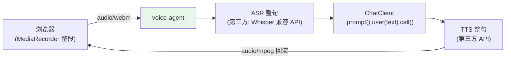

# 01-最小 Demo：一句话语音闭环

> **定位**：跑通最小实时闭环：浏览器麦克风 → 后端收音频帧 → 按句转文本 → ChatClient 单轮 → 文本转语音回流播放。先**不追求**流式/打断/多模态（后续迭代）。读者画像：要听到 Agent 开口说话的开发者。前置阅读：[00-需求分析与架构设计](00-需求分析与架构设计.md)。
>
> **铁律 0**：编排用真实 ChatClient；ASR/TTS 第三方（真实坐标/概念标注）。

---

## 一、四问

| 问 | 答 |
|----|----|
| **新增了什么需求** | 整句语音进出闭环（录音→ASR→LLM→TTS→播放） |
| **影响了哪些模块** | 新单体 `voice-agent`（HTTP 收音频 + 回音频） |
| **架构如何演进** | 无 → 整句闭环（后续迭代流式化） |
| **上一版痛点** | 无 |

**本迭代验收**：① 浏览器说一句话 → 听到回答 ② 端到端 ≤5s（整句版，非目标延迟——流式是 02+） ③ 文本回退通道（TTS 故障时文字仍达）。

## 二、最小链路



## 三、核心代码

```java
package com.example.voiceagent;

import org.springframework.ai.chat.client.ChatClient;
import org.springframework.http.MediaType;
import org.springframework.web.bind.annotation.*;
import org.springframework.web.reactive.function.client.WebClient;
import reactor.core.publisher.Mono;

/** 最小语音闭环——整句版（后续迭代改流式）。 */
@RestController
public class VoiceController {

    private final ChatClient chatClient;          // javap 实证 API
    private final WebClient asr;                  // 第三方 ASR（OpenAI 兼容 /audio/transcriptions）
    private final WebClient tts;                  // 第三方 TTS（/audio/speech）

    public VoiceController(ChatClient chatClient, WebClient.Builder wb) {
        this.chatClient = chatClient;
        this.asr = wb.baseUrl(System.getenv("ASR_URL")).build();
        this.tts = wb.baseUrl(System.getenv("TTS_URL")).build();
    }

    @PostMapping(value = "/voice", consumes = MediaType.MULTIPART_FORM_DATA_VALUE,
                 produces = "audio/mpeg")
    public Mono<byte[]> voice(@RequestParam("audio") byte[] audio) {
        return asr.post().uri("/transcriptions")
                .contentType(MediaType.MULTIPART_FORM_DATA)
                .bodyValue(audioBody(audio))                       // multipart 组包（略）
                .retrieve().bodyToMono(Transcription.class)
                .map(Transcription::text)
                .flatMap(text -> Mono.fromCallable(() ->
                        chatClient.prompt()
                                .system("你是语音助手，回答口语化、一两句话")
                                .user(text)
                                .call().content()))                // javap 实证：content()
                .flatMap(reply -> tts.post().uri("/speech")
                        .bodyValue(java.util.Map.of("input", reply, "voice", "alloy"))
                        .retrieve().bodyToMono(byte[].class));
    }

    record Transcription(String text) {}
}
```

## 四、验证包（手工测试与验证）
**前置条件**：/voice 端点（音频上传→ASR→LLM→TTS→MP3 返回）实现；ASR/TTS 可 mock 故障；ffmpeg 可用。

**材料 A——音频样本**：录一段 2s 的"你好，请介绍一下你们的产品"（wav/mp3 均备）。

**材料 B——故障开关**：环境变量切 ASR 服务为 503。

**步骤与断言**：

| # | 操作 | 预期（PASS 判据） |
|---|------|------------------|
| 1 | `curl -F file=@hello.wav /voice` -o out.mp3 | 返回 200；out.mp3 可播放且内容是对产品的中文回答 |
| 2 | 材料B 开启后再 curl | 返回 502 + 文字版回答（降级通道不死等） |
| 3 | 步骤1 计时（3 次取均值） | 端到端 ≤5s（整句基线；02 迭代再压） |
| 4 | 上传非音频文件 | 明确 4xx 错误码（不进 ASR） |

**失败排查**：①无声→TTS 编码采样率与 Content-Type 不符（用 ffprobe 检查 out.mp3）；②降级挂死→降级路径没有超时；③超 5s→串行 ASR/LLM/TTS 无预连接（连接池预热）。


## 五、本迭代痛点

① 整句等待（用户说完才处理）② 无法打断 ③ ASR/TTS 非流式 → 02 流式化。

## 六、验收对照

| 验收项 | 标准 | 状态 |
|--------|------|------|
| 语音闭环 | 说→听回 | ✅ |
| 文本回退 | TTS 故障文字可达 | ✅ |
| 基线 | ≤5s | ✅ |

**下一篇**：[02-迭代一-全双工语音流水线](02-迭代一-全双工语音流水线.md)。
