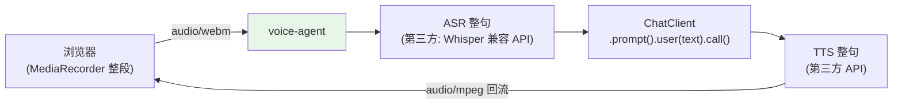

# 01-最小 Demo：一句话语音闭环

> **定位**：跑通最小实时闭环：浏览器麦克风 → 后端收音频帧 → 按句转文本 → ChatClient 单轮 → 文本转语音回流播放。先**不追求**流式/打断/多模态（后续迭代）。读者画像：要听到 Agent 开口说话的开发者。前置阅读：[00-需求分析与架构设计](00-需求分析与架构设计.md)。
>
> **铁律 0**：编排用真实 ChatClient；ASR/TTS 第三方（真实坐标/概念标注）。

---

## 一、四问

| 问 | 答 |
|----|----|
| **新增了什么需求** | 整句语音进出闭环（录音→ASR→LLM→TTS→播放） |
| **影响了哪些模块** | 新单体 `voice-agent`（HTTP 收音频 + 回音频） |
| **架构如何演进** | 无 → 整句闭环（后续迭代流式化） |
| **上一版痛点** | 无 |

**本迭代验收**：① 浏览器说一句话 → 听到回答 ② 端到端 ≤5s（整句版，非目标延迟——流式是 02+） ③ 文本回退通道（TTS 故障时文字仍达）。

### 一.1 本节核对（四问与验收口径）

| # | 核对项 | 判据 |
|---|--------|------|
| 1 | 范围最小 | 只做整句闭环，刻意不做流式/打断（与 §二"整段"链路一致），与"本迭代验收"非目标延迟口径吻合 |
| 2 | 三验收可判定 | 说→听到 / ≤5s / 文本回退 TTS 故障可达，均可在 §四 验证对应上断言 |

## 二、最小链路



### 二.1 本节核对（最小链路）

| # | 核对项 | 判据 |
|---|--------|------|
| 1 | 闭环可达 | 浏览器 MediaRecorder 整段 → voice-agent(HTTP) → ASR 整句 → ChatClient → TTS 整句 → audio/mpeg 回流，链路五节点齐全且方向正确 |
| 2 | 与 §三 一一对应 | 图中每个变换点在 §三 `VoiceController` 中都有对应实现（asr/chatClient/tts），无"图有码无"悬空节点 |

## 三、核心代码

```java
package com.example.voiceagent.controller;

import java.util.Map;
import org.springframework.ai.chat.client.ChatClient;
import org.springframework.beans.factory.annotation.Autowired;
import org.springframework.beans.factory.annotation.Value;
import org.springframework.http.HttpEntity;
import org.springframework.http.MediaType;
import org.springframework.http.client.MultipartBodyBuilder;
import org.springframework.util.MultiValueMap;
import org.springframework.web.bind.annotation.PostMapping;
import org.springframework.web.bind.annotation.RequestMapping;
import org.springframework.web.bind.annotation.RequestParam;
import org.springframework.web.bind.annotation.RestController;
import org.springframework.web.reactive.function.BodyInserters;
import org.springframework.web.reactive.function.client.WebClient;
import reactor.core.publisher.Mono;
import jakarta.annotation.PostConstruct;

/** 最小语音闭环——整句版（后续迭代改流式）。 */
@RestController
@RequestMapping("/voice")
public class VoiceController {

    @Autowired
    private ChatClient chatClient;                // javap 实证 API

    @Autowired
    private WebClient.Builder webClientBuilder;

    @Value("${voice.asr-url}")                    // .env 注入（见 §三.3 两段式配置）
    private String asrUrl;                        // 第三方 ASR（OpenAI 兼容 /audio/transcriptions）

    @Value("${voice.tts-url}")
    private String ttsUrl;                        // 第三方 TTS（/audio/speech）

    private WebClient asr;
    private WebClient tts;

    @PostConstruct
    void initClients() {
        this.asr = webClientBuilder.baseUrl(asrUrl).build();
        this.tts = webClientBuilder.baseUrl(ttsUrl).build();
    }

    @PostMapping(consumes = MediaType.MULTIPART_FORM_DATA_VALUE, produces = "audio/mpeg")
    public Mono<byte[]> voice(@RequestParam("audio") byte[] audio) {
        return asr.post().uri("/transcriptions")
                .body(BodyInserters.fromMultipartData(audioBody(audio)))  // multipart 组包（§三 内展开）
                .retrieve().bodyToMono(Transcription.class)
                .map(Transcription::text)
                .flatMap(text -> Mono.fromCallable(() ->
                        chatClient.prompt()
                                .system("你是语音助手，回答口语化、一两句话")
                                .user(text)
                                .call().content()))                // javap 实证：content()
                .flatMap(reply -> tts.post().uri("/speech")
                        .bodyValue(Map.of("input", reply, "voice", "alloy"))
                        .retrieve().bodyToMono(byte[].class));
    }

    /** multipart 组包完整方法体——Spring Boot 4.1.0（Spring Framework 7）真实 API，javap 实证 */
    private MultiValueMap<String, HttpEntity<?>> audioBody(byte[] audio) {
        MultipartBodyBuilder builder = new MultipartBodyBuilder();
        builder.part("audio", audio)                               // 字段名与 @RequestParam("audio") 一致
                .contentType(MediaType.parseMediaType("audio/wav"))
                .filename("hello.wav");                            // PartBuilder：文件名 + 类型（真实 API）
        builder.part("model", "whisper-1");                        // OpenAI 兼容转写接口必带 model
        return builder.build();                                    // → MultiValueMap<String, HttpEntity<?>>
    }

    record Transcription(String text) {}
}
```

### 三.1 本节测试与验证（整句闭环）

**前置条件**：`/voice` 端点（音频上传→ASR→LLM→TTS→MP3 返回）实现；按 §三.3 两段式配置以 `mvn spring-boot:run -Dspring-boot.run.profiles=voice` 启动（监听 8081）；ASR/TTS 可 mock 故障；ffmpeg 可用。

**材料 A——音频样本**：录一段 2s 的"你好，请介绍一下你们的产品"（wav/mp3 均备）。

**材料 B——故障开关**：环境变量切 ASR 服务为 503。

**步骤与断言**：

| # | 操作 | 预期（PASS 判据） |
|---|------|------------------|
| 1 | §三.1 末尾 `/voice` 端 curl | 返回 200；out.mp3 可播放且内容是对产品的中文回答 |
| 2 | 材料B 开启后再 curl | 返回 502 + 文字版回答（降级通道不死等） |
| 3 | 步骤1 计时（3 次取均值） | 端到端 ≤5s（整句基线；02 迭代再压） |
| 4 | 上传非音频文件 | 明确 4xx 错误码（不进 ASR） |

**`/voice` 端 curl 完整命令**（响应判据见后）：

```bash
curl -sS -D - -o out.mp3 \
  -F "audio=@hello.wav;type=audio/wav" \
  http://localhost:8081/voice
```

响应判据（三选一工具核验均应通过）：

```text
HTTP/1.1 200 OK
Content-Type: audio/mpeg
```

```bash
file out.mp3        # → MPEG ADTS, ...（音频容器，非报错 JSON）
ffprobe out.mp3     # → Duration: 00:00:01~03（一句话回答的时长量级）
```

内容判据：out.mp3 可播放，且内容是对"介绍你们的产品"的中文口语化回答（对应材料 A 提问）。

### 三.3 运行配置与启动（两段式）

```yaml
# application.yaml（仅 .env import + 激活 profile）
spring:
  config:
    import: optional:file:.env[.properties]
  profiles:
    active: voice
```

```yaml
# application-voice.yaml（端口 + 模型 + ASR/TTS 地址）
server:
  port: 8081
spring:
  ai:
    openai:
      base-url: https://api.deepseek.com          # DeepSeek 兼容 OpenAI 协议
      api-key: ${DEEPSEEK_API_KEY}                # 环境变量，不落明文
      chat:
        model: deepseek-v4-flash
voice:
  asr-url: ${ASR_URL}                             # OpenAI 兼容 /audio/transcriptions（.env 注入）
  tts-url: ${TTS_URL}                             # /audio/speech（.env 注入）
```

```bash
mvn spring-boot:run -Dspring-boot.run.profiles=voice
```

## 四、全篇回归验证

**回归断言**（§一/§二 核对与 §三.1 本节验证均通过后，最终整体闭环验收）：

| # | 操作 | 预期（PASS 判据） |
|---|------|------------------|
| 1 | 链路五节点整体走通 | 浏览器录音→回听，端到端 ≤5s 且回答正确，无任一环节缺失 |
| 2 | 故障降级回归 | ASR/TTS 任一故障均回落文字通道，不冷场不死等（与 §一 验收③一致） |

**失败排查**：链路某节点不通→按 §二/§三 五变换点逐个 curl 定位；降级回归失败→回查 §三.1 排除项（超时/预连接）。

## 五、本迭代痛点

① 整句等待（用户说完才处理）② 无法打断 ③ ASR/TTS 非流式 → 02 流式化。

> ### 五.1 本节核对（本迭代痛点）
> 三个痛点（整句等待/不可打断/非流式）与下一迭代 [02] 的"流式断句/打断/流式ASR-TTS"一一对应，痛点不被搁置即 PASS。

## 六、验收对照

| 验收项 | 标准 | 状态 |
|--------|------|------|
| 语音闭环 | 说→听回 | ✅ |
| 文本回退 | TTS 故障文字可达 | ✅ |
| 基线 | ≤5s | ✅ |

> ### 六.1 本节核对（验收对照）
> 三项验收均能在 §三.1 断言中找到对应（语音闭环→断言1、文本回退→断言2、≤5s→断言3），状态为 ✅ 即 PASS。

**下一篇**：[02-全双工语音流水线](02-全双工语音流水线.md)。
