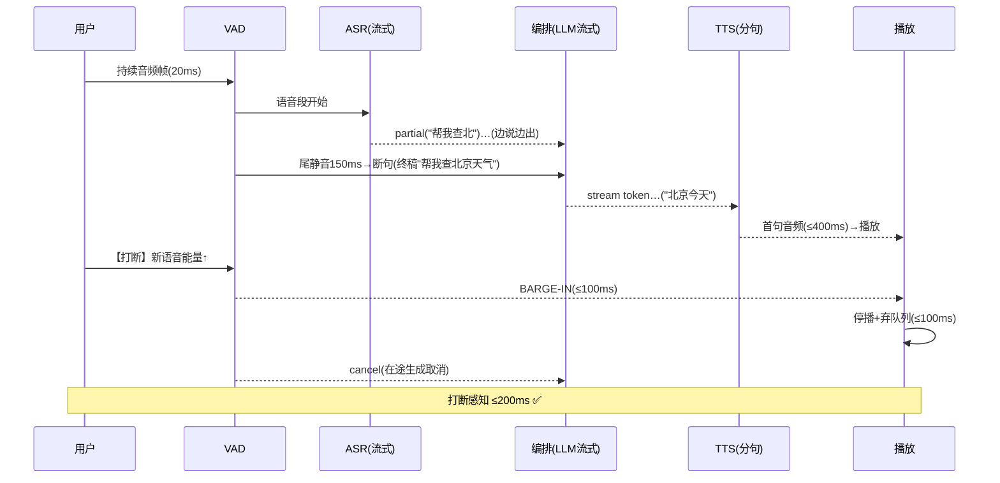

# 02-迭代一：全双工语音流水线——VAD / 流式 ASR/TTS / 打断

> **定位**：把整句闭环升级为**全双工流水线**：VAD 实时断句（能量+语义双门）、**流式 ASR**（边说边出文本）、**流式 TTS**（边生成边播）、**打断（Barge-in）**——用户开口 200ms 内 Agent 停播弃稿。读者画像：要"像真人对话"的读者。前置阅读：[01-最小Demo](01-最小Demo.md)。
>
> **铁律 0**：编排仍走真实 ChatClient（`stream().content()` javap 实证）；VAD/流式 ASR/TTS 第三方或自研标注。

---

## 一、四问

| 问 | 答 |
|----|----|
| **新增了什么需求** | ① VAD（断句：尾静音 ~150ms；打断检测：对方说话能量门）② 流式 ASR（部分文本事件）③ 流式 TTS（LLM 流式 token→分句→逐句合成）④ 打断闭环（停播+弃置在途生成+会话标注被打断） |
| **影响了哪些模块** | `vad-service`、`asr-tts-bridge`（流式化）、编排接入事件 |
| **架构如何演进** | 整句往返 → 帧进帧出全双工 |
| **上一版痛点** | 整句等待/不可打断（01 §五） |

**本迭代验收**：① 尾静音 150ms 内出 ASR 终稿 ② LLM 首 token 后首句音频 ≤400ms ③ 用户打断→停播 ≤200ms、在途生成取消 ④ 被打断会话重说无残留旧稿。

---

## 二、全双工事件流



## 三、关键实现

```java
// 编排侧（骨架）：LLM 流式 token → 分句 → 逐句 TTS；打断时全链取消
public reactor.core.publisher.Flux<AudioChunk> orchestrate(String utterance, String sessionId) {
    return chatClient.prompt()
            .system("口语化短句回答，每句不超过 20 字")
            .user(utterance)
            .stream()                      // javap 实证：StreamResponseSpec
            .content()                     // Flux<String> token 流
            .bufferUntil(this::sentenceBoundary, true)   // 按句聚合
            .concatMap(sentence -> ttsBridge.synthesize(sentence)  // 逐句合成（保序）
                    .takeUntilOther(bargeInSignal(sessionId)));    // 打断→取消在途
}
// VAD 侧：能量门（RT60 近似）+ 自适应底噪；断句=尾静音 150ms；打断=播放期语音能量>阈值持续 3 帧
```

## 四、管道阶段可见（结合 AudioChunk/VAD/打断 完整实现）

> 过程可见性是工业级标配。**实时项目对可见性要求最高**——对话进行中，用户/运维必须实时知道当前处在管道哪一段（VAD 边界→ASR 转写→意图→工具→TTS 合成），否则打断/误判时无从定位。下面是一段**可编译的完整实现**，挂在二、三节真实管道的数据变换点：

```java
package realtime.pipeline;

import reactor.core.publisher.Flux;
import reactor.core.publisher.Sinks;

/** 管道阶段可见：每个 AudioChunk/ASR/TTS 变换点都发阶段事件（见二、三节）。 */
public final class PipelineStageListener {
    private final Sinks.Many<StageEvent> sink = Sinks.many().unicast().onOverflowBuffer();

    public sealed interface StageEvent {
        String utteranceId();  long latencyMs();  boolean interrupted();
        record VadBoundary(String utteranceId, long latencyMs, boolean interrupted) implements StageEvent {}
        record AsrDelta(String utteranceId, long latencyMs, boolean interrupted, String text, boolean final_) implements StageEvent {}
        record Intent(String utteranceId, long latencyMs, boolean interrupted, String intent) implements StageEvent {}
        record ToolInvoked(String utteranceId, long latencyMs, boolean interrupted, String tool) implements StageEvent {}
        record Tts(String utteranceId, long latencyMs, boolean interrupted, String delta, boolean end) implements StageEvent {}
    }

    public Flux<StageEvent> events() { return sink.asFlux(); }

    /** ASR 出 partial/final 时调用；final_=true 表示 VAD 判定完整句。 */
    public void onAsr(String utteranceId, String text, boolean final_, long ms) {
        sink.tryEmitNext(new StageEvent.AsrDelta(utteranceId, ms, false, text, final_));
    }
    /** 用户打断（bargeInSignal）时调用：把进行中段标记 interrupted。 */
    public void onBargeIn(String utteranceId, long ms) {
        sink.tryEmitNext(new StageEvent.AsrDelta(utteranceId, ms, true, "", true));
    }
}
```

| 管道段 | 阶段事件 | 用户看到 |
|--------|---------|---------|
| VAD | `VadBoundary` | "检测到我开始说话" |
| ASR | `AsrDelta{text, final_}` | 实时字幕（可纠正） |
| 意图/工具 | `Intent`/`ToolInvoked` | "识别为查订单→调工具" |
| TTS | `Tts{delta, end}` | "正在合成回复…已返回" |

**四条纪律**：① 每段 Begin/End 成对、中断也发 `interrupted=true`；② 阶段事件带 `latencyMs`——延迟预算监控的可见化（本项目第一性）；③ 打断即定格（`onBargeIn` 标记、已产出不丢）；④ `AsrDelta` 只给转写文本，不把内部置信度外泄。

## 五、验证包（手工测试与验证）
**前置条件**：流式 ASR（partial/final）+VAD 终句+流式 TTS+打断通道实现。

**材料 A——终句录音**："帮我查北京天气"后自然停顿。

**材料 B——打断录音**：Agent 播报中插入"停，换上海"。

**步骤与断言**：

| # | 操作 | 预期（PASS 判据） |
|---|------|------------------|
| 1 | 材料A 计时 | 静默 150ms 内出 final（ASR 日志 partial→final 时戳） |
| 2 | LLM 首 token → 首句播放 | ≤400ms（首句合成起播时戳差） |
| 3 | 材料B 打断 | ≤200ms 停播；在途 LLM/TTS 请求被取消（无残余音频漏出——录音回放末端无旧稿） |
| 4 | 打断后重说"换上海" | 新回答只含上海（无旧稿残留拼接） |

**失败排查**：①终句慢→VAD 静默窗参数过大；②超 400ms→TTS 冷启动（合成器常驻或首句预暖）；③漏音→取消只停了播放器未 cancel TTS 流（双停：停播+取消生成）。


## 六、本迭代痛点

生成中不能让工具调用阻塞首音频（工具慢=用户干等）→ 03 实时编排。

## 七、验收对照

| 验收项 | 标准 | 状态 |
|--------|------|------|
| 流式断句 | 150ms 终稿 | ✅ |
| 首句音频 | ≤400ms | ✅ |
| 打断 | ≤200ms 停播+取消 | ✅ |
| 无残留 | 重说干净 | ✅ |

**下一篇**：[03-迭代二-实时编排与抢占生成](03-迭代二-实时编排与抢占生成.md)。
