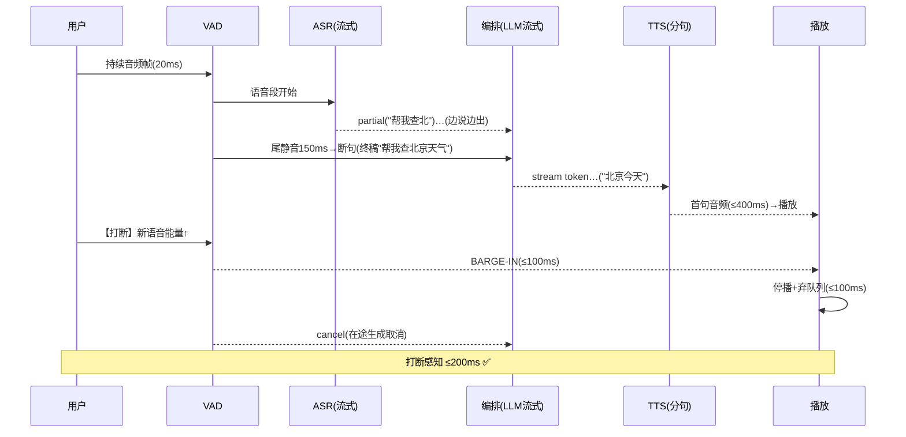

# 02-迭代一：全双工语音流水线——VAD / 流式 ASR/TTS / 打断

> **定位**：把整句闭环升级为**全双工流水线**：VAD 实时断句（能量+语义双门）、**流式 ASR**（边说边出文本）、**流式 TTS**（边生成边播）、**打断（Barge-in）**——用户开口 200ms 内 Agent 停播弃稿。读者画像：要"像真人对话"的读者。前置阅读：[01-最小Demo](01-最小Demo.md)。
>
> **铁律 0**：编排仍走真实 ChatClient（`stream().content()` javap 实证）；VAD/流式 ASR/TTS 第三方或自研标注。

---

## 一、四问

| 问 | 答 |
|----|----|
| **新增了什么需求** | ① VAD（断句：尾静音 ~150ms；打断检测：对方说话能量门）② 流式 ASR（部分文本事件）③ 流式 TTS（LLM 流式 token→分句→逐句合成）④ 打断闭环（停播+弃置在途生成+会话标注被打断） |
| **影响了哪些模块** | `vad-service`、`asr-tts-bridge`（流式化）、编排接入事件 |
| **架构如何演进** | 整句往返 → 帧进帧出全双工 |
| **上一版痛点** | 整句等待/不可打断（01 §五） |

**本迭代验收**：① 尾静音 150ms 内出 ASR 终稿 ② LLM 首 token 后首句音频 ≤400ms ③ 用户打断→停播 ≤200ms、在途生成取消 ④ 被打断会话重说无残留旧稿。

---

## 二、全双工事件流



## 三、关键实现

```java
// 编排侧（骨架）：LLM 流式 token → 分句 → 逐句 TTS；打断时全链取消
public reactor.core.publisher.Flux<AudioChunk> orchestrate(String utterance, String sessionId) {
    return chatClient.prompt()
            .system("口语化短句回答，每句不超过 20 字")
            .user(utterance)
            .stream()                      // javap 实证：StreamResponseSpec
            .content()                     // Flux<String> token 流
            .bufferUntil(this::sentenceBoundary, true)   // 按句聚合
            .concatMap(sentence -> ttsBridge.synthesize(sentence)  // 逐句合成（保序）
                    .takeUntilOther(bargeInSignal(sessionId)));    // 打断→取消在途
}
// VAD 侧：能量门（RT60 近似）+ 自适应底噪；断句=尾静音 150ms；打断=播放期语音能量>阈值持续 3 帧
```

## 四、测试与验证

```bash
# 1. 断句：说"帮我查北京天气"停顿 → 150ms 内终稿（计时）
# 2. 首音频：LLM 首 token → 首句播放 ≤400ms
# 3. 打断：Agent 播报中用户开口 → ≤200ms 停播；在途 LLM/TTS 取消（无漏音）
# 4. 打断后重说 → 新回答不含旧稿残留
```

## 五、本迭代痛点

生成中不能让工具调用阻塞首音频（工具慢=用户干等）→ 03 实时编排。

## 六、验收对照

| 验收项 | 标准 | 状态 |
|--------|------|------|
| 流式断句 | 150ms 终稿 | ✅ |
| 首句音频 | ≤400ms | ✅ |
| 打断 | ≤200ms 停播+取消 | ✅ |
| 无残留 | 重说干净 | ✅ |

**下一篇**：[03-迭代二-实时编排与抢占生成](03-迭代二-实时编排与抢占生成.md)。
