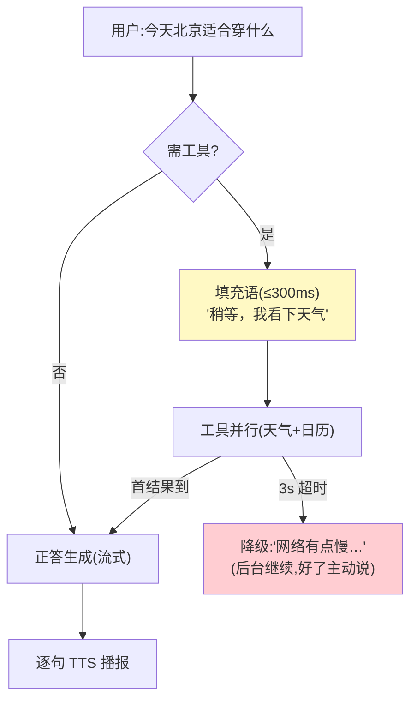

# 03-实时编排与抢占生成——先开口后思考 / 工具并行 / 降级话术

> **定位**：让编排适配**秒表**：**先开口**（填充语"稍等我查一下"先播，工具结果回来再正答）、**工具并行**（多工具并发+结果流式合入）、**抢占生成**（新信息到达时放弃当前稿重新生成——流式版的"重启"）、**降级话术**（超预算逐级降级：完整答→短答→话术兜底）。读者画像：要工具调用不冷场的读者。前置阅读：[02-全双工语音流水线](02-全双工语音流水线.md)、[教程 28-流式工具调用与事件协议]。
>
> **铁律 0**：工具循环与事件协议对齐教程 19 实证口径（ToolCallingManager/Generation 级 finishReason）。

---

## 一、四问

| 问 | 答 |
|----|----|
| **新增了什么需求** | ① 填充语策略（预计>800ms 的工具调用先播"稍等"）② 工具并行（flatMap 并发+首结果先合入）③ 抢占生成（打断/新工具结果→弃当前 TTS 队列重生成）④ 三级降级话术（超预算触发） |
| **影响了哪些模块** | `realtime-orchestrator`（核心重构） |
| **架构如何演进** | 一问一答流 → 会话内多事件抢占式生成 |
| **上一版痛点** | 工具调用期冷场、慢工具拖死首音频（02 §五） |

**本迭代验收**：① 含工具调用的轮次：填充语 ≤300ms 先播 ② 双工具并行总时延≈最慢者 ③ 工具结果到达→抢占重生成≤150ms 弃旧稿 ④ 超 3s 工具→降级话术兜底并异步补答。

### 一.1 本节核对（四问与验收口径）

| # | 核对项 | 判据 |
|---|--------|------|
| 1 | 四项能力有落点 | 填充语/工具并行/抢占生成/三级降级话术在 §二 时间线与骨架代码中均有对应节点，非只列需求 |
| 2 | 四条验收可度量 | ≤300ms 填充 / ≈最慢者 / ≤150ms 抢占 / 3s 降级，均可作为 §二.1 断言判据 |

---

## 二、时间线（先开口后思考）



```java
// 编排骨架（复用 02 的流式管道）：
// ① 意图判定需工具 → 先合成填充语（本地预合成缓存，0 LLM）
// ② 工具并行：Flux.merge(toolA, toolB)（并发上限 3）——首个完成即开始正答，其余结果作为"追补"
// ③ 抢占：追补/打断到达 → 弃 TTS 队列（02 的 takeUntilOther）→ 带新上下文重生成
// ④ 降级：工具 Mono.timeout(3s) → 话术兜底 + 工具结果异步到达后触发"主动补充"轮
```

### 二.1 本节测试与验证（先开口、并行、抢占、降级）

> **前置**：编排器（填充语/并行工具/抢占/降级话术）按 §二 实现并接入 02 流式管道。

**材料 A——工具轮次问题**："查下我的订单物流"（触发工具）。

**材料 B——双工具问题**：需两个工具（mock 1s/2s）。

**材料 C——抢占剧本**：先答慢工具版，快工具结果 1s 后到。

**步骤与断言**：

| # | 操作 | 预期（PASS 判据） |
|---|------|------------------|
| 1 | 材料A | 需工具轮次填充语 ≤300ms 播出（无冷场静默） |
| 2 | 材料B | 正确答案 ~2s 档起播（并行，非 3s 串行相加） |
| 3 | 材料C | 旧稿停止；新稿 ≤150ms 起播（抢占生效） |
| 4 | 工具挂 4s（mock） | 3s 降级话术兜底；若结果 5s 到 → 主动补答一轮 |

**失败排查**：①填充语迟→填充语生成走了 LLM（应模板化预置）；③起播慢→抢占重建 TTS 会话（应复用合成器）；④死等→工具无 deadline。

## 三、全篇回归验证

**回归断言**（§一 核对与 §二.1 本节验证均通过后，最终整体验收）：

| # | 操作 | 预期（PASS 判据） |
|---|------|------------------|
| 1 | 混合工具轮次压测（A/B/C 交错多轮） | 填充语 ≤300ms、并行≈最慢者、抢占 ≤150ms、3s 降级四验收项全绿 |
| 2 | 降级后补答回归 | 工具结果异步到达后主动补答一轮，口语衔接无冷场 |

**失败排查**：混合轮某验收项降级→回查 §二.1 对应行；降级后无补答→"主动补充"轮未挂载或与 §五 验收③口径不一致。

## 四、本迭代痛点

只有语音——用户举着屏幕/共享文档时 Agent 看不见 → 04 多模态融合。

> ### 四.1 本节核对（本迭代痛点）
> "只有语音、看不见屏幕"与下一迭代 [04] 的"关键帧抽取/屏幕理解"一一对应，痛点不被搁置即 PASS。

## 五、验收对照

| 验收项 | 标准 | 状态 |
|--------|------|------|
| 填充语 | ≤300ms | ✅ |
| 工具并行 | ≈最慢者 | ✅ |
| 抢占 | ≤150ms 弃旧 | ✅ |
| 降级 | 3s 兜底+异步补答 | ✅ |

> ### 五.1 本节核对（验收对照）
> 四项验收均能在 §二.1 断言中找到对应（填充语→1、并行→2、抢占→3、降级→4/补答→回归2），状态为 ✅ 即 PASS。

**下一篇**：[04-多模态融合通道](04-多模态融合通道.md)。
